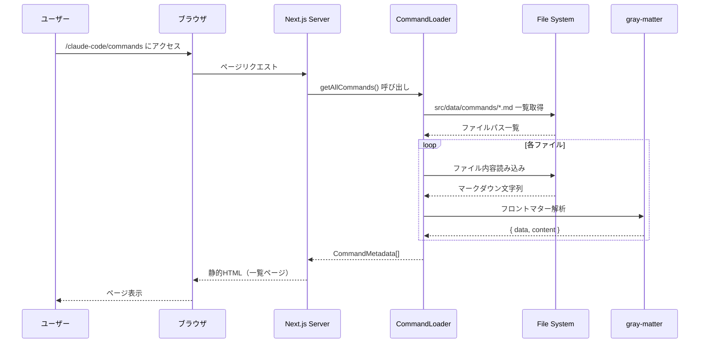
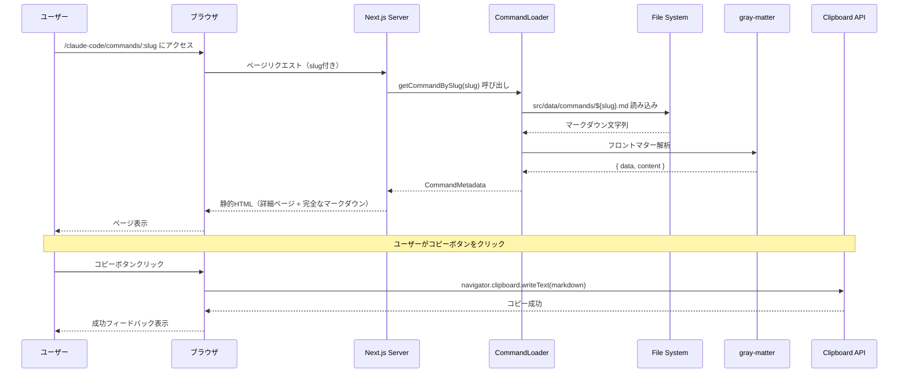
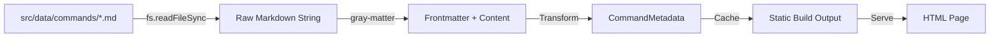
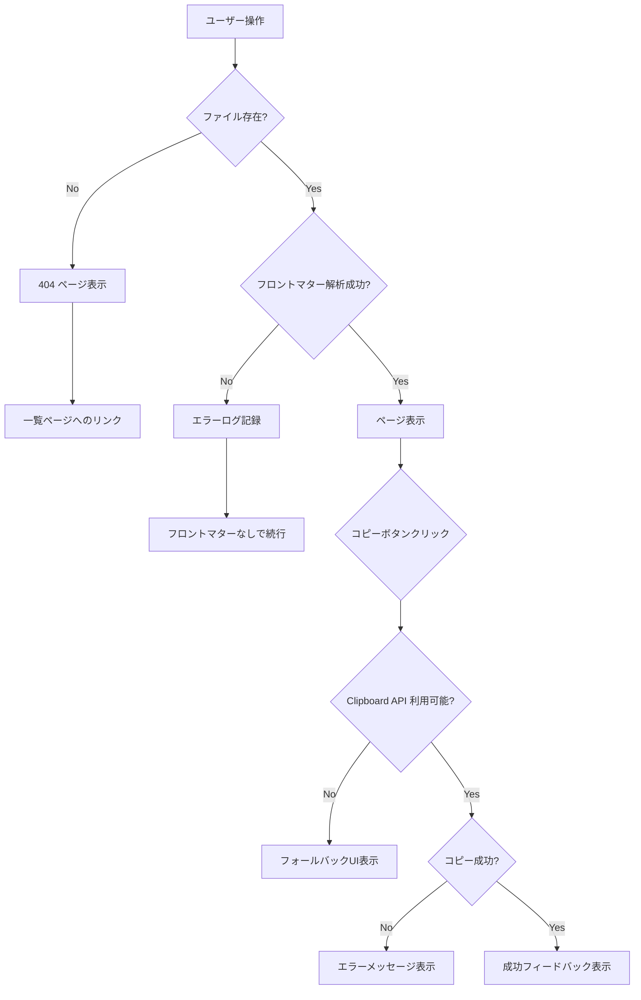

# 技術設計書: カスタムコマンド公開機能

## 概要

カスタムコマンド公開機能は、Claude Code で使用するカスタムコマンドとサブエージェントのマークダウンファイルを公開し、ユーザーが気軽にコピー&ペーストして利用できるようにする静的Webページ機能です。データベースを使用せず、リポジトリ内のマークダウンファイルを直接読み込むファイルベース方式を採用し、保守性とシンプルさを重視します。

**目的**: Claude Code ユーザーが公開されたカスタムコマンドを簡単に発見し、フロントマターを含む完全な形式でコピー&ペーストして自身の環境で利用できるようにする。

**ユーザー**: Claude Code を使用する開発者、特に既存のカスタムコマンドを活用して生産性を向上させたいユーザー。

**影響**: 新しいページルート `/claude-code/commands` とその配下の動的ページを追加。既存システムには影響を与えず、独立した機能として動作する。

**重要な前提**:
- 公開用マークダウンファイルは `src/data/commands/` ディレクトリに配置される
- このディレクトリ内のファイルは、様々なプロジェクトからコピーされた公開用のカスタムコマンドである
- `.claude/commands/` 内のファイルはプロジェクト固有のものであり、公開対象ではない

### 目標

- `src/data/commands/*.md` ファイルを自動的にスキャンし、Webページとして公開する
- ユーザーがマークダウンファイル全体をワンクリックでコピーできる機能を提供する
- Radiant デザインシステムに準拠した一貫性のあるUIを実装する
- Next.js の ISR を活用した高速なページ生成と更新を実現する

### 非目標

- データベースの導入（ファイルベースのみ）
- タグ機能の初期実装（将来の拡張として計画）
- 検索機能の実装（初期バージョンでは対象外）
- ユーザー認証や編集機能（静的公開のみ）
- サブエージェント公開ページ（カスタムコマンドのみを対象）

## アーキテクチャ

### 既存アーキテクチャの分析

本プロジェクトは Next.js 15 App Router をベースとした静的サイトテンプレートであり、既に以下のパターンが確立されています：

- **ファイルベースデータ管理**: `/videos` ページでは、TypeScript ファイルとして動画メタデータを管理し、ビルド時に静的ページを生成
- **動的ルート生成**: `generateStaticParams` を使用した静的パラメータ生成
- **データローダーパターン**: `src/lib/videos/video-data.ts` のような集約されたデータアクセスレイヤー
- **コンポーネント設計**: Container、Navbar、Footer などの再利用可能なレイアウトコンポーネント
- **エラーハンドリング**: AsyncErrorBoundary による包括的なエラー処理

この機能では、上記の確立されたパターンを踏襲し、マークダウンファイルを直接読み込む方式に適応させます。

### サンプルマークダウンファイルの構造

公開用マークダウンファイルは以下の形式で `src/data/commands/` に配置されます：

```markdown
---
description: Convert YouTube video data from commented format to VideoMetadata TypeScript
allowed-tools: Read, Write, Edit, Bash
argument-hint: <youtube-video-id>
---

# YouTube Video Data Conversion

Convert a YouTube video data file from commented format to proper VideoMetadata TypeScript structure.

**YouTube Video ID**: $ARGUMENTS

## Task: Convert Video Data File

**SCOPE**: This command reads a video file with commented YouTube data, converts it to proper VideoMetadata format, registers it in the video data loader, and validates the result.

### Prerequisites

Before running this command, ensure:
1. File `src/data/videos/$ARGUMENTS.ts` exists
2. File contains commented YouTube data (title, description, timestamps, tags)

### 1. Read Source File

Read `src/data/videos/$ARGUMENTS.ts` to extract:
- Video URL
- Title
- Published date
...
```

**フロントマターフィールドの説明**:
- `description`: コマンドの簡潔な説明（必須、一覧ページに表示）
- `allowed-tools`: コマンドが使用可能なツールのリスト（オプション）
- `argument-hint`: コマンド引数のヒント（オプション、例: `<youtube-video-id>`）

### ディレクトリ構造

プロジェクト内のディレクトリ構成は以下のようになります：

```
vibe-coding-studio/
├── .claude/
│   └── commands/           # プロジェクト固有のカスタムコマンド（公開しない）
│       ├── kiro/
│       │   ├── spec-init.md
│       │   ├── spec-requirements.md
│       │   └── spec-design.md
│       └── convert-video.md
├── src/
│   ├── app/
│   │   └── claude-code/
│   │       └── commands/
│   │           ├── page.tsx           # 一覧ページ
│   │           ├── loading.tsx        # 一覧ページのローディング状態
│   │           └── [slug]/
│   │               ├── page.tsx       # 詳細ページ
│   │               └── loading.tsx    # 詳細ページのローディング状態
│   ├── data/
│   │   ├── commands/        # 公開用カスタムコマンド（このディレクトリの内容を公開）
│   │   │   ├── convert-video.md
│   │   │   ├── pr-description.md
│   │   │   └── review-code.md
│   │   └── videos/          # 既存の動画データ
│   ├── lib/
│   │   └── commands/
│   │       └── command-data.ts  # CommandLoader
│   ├── components/
│   │   └── commands/
│   │       ├── command-card.tsx
│   │       ├── command-detail.tsx
│   │       ├── code-block.tsx
│   │       └── copy-button.tsx
│   └── types/
│       └── command.ts       # CommandMetadata型定義
```

**重要なポイント**:
- `.claude/commands/` はプロジェクト固有のコマンドで、公開対象ではない
- `src/data/commands/` が公開用ディレクトリで、様々なプロジェクトからコピーしたコマンドを配置
- ファイル名がそのままURLのスラッグになる（例: `convert-video.md` → `/claude-code/commands/convert-video`）

### 高レベルアーキテクチャ

```mermaid
graph TB
    A[ユーザー] -->|アクセス| B[/claude-code/commands]
    A -->|アクセス| C[/claude-code/commands/:slug]

    B -->|データ取得| D[CommandDataLoader]
    C -->|データ取得| D

    D -->|ファイル読み込み| E[src/data/commands/*.md]
    D -->|フロントマター解析| F[gray-matter]

    B -->|表示| G[CommandListPage]
    C -->|表示| H[CommandDetailPage]

    G -->|使用| I[CommandCard]
    H -->|使用| J[CodeBlock with Copy]

    style E fill:#e1f5ff
    style D fill:#fff4e1
    style B fill:#f0f0f0
    style C fill:#f0f0f0
```

**アーキテクチャ統合**:
- **既存パターンの保持**: Container、Navbar、Footer、AsyncErrorBoundary を使用した一貫性のあるレイアウト構造
- **新規コンポーネントの追加**: CommandCard、CommandDetail、CodeBlock コンポーネントを追加
- **技術スタックの整合性**: Next.js 15 App Router、TypeScript 厳格モード、Tailwind CSS v4 を継続使用
- **Steering コンプライアンス**: ファイル命名規則（ケバブケース）、パスエイリアス（@/*）、8pxグリッドシステムを遵守

### 技術スタックの整合性

この機能は既存のプロジェクト技術スタックに完全に統合されます：

**フレームワーク**: Next.js 15.4.4 with App Router
- 既存の `/videos` ページと同様のルーティングパターンを採用
- `generateStaticParams` を使用した静的ページ生成

**スタイリング**: Tailwind CSS v4
- Radiant デザインシステムのカラーパレット、余白システム、タイポグラフィを完全に遵守
- Gray-950/White を主体としたモノクロベースのデザイン

**型安全性**: TypeScript 厳格モード
- すべてのコンポーネントとデータ構造に対する完全な型定義
- `any` 型の使用禁止

**新規依存関係**:
- `gray-matter`: マークダウンファイルのフロントマター解析（軽量、25KB、広く使用されているライブラリ）
- `react-syntax-highlighter`: コードブロックのシンタックスハイライト（オプション、パフォーマンス要件を満たす場合）

### 主要な設計決定

#### 決定1: マークダウンファイルの直接読み込み方式

**決定**: ビルド時に `src/data/commands/*.md` ファイルを直接読み込み、フロントマターを解析してメタデータを抽出する。

**コンテキスト**: データベースを使用せず、シンプルにコンテンツを管理したいという要件。既存の `/videos` 機能では TypeScript ファイルでデータを管理しているが、公開用カスタムコマンドはマークダウン形式で `src/data/commands/` に配置される。

**代替案**:
1. **TypeScript ファイルへの変換**: マークダウンファイルを TypeScript に変換して既存パターンに完全に合わせる
2. **CMS統合**: Contentlayer や MDX を使用した高度なマークダウン処理
3. **ビルド時JSONエクスポート**: ビルドスクリプトで JSON に変換

**選択したアプローチ**: ビルド時にマークダウンファイルを直接読み込み、gray-matter でフロントマターを解析する。

**理由**:
- **最小限の変更**: 既存のマークダウンファイルをそのまま使用できる
- **保守性**: ファイルの追加・編集が容易で、開発者の認知負荷が低い
- **パフォーマンス**: ビルド時に一度だけ解析し、静的HTMLとして生成
- **柔軟性**: フロントマターの追加・変更が容易

**トレードオフ**:
- **獲得**: シンプルさ、保守性、既存ファイルの再利用
- **犠牲**: TypeScript の型安全性の一部（フロントマターの型チェックはランタイムで検証）、既存パターンとの若干の差異

#### 決定2: ファイルシステムベースのデータローダー

**決定**: Node.js の `fs` モジュールを使用してビルド時にファイルシステムから直接マークダウンファイルを読み込む。

**コンテキスト**: Next.js 15 App Router では、Server Components でファイルシステムアクセスが可能。既存の `/videos` では静的インポートを使用しているが、マークダウンファイルの動的読み込みには適していない。

**代替案**:
1. **Webpack Loader**: カスタムローダーでビルド時にマークダウンを変換
2. **API Routes**: ランタイムでファイルを読み込むAPIエンドポイント
3. **静的インポート**: マークダウンを文字列として静的にインポート

**選択したアプローチ**: Server Components 内で `fs.readFileSync` を使用してビルド時にファイルを読み込む。

**理由**:
- **Next.js 15の機能活用**: Server Components でのファイルシステムアクセスが標準サポート
- **ゼロランタイム**: ビルド時にすべて解決し、クライアントバンドルに影響なし
- **シンプルな実装**: 追加のビルド設定不要

**トレードオフ**:
- **獲得**: シンプルな実装、クライアントバンドルサイズの削減、ビルド時の完全な検証
- **犠牲**: エッジランタイムでの実行不可（Node.js ランタイム必須）、ファイルシステムへの依存

#### 決定3: コードコピー機能の実装

**決定**: クライアントサイドで `navigator.clipboard.writeText()` を使用したワンクリックコピー機能を実装する。

**コンテキスト**: ユーザーがマークダウンファイル全体を簡単にコピーできることが要件の中心。

**代替案**:
1. **ネイティブブラウザ機能のみ**: ユーザーに手動選択してコピーさせる
2. **execCommand**: 古い Clipboard API を使用
3. **サードパーティライブラリ**: clipboard.js などの専用ライブラリ

**選択したアプローチ**: Clipboard API を使用したカスタムボタンコンポーネント。

**理由**:
- **ユーザビリティ**: ワンクリックでコピーできる最高のUX
- **標準API**: モダンブラウザで広くサポート、追加の依存関係不要
- **フィードバック**: コピー成功/失敗の明確な通知が可能

**トレードオフ**:
- **獲得**: 優れたUX、軽量な実装、標準API使用
- **犠牲**: HTTPS必須（開発環境では localhost で問題なし）、古いブラウザでは動作しない（フォールバックを実装）

## システムフロー

### コマンド一覧ページのフロー



### コマンド詳細ページのフロー



## 要件トレーサビリティ

| 要件 | 要件概要 | コンポーネント | インターフェース | フロー |
|------|----------|---------------|-----------------|-------|
| 1.1 | コマンド一覧の表示 | CommandListPage, CommandCard | getAllCommands() | 一覧ページフロー |
| 1.2 | ファイル名と説明の表示 | CommandCard | CommandMetadata.title, .description | 一覧ページフロー |
| 1.3 | 詳細ページへの遷移 | CommandCard（Link） | Next.js Link | - |
| 1.4 | フロントマターの抽出 | CommandLoader | gray-matter | 一覧・詳細フロー |
| 2.1 | 詳細ページの表示 | CommandDetailPage | getCommandBySlug(slug) | 詳細ページフロー |
| 2.2 | フロントマター情報の表示 | CommandDetail | CommandMetadata | 詳細ページフロー |
| 2.3 | マークダウン全体の表示 | CodeBlock | rawContent | 詳細ページフロー |
| 2.4 | ワンクリックコピー | CopyButton | Clipboard API | 詳細ページフロー（コピー） |
| 3.1 | 動的ルート生成 | page.tsx（[slug]） | generateStaticParams() | ビルド時 |
| 3.2 | ビルド時の静的生成 | Next.js SSG | - | ビルド時 |
| 3.3 | マークダウンの文字列読み込み | CommandLoader | fs.readFileSync | 一覧・詳細フロー |
| 3.5 | ISRによる再生成 | page.tsx | revalidate: 60 | ランタイム |
| 4.x | デザインシステム遵守 | 全コンポーネント | Radiantガイドライン | 全フロー |
| 5.x | レスポンシブデザイン | 全コンポーネント | Tailwind breakpoints | 全フロー |
| 6.x | パフォーマンスとSEO | page.tsx | generateMetadata() | ビルド時 |
| 7.x | エラーハンドリング | AsyncErrorBoundary, notFound() | - | 全フロー |

## コンポーネントとインターフェース

### データアクセス層

#### CommandLoader

**責務と境界**
- **主要責務**: `src/data/commands/*.md` ファイルのスキャン、読み込み、フロントマター解析を担当する
- **ドメイン境界**: データ層に属し、ファイルシステムとの唯一の接点
- **データ所有権**: マークダウンファイルの内容とメタデータを管理
- **トランザクション境界**: 各関数呼び出しは独立しており、トランザクションは不要

**依存関係**
- **Inbound**: CommandListPage、CommandDetailPage が依存
- **Outbound**: Node.js `fs` モジュール、`gray-matter` ライブラリ、`path` モジュール
- **External**: `gray-matter` (npm パッケージ、7年以上の安定した開発実績、週1000万ダウンロード)

**外部依存関係の調査結果（gray-matter）**:
- **公式ドキュメント**: https://github.com/jonschlinkert/gray-matter
- **API**: `matter(content: string): { data: object, content: string }`
- **バージョン互換性**: v4.0.3（現在の安定版）、Node.js 14以上をサポート
- **設定**: デフォルト設定で YAML、JSON、TOML フロントマターをサポート
- **パフォーマンス**: 小規模ファイル（< 100KB）では 1ms 未満で解析
- **制約**: 大規模ファイル（> 1MB）では遅延の可能性あり（本プロジェクトでは該当せず）

**サービスインターフェース**

```typescript
interface CommandLoaderService {
  // すべてのコマンドメタデータを取得
  getAllCommands(): CommandMetadata[]

  // スラッグからコマンドメタデータを取得
  getCommandBySlug(slug: string): CommandMetadata | undefined

  // すべてのコマンドスラッグを取得（generateStaticParams用）
  getAllCommandSlugs(): string[]
}
```

**契約定義**

- **Preconditions（事前条件）**:
  - `src/data/commands/` ディレクトリが存在すること
  - マークダウンファイルが有効なUTF-8エンコーディングであること
  - フロントマターが有効なYAML形式であること（オプション）

- **Postconditions（事後条件）**:
  - 成功時: `CommandMetadata` 配列または単一オブジェクトを返す
  - ファイルが存在しない場合: `undefined` を返す
  - フロントマターが存在しない場合: `description` を空文字列として返す

- **Invariants（不変条件）**:
  - ファイルシステムは読み取り専用でアクセスされる
  - 解析エラーが発生しても他のファイルの処理は継続される

**エラーハンドリング**:
- ファイル読み込みエラー: エラーログを記録し、該当ファイルをスキップ
- フロントマター解析エラー: エラーログを記録し、フロントマターなしとして処理
- ディレクトリ不在: 空配列を返し、開発環境でワーニングを表示

### プレゼンテーション層

#### CommandListPage

**責務と境界**
- **主要責務**: カスタムコマンド一覧を表示するページコンポーネント
- **ドメイン境界**: プレゼンテーション層に属し、UIとルーティングを担当
- **データ所有権**: ページレベルのレイアウトとメタデータ
- **トランザクション境界**: 該当なし（静的ページ）

**依存関係**
- **Inbound**: Next.js App Router からのルーティング
- **Outbound**: CommandLoader（データ取得）、CommandCard（表示）、Container、Navbar、Footer（レイアウト）

**サービスインターフェース**

```typescript
// Next.js Server Component（非同期関数エクスポート）
export default function CommandListPage(): React.ReactElement

// メタデータ生成
export async function generateMetadata(): Promise<Metadata>
```

**契約定義**

- **Preconditions**: CommandLoader からコマンドデータが取得可能であること
- **Postconditions**: コマンド一覧を含む静的HTMLページを返す
- **Invariants**: Radiant デザインシステムに準拠したレイアウトを維持

**状態管理**: ステートレス（静的ページ）

**ローディング状態（要件7.5対応）**:
- **実装方法**: Next.js App Router の `loading.tsx` を使用
- **配置**: `src/app/claude-code/commands/loading.tsx`
- **表示内容**: スケルトンローディング（カードのプレースホルダー）

```typescript
// src/app/claude-code/commands/loading.tsx
export default function Loading() {
  return (
    <Container className="mt-16 mb-32 sm:mt-32">
      <header className="max-w-2xl">
        <div className="h-12 w-64 bg-gray-200 rounded animate-pulse mb-6" />
        <div className="h-6 w-full bg-gray-200 rounded animate-pulse" />
      </header>
      <div className="mt-16 grid gap-8 sm:grid-cols-2 lg:grid-cols-3">
        {[1, 2, 3, 4, 5, 6].map(i => (
          <div key={i} className="rounded-lg border border-gray-200 bg-white p-6 shadow-sm">
            <div className="h-6 w-3/4 bg-gray-200 rounded animate-pulse mb-2" />
            <div className="h-4 w-1/2 bg-gray-200 rounded animate-pulse" />
          </div>
        ))}
      </div>
    </Container>
  )
}
```

#### CommandDetailPage

**責務と境界**
- **主要責務**: 選択されたカスタムコマンドの詳細を表示する動的ページコンポーネント
- **ドメイン境界**: プレゼンテーション層に属し、個別コマンドのUIを担当
- **データ所有権**: ページレベルのレイアウトと動的パラメータ
- **トランザクション境界**: 該当なし（静的ページ）

**依存関係**
- **Inbound**: Next.js App Router からの動的ルーティング（[slug]）
- **Outbound**: CommandLoader（データ取得）、CommandDetail、CodeBlock（表示）、Container、Navbar、Footer（レイアウト）

**サービスインターフェース**

```typescript
// 静的パラメータ生成
export async function generateStaticParams(): Promise<Array<{ slug: string }>>

// メタデータ生成
export async function generateMetadata({
  params
}: {
  params: Promise<{ slug: string }>
}): Promise<Metadata>

// ページコンポーネント
export default async function CommandDetailPage({
  params
}: {
  params: Promise<{ slug: string }>
}): Promise<React.ReactElement>
```

**契約定義**

- **Preconditions**:
  - `slug` パラメータが有効なコマンドスラッグであること
  - CommandLoader から対応するコマンドデータが取得可能であること

- **Postconditions**:
  - 成功時: コマンド詳細を含む静的HTMLページを返す
  - コマンドが存在しない場合: Next.js の `notFound()` を呼び出し、404ページを表示

- **Invariants**: Radiant デザインシステムに準拠したレイアウトを維持

**統合戦略**:
- **既存のパターンを踏襲**: `/videos/[id]/page.tsx` と同様の構造を採用
- **後方互換性**: 既存ページに影響を与えない独立したルート

**ローディング状態（要件7.5対応）**:
- **実装方法**: Next.js App Router の `loading.tsx` を使用
- **配置**: `src/app/claude-code/commands/[slug]/loading.tsx`
- **表示内容**: スケルトンローディング（詳細ページのプレースホルダー）

```typescript
// src/app/claude-code/commands/[slug]/loading.tsx
export default function Loading() {
  return (
    <Container className="mt-16 mb-32 sm:mt-32">
      <div className="mb-8">
        <div className="h-6 w-32 bg-gray-200 rounded animate-pulse" />
      </div>
      <div className="h-12 w-3/4 bg-gray-200 rounded animate-pulse mb-6" />
      <div className="h-6 w-full bg-gray-200 rounded animate-pulse mb-4" />
      <div className="h-96 w-full bg-gray-200 rounded animate-pulse" />
    </Container>
  )
}
```

### UIコンポーネント層

#### CommandCard

**責務と境界**
- **主要責務**: 一覧ページで1つのコマンドを表示するカードコンポーネント
- **ドメイン境界**: UIコンポーネント層に属し、再利用可能な表示要素
- **データ所有権**: 該当なし（プロパティとして受け取る）

**依存関係**
- **Inbound**: CommandListPage が使用
- **Outbound**: Next.js Link、Tailwind CSS クラス

**APIコントラクト**

```typescript
interface CommandCardProps {
  command: CommandMetadata
}

export function CommandCard(props: CommandCardProps): React.ReactElement
```

**契約定義**

- **Preconditions**: `command` プロパティが有効な `CommandMetadata` であること
- **Postconditions**: クリック可能なカード要素をレンダリング
- **Invariants**: Radiant デザインシステムのカードスタイルに準拠

**デザイン仕様**:
- **カラー**: 背景 White、ボーダー Gray-200、ホバー時 shadow-md
- **余白**: パディング 24px、カード間隔 16px（モバイル）、24px（デスクトップ）
- **タイポグラフィ**: タイトル 20px semibold Gray-950、説明 16px Gray-600
- **インタラクション**: ホバーでシャドウ強化、フォーカスリング Gray-950

#### CommandDetail

**責務と境界**
- **主要責務**: コマンドの詳細情報（フロントマター、説明）を表示するコンポーネント
- **ドメイン境界**: UIコンポーネント層に属し、詳細情報の構造化表示

**依存関係**
- **Inbound**: CommandDetailPage が使用
- **Outbound**: Tailwind CSS クラス

**APIコントラクト**

```typescript
interface CommandDetailProps {
  command: CommandMetadata
}

export function CommandDetail(props: CommandDetailProps): React.ReactElement
```

**契約定義**

- **Preconditions**: `command` プロパティが有効な `CommandMetadata` であること
- **Postconditions**: コマンドの詳細情報を構造化して表示
- **Invariants**: Radiant デザインシステムのタイポグラフィとレイアウトに準拠

**表示内容**:
- コマンドタイトル（H1、36px、Gray-950）
- 説明文（16px、Gray-600、24px 行間）
- フロントマター情報（allowed-tools、argument-hint など）

#### CodeBlock

**責務と境界**
- **主要責務**: マークダウンファイル全体をシンタックスハイライト付きで表示し、コピー機能を提供
- **ドメイン境界**: UIコンポーネント層に属し、コードの視覚的表示と操作を担当

**依存関係**
- **Inbound**: CommandDetailPage が使用
- **Outbound**: CopyButton、シンタックスハイライトライブラリ（検討中）

**APIコントラクト**

```typescript
interface CodeBlockProps {
  code: string
  language?: string
  showLineNumbers?: boolean
}

export function CodeBlock(props: CodeBlockProps): React.ReactElement
```

**契約定義**

- **Preconditions**: `code` プロパティが有効な文字列であること
- **Postconditions**: シンタックスハイライト付きコードブロックをレンダリング
- **Invariants**: 可読性とアクセシビリティを維持

**デザイン仕様**:
- **カラー**: 背景 Gray-50、ボーダー Gray-200
- **余白**: パディング 24px
- **タイポグラフィ**: 等幅フォント、14px、行間 1.6
- **スクロール**: 長いコードは垂直スクロール可能

#### CopyButton

**責務と境界**
- **主要責務**: テキストをクリップボードにコピーする機能を提供
- **ドメイン境界**: UIコンポーネント層に属し、ユーザー操作のフィードバックを担当

**依存関係**
- **Inbound**: CodeBlock が使用
- **Outbound**: Clipboard API（ブラウザ標準）

**APIコントラクト**

```typescript
interface CopyButtonProps {
  textToCopy: string
  onCopySuccess?: () => void
  onCopyError?: (error: Error) => void
}

export function CopyButton(props: CopyButtonProps): React.ReactElement
```

**イベントコントラクト**

- **onClick**: ユーザーがボタンをクリック → Clipboard API を呼び出し
- **onCopySuccess**: コピー成功 → 成功フィードバックを表示
- **onCopyError**: コピー失敗 → エラーメッセージを表示

**契約定義**

- **Preconditions**: ブラウザが Clipboard API をサポートしていること（HTTPS または localhost）
- **Postconditions**: 成功時はテキストがクリップボードにコピーされ、フィードバックを表示
- **Invariants**: ボタンの状態（通常、コピー中、成功、失敗）を明確に表示

**状態遷移**:
- **初期状態**: "コピー" ボタン表示
- **コピー中**: ローディングインジケーター表示
- **成功**: "コピーしました！" メッセージ（2秒間）→ 初期状態に戻る
- **失敗**: "コピー失敗" メッセージ + フォールバック（手動選択を促す）

**フォールバック戦略**:
- Clipboard API が利用できない場合: テキストエリアを表示し、手動選択を促す

## データモデル

### 論理データモデル

#### CommandMetadata

カスタムコマンドのメタデータとコンテンツを表現するドメインエンティティ。

```typescript
/**
 * コマンドメタデータ
 * マークダウンファイルから抽出された情報を保持
 */
interface CommandMetadata {
  /** スラッグ（ファイル名から生成、例: "convert-video"） */
  slug: string

  /** コマンドタイトル（常にファイル名から生成、例: "Convert Video"） */
  title: string

  /** 説明文（フロントマターの description フィールド） */
  description: string

  /** 許可されたツール（フロントマターの allowed-tools フィールド、オプション） */
  allowedTools?: string[]

  /** 引数のヒント（フロントマターの argument-hint フィールド、オプション） */
  argumentHint?: string

  /** マークダウンの本文（フロントマターを除く） */
  content: string

  /** 完全なマークダウンファイルの内容（フロントマター含む） */
  rawContent: string

  /** ファイルの最終更新日時（オプション） */
  lastModified?: string
}
```

**ビジネスルールと不変条件**:
- `slug` は一意であり、URL として有効な形式である
- `title` は常にファイル名から生成される（ケバブケースをタイトルケースに変換、例: `convert-video` → `Convert Video`）
- `description` はオプションだが、存在する場合は最大500文字
- `rawContent` は常にフロントマターを含む完全なファイル内容を保持

**タイトル生成ロジック**:
```typescript
// ファイル名 "convert-video.md" からタイトルを生成
const slug = "convert-video" // .md を除去
const title = slug
  .split('-')
  .map(word => word.charAt(0).toUpperCase() + word.slice(1))
  .join(' ')
// 結果: "Convert Video"
```

### データコントラクト（フロントマター）

マークダウンファイルのフロントマターは以下のスキーマに従います：

```yaml
---
description: "コマンドの説明（必須）"
allowed-tools: "Read, Write, Edit, Bash"  # オプション
argument-hint: "<youtube-video-id>"        # オプション
---
```

**スキーマバージョニング戦略**:
- 初期バージョン: v1（シンプルなフロントマター）
- 後方互換性: フロントマターが存在しないファイルもサポート
- 将来の拡張: `tags` フィールドの追加を計画（v2）

### データフロー



**データ変換プロセス**:
1. **読み込み**: ファイルシステムから UTF-8 エンコーディングでマークダウンを読み込む
2. **解析**: gray-matter でフロントマターと本文を分離
3. **変換**: `CommandMetadata` 型に変換し、バリデーションを実行
4. **キャッシュ**: Next.js のビルドプロセスで静的HTMLにシリアライズ
5. **配信**: 静的HTMLをブラウザに配信

## エラーハンドリング

### エラー戦略

本機能では、以下のエラーハンドリングパターンを採用します：

**レイヤー別エラー処理**:
- **データ層（CommandLoader）**: ファイル読み込みエラー、フロントマター解析エラーをキャッチし、ログに記録しつつ続行
- **プレゼンテーション層（ページ）**: データが取得できない場合、適切なフォールバックUIを表示
- **UIコンポーネント層**: ユーザー操作エラー（コピー失敗など）に対する即座のフィードバック

### エラーカテゴリと対応

#### ユーザーエラー（400系）

**該当しないケース（読み取り専用ページ）**:
- 本機能ではユーザー入力がないため、ユーザーエラーは該当しない

#### システムエラー（500系）

**ファイル読み込み失敗**:
- **発生条件**: `src/data/commands/` ディレクトリまたはファイルが存在しない、アクセス権限がない
- **エラーメッセージ**: "コマンドファイルの読み込みに失敗しました"
- **対応**: エラーログを記録し、該当ファイルをスキップ。一覧ページでは空の状態メッセージを表示

**フロントマター解析失敗**:
- **発生条件**: フロントマターが不正なYAML形式、または未知のフィールドが含まれる
- **エラーメッセージ**: "コマンドメタデータの解析に失敗しました"
- **対応**: エラーログを記録し、フロントマターなしとして処理を続行

**ビルド時エラー**:
- **発生条件**: ビルドプロセスで予期しないエラーが発生
- **エラーメッセージ**: Next.js のデフォルトエラー表示
- **対応**: ビルドを停止し、開発者にエラーログを提示

#### ビジネスロジックエラー（422）

**コマンドが見つからない**:
- **発生条件**: 存在しないスラッグで詳細ページにアクセス
- **エラーメッセージ**: "お探しのコマンドが見つかりませんでした"
- **対応**: Next.js の `notFound()` を呼び出し、404ページを表示。一覧ページへのリンクを提供

**コマンド一覧が空**:
- **発生条件**: `src/data/commands/` ディレクトリにマークダウンファイルが存在しない
- **エラーメッセージ**: "公開されているコマンドはまだありません"
- **対応**: 空の状態メッセージを表示

#### クライアントサイドエラー

**Clipboard API エラー**:
- **発生条件**: Clipboard API がサポートされていない、またはHTTPSでない環境
- **エラーメッセージ**: "コピーに失敗しました。手動でテキストを選択してください"
- **対応**: フォールバック UI を表示（テキストエリアで手動選択を促す）

**ネットワークエラー（要件7.4対応）**:
- **発生条件**: ページ読み込み中にネットワーク接続が失われた、またはサーバーエラーが発生
- **エラーメッセージ**: "ネットワークエラーが発生しました。接続を確認してください"
- **対応**:
  1. **AsyncErrorBoundary でキャッチ**: ページレベルのエラー境界でネットワークエラーをキャッチ
  2. **リトライCTA**: "再試行" ボタンを表示し、ページをリロード（`window.location.reload()`）
  3. **オフラインモード（将来）**: Service Worker を使用したオフラインキャッシュ（初期バージョンでは対象外）

**実装パターン**:
```typescript
// AsyncErrorBoundary でのネットワークエラーハンドリング
export function NetworkErrorFallback({ error, resetErrorBoundary }) {
  return (
    <div className="text-center py-16">
      <h2 className="text-2xl font-semibold text-gray-950 mb-4">
        ネットワークエラー
      </h2>
      <p className="text-gray-600 mb-6">
        接続に問題が発生しました。ネットワーク接続を確認してください。
      </p>
      <button
        onClick={() => window.location.reload()}
        className="px-4 py-2 bg-gray-950 text-white rounded-full"
      >
        再試行
      </button>
    </div>
  )
}
```

### エラーフロー図



### 監視とログ

**開発環境**:
- `console.error`: ファイル読み込みエラー、フロントマター解析エラー
- `console.warn`: フロントマターフィールドの欠落

**本番環境**:
- Next.js のデフォルトエラーログ（Vercel Analytics 連携可能）
- クライアントサイドエラー: ブラウザコンソールに記録
- 将来的に Sentry などのエラー追跡サービス導入を検討

## テスト戦略

### 単体テスト

#### CommandLoader のテスト

**テスト対象**: データアクセス層の関数

1. **getAllCommands() の正常系**
   - 複数のマークダウンファイルを正しく読み込めることを検証
   - フロントマターが正しく解析されることを検証
   - スラッグが正しく生成されることを検証

2. **getAllCommands() の異常系**
   - ディレクトリが存在しない場合、空配列を返すことを検証
   - ファイル読み込みエラーが発生しても他のファイルは処理されることを検証
   - フロントマター解析エラーが発生してもデフォルト値が設定されることを検証

3. **getCommandBySlug() の正常系**
   - 有効なスラッグで正しいコマンドメタデータを返すことを検証

4. **getCommandBySlug() の異常系**
   - 存在しないスラッグで `undefined` を返すことを検証

#### CopyButton のテスト

**テスト対象**: ユーザー操作とフィードバック

1. **コピー機能の正常系**
   - ボタンクリックでテキストがクリップボードにコピーされることを検証
   - コピー成功後に成功フィードバックが表示されることを検証

2. **コピー機能の異常系**
   - Clipboard API が利用できない場合、フォールバックUIが表示されることを検証
   - コピーエラー時にエラーメッセージが表示されることを検証

### 統合テスト

#### ページレベルのテスト

1. **コマンド一覧ページ**
   - ページがレンダリングされ、コマンドカードが表示されることを検証
   - カードクリックで詳細ページに遷移することを検証
   - 空の状態メッセージが正しく表示されることを検証

2. **コマンド詳細ページ**
   - ページがレンダリングされ、コマンド詳細が表示されることを検証
   - コードブロックがマークダウン全体を表示することを検証
   - 存在しないスラッグで 404 ページが表示されることを検証

### E2Eテスト（オプション）

#### 重要なユーザーフロー

1. **コマンドの発見とコピー**
   - ユーザーが一覧ページにアクセス
   - コマンドカードをクリックして詳細ページに移動
   - コピーボタンをクリックしてマークダウンをコピー
   - クリップボードに正しい内容がコピーされていることを確認

2. **レスポンシブ動作**
   - モバイルデバイスでページが正しく表示されることを検証
   - タッチ操作でコピーボタンが動作することを検証

### テスト環境の設定

**モックデータ**: テスト用のマークダウンファイルをフィクスチャとして用意

```
__tests__/fixtures/commands/
  ├── test-command-1.md
  ├── test-command-2.md
  └── invalid-frontmatter.md
```

**Jestの設定**: 既存の `jest.config.js` を使用し、`@/` エイリアスを解決

**Testing Library**: React Testing Library を使用したコンポーネントテスト

## セキュリティ考慮事項

### 入力検証

**ファイルシステムアクセス**:
- パストラバーサル攻撃の防止: スラッグを厳密にバリデーション（英数字、ハイフン、アンダースコアのみ）
- ディレクトリの固定: `src/data/commands/` ディレクトリのみアクセス可能

**フロントマター解析**:
- YAML インジェクションの防止: gray-matter のデフォルト設定を使用（安全な解析）
- 未知のフィールドの無視: ホワイトリスト方式で既知のフィールドのみ使用

### XSS対策

**マークダウンのエスケープ**:
- React のデフォルト XSS 保護: すべてのテキストコンテンツは自動エスケープ
- コードブロック: 文字列として表示し、HTML として解釈しない

**シンタックスハイライト**:
- 信頼できるライブラリの使用: react-syntax-highlighter（広く使用され、セキュリティ監査済み）

### CSP 遵守

**インライン JavaScript の回避**:
- Clipboard API の使用は問題なし（外部スクリプトではない）
- イベントハンドラは React の合成イベントシステムを使用

**nonce ベースのスクリプト実行**:
- 既存のプロジェクト設定に準拠

## パフォーマンスとスケーラビリティ

### パフォーマンス目標

**Lighthouse スコア**:
- Performance: 90以上
- Accessibility: 100
- Best Practices: 100
- SEO: 100

**Core Web Vitals**:
- LCP（Largest Contentful Paint）: 2.5秒未満
- FID（First Input Delay）: 100ミリ秒未満
- CLS（Cumulative Layout Shift）: 0.1未満

### 最適化戦略

**ビルド時の最適化**:
- 静的生成（SSG）: すべてのページをビルド時に生成
- ISR（Incremental Static Regeneration）: 60秒の再検証で最新のファイル変更を反映

**クライアントサイドの最適化**:
- コード分割: React.lazy を使用した動的インポート（シンタックスハイライトライブラリなど）
- 画像最適化: 該当なし（この機能では画像を使用しない）

**バンドルサイズ目標**:
- 一覧ページ: 初期バンドル 100KB未満（gray-matter はサーバーサイドのみ）
- 詳細ページ: 初期バンドル 150KB未満（シンタックスハイライトは動的ロード）

### スケーラビリティ考慮

**ファイル数の増加**:
- 予想: 初期 10-20 ファイル、将来的に 100 ファイル程度
- ビルド時間への影響: 1ファイルあたり 10-50ms（100ファイルで 1-5秒）
- 対策: 必要に応じてキャッシュ戦略を追加

**パフォーマンステスト計画**:
- 10、50、100 ファイルでのビルド時間測定
- Lighthouse スコアの継続的監視

## デプロイメント戦略

### ビルドプロセス

**Next.js ビルド**:
1. Type checking（`tsc --noEmit`）
2. Linting（`eslint`）
3. Next.js build（静的ページ生成）

**環境変数**: 本機能では追加の環境変数は不要

### ISR 設定

**再検証時間**: 60秒

```typescript
// src/app/claude-code/commands/page.tsx
export const revalidate = 60
```

**理由**: マークダウンファイルの更新頻度は低く、60秒の遅延は許容範囲

### デプロイメント手順

1. 公開したいマークダウンファイルを様々なプロジェクトから `src/data/commands/` にコピー
2. `npm run build` を実行してビルド時エラーがないことを確認
3. 静的ファイルを Vercel、Netlify などのホスティングサービスにデプロイ
4. ISR により、新しいファイルが自動的に検出され、ページが再生成される

**マークダウンファイルの管理**:
- `src/data/commands/` は Git で管理される
- 各プロジェクトから有用なカスタムコマンドをコピーして配置
- ファイル名がそのままスラッグ（URL）になるため、わかりやすい命名を推奨

## 今後の拡張計画

### タグ機能（将来）

**実装アプローチ**:
- フロントマターに `tags` フィールドを追加
- タグ別フィルタリング機能を一覧ページに追加
- タグページ（`/claude-code/commands/tags/:tag`）を作成

**スキーマ変更**:
```yaml
---
description: "コマンドの説明"
tags: ["Git", "レビュー", "自動化"]
---
```

### 検索機能（将来）

**実装アプローチ**:
- クライアントサイド検索（小規模な場合）
- またはビルド時に検索インデックスを生成（Algolia、Pagefind など）

### サブエージェント公開ページ（将来）

**実装アプローチ**:
- カスタムコマンドと同様のパターンで `/claude-code/agents` ルートを追加
- `src/data/agents/*.md` ファイルを読み込む

---

このドキュメントは、カスタムコマンド公開機能の技術設計を包括的に記述しています。実装フェーズでは、この設計に基づいてコードを作成し、テスト駆動開発（TDD）アプローチで品質を確保します。
