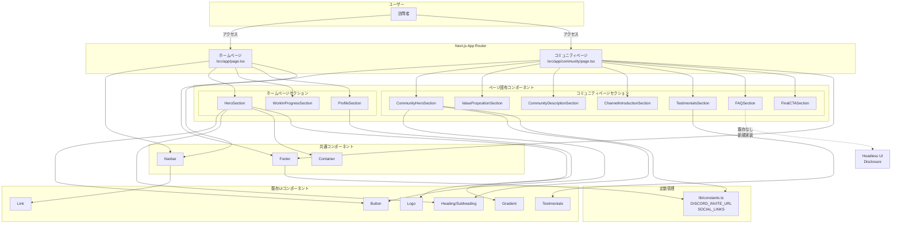
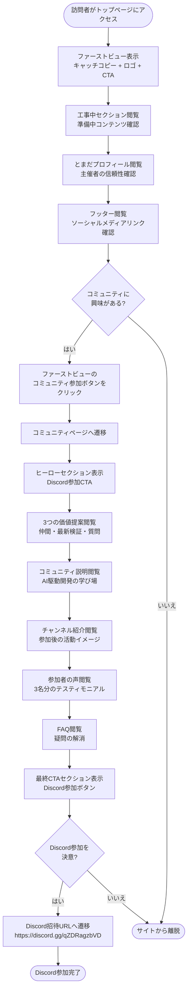
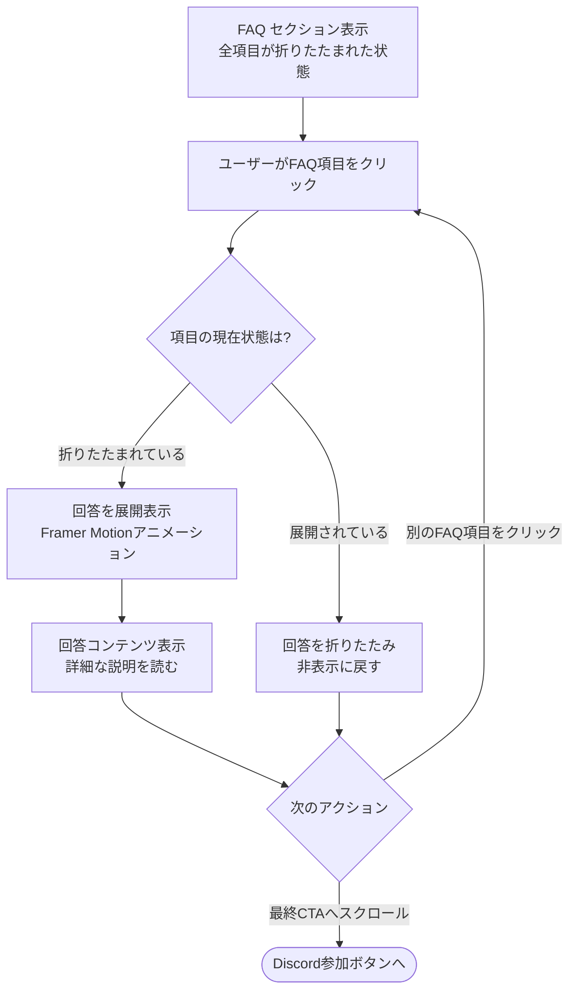

# 技術設計ドキュメント: Discord Community Site

## 概要

**目的:** Vibe Coding StudioのDiscordコミュニティへの参加を促進する静的ランディングページ。AI駆動開発を学ぶ仲間が集まり、「とまだ」の最新検証を見ながら一緒に成長するコミュニティの価値を訪問者に伝える。

**対象ユーザー:** AI駆動開発に興味がある開発者、学習者、技術コミュニティへの参加を検討している人々。

**影響範囲:** 新規ページ追加（/、/community）と定数管理ライブラリの追加。既存のRadiantテンプレート構造に影響を与えず、既存コンポーネントを最大限再利用する。

### 目標

- Discordコミュニティへの参加を促進する魅力的なランディングページを構築
- 既存のRadiantテンプレートデザインシステムとの一貫性を保持
- レスポンシブデザイン（スマホ・タブレット・PC）の完全実装
- コミュニティの価値提案を明確に伝達

### 非目標

- ユーザー認証やログイン機能（将来の拡張候補）
- Discord APIとのリアルタイム連携（静的サイト）
- 動的なコンテンツ管理システム（CMS統合）
- 既存ページ（/company、/pricing）の変更

## アーキテクチャ

### 既存アーキテクチャ分析

**現在のアーキテクチャパターン:**
- Next.js 15 App Routerによるファイルシステムベースルーティング
- `/src/app/page.tsx`: トップページ（既存）
- `/src/app/company/page.tsx`: 会社情報ページ
- `/src/app/pricing/page.tsx`: 料金ページ
- セクションベースのコンポーネント構成（Hero、FeatureSection、BentoSection等）

**保持すべき既存パターン:**
- セクションごとにコンポーネント分割
- AsyncErrorBoundaryによるエラーハンドリング
- Container、Navbar、Footerの一貫した使用
- Headless UI + Framer Motionのアニメーション戦略

**技術的制約:**
- TypeScript厳格モード
- Tailwind CSS v4のユーティリティクラス
- CSP nonceプロバイダーの使用
- エッジランタイム対応

### 高レベルアーキテクチャ



**アーキテクチャの統合:**

- **保持される既存パターン:**
  - セクションベースコンポーネント構成
  - AsyncErrorBoundaryによる各セクションのエラー分離
  - Container/Navbar/Footerの再利用
  - Headless UI + Framer Motionの組み合わせ

- **新規コンポーネントの理由:**
  - `lib/constants.ts`: Discord URLとソーシャルメディアリンクの一元管理
  - `FAQSection`: アコーディオンUI（Headless UI Disclosure使用）
  - ページ固有セクション: 要件に基づく各セクションの実装

- **技術スタックの整合性:**
  - Next.js 15 App Router: 既存ルーティングパターンを踏襲
  - TypeScript厳格モード: 既存の型安全性基準を維持
  - Tailwind CSS v4: 既存のデザイントークンとユーティリティクラスを活用

- **ステアリング原則の遵守:**
  - `structure.md`: `/src/app`のページ配置、`/src/lib`のユーティリティ配置
  - `tech.md`: Next.js 15、TypeScript、Tailwind CSS v4の使用
  - `product.md`: 既存デザインシステムの踏襲、アクセシビリティ基準の維持

### 技術スタックの整合性

**フレームワーク層:**
- **既存技術:** Next.js 15.4.4 (App Router)
- **整合性:** `/src/app/community/page.tsx`として新規ページを追加。既存のルーティング構造を維持。

**スタイリング層:**
- **既存技術:** Tailwind CSS v4、PostCSS
- **整合性:** 既存のデザイントークンとユーティリティクラスを使用。カスタムCSSは追加しない。

**コンポーネント層:**
- **既存技術:** Headless UI、Framer Motion、Heroicons
- **新規依存:** なし（既存ライブラリを活用）
- **整合性:** 既存コンポーネント（Button、Heading、Container、Navbar、Footer、Testimonials等）を最大限再利用。

**ユーティリティ層:**
- **新規追加:** `src/lib/constants.ts`（定数管理）
- **理由:** Discord招待URLとソーシャルメディアリンクを一元管理し、メンテナンス性を向上。既存の`src/lib/`パターンに準拠。

### 主要な設計決定

#### 決定1: 既存コンポーネントの最大限再利用

**決定:** 新規UIコンポーネントを作成せず、既存のRadiantテンプレートコンポーネントを活用する。

**コンテキスト:** 要件15「技術スタックの遵守」で、既存の`/src/components`ディレクトリのコンポーネントを最大限活用することが求められている。

**代替案:**
1. 新規コンポーネントライブラリ（例: shadcn/ui）の導入
2. カスタムコンポーネントをゼロから実装
3. 既存コンポーネントの拡張版を作成

**選択したアプローチ:** 既存コンポーネント（Button、Heading、Container、Navbar、Footer、Testimonials、Link、Logo、Gradient等）をそのまま使用し、ページ固有のセクションコンポーネントのみを`/src/app/page.tsx`および`/src/app/community/page.tsx`内に実装。

**理由:**
- デザインシステムの一貫性を保証
- 新規依存関係の追加を回避
- メンテナンス負荷を最小化
- 既存のアクセシビリティパターンを継承

**トレードオフ:**
- **利点:** 一貫性、保守性、実装速度
- **欠点:** カスタマイズの柔軟性が限定される（ただし要件上は問題なし）

#### 決定2: アコーディオンUIにHeadless UI Disclosureを使用

**決定:** FAQ要件（要件10）のアコーディオン実装にHeadless UI Disclosureコンポーネントを使用。

**コンテキスト:** 既存のNavbarコンポーネントがHeadless UI Disclosureを使用しており、同一パターンを踏襲できる。

**代替案:**
1. React StateとCSSアニメーションで手動実装
2. 別のアコーディオンライブラリ（例: Radix UI）の導入
3. Framer Motionのアニメーション機能のみで実装

**選択したアプローチ:** Headless UI DisclosureとFramer Motionを組み合わせたアコーディオン実装。

**理由:**
- `src/components/navbar.tsx`の既存実装パターンを踏襲
- アクセシビリティ（ARIA属性）が自動で適用される
- 新規依存関係なし
- Framer Motionで滑らかなアニメーションを追加可能

**トレードオフ:**
- **利点:** アクセシビリティ、一貫性、実装の簡潔性
- **欠点:** Headless UIの学習コストが必要（ただし既存使用例があるため最小限）

#### 決定3: 定数管理ファイルの分離

**決定:** Discord招待URLとソーシャルメディアリンクを`src/lib/constants.ts`で一元管理。

**コンテキスト:** 要件12「定数管理システムの実装」で、lib/constants.tsでの一元管理が求められている。

**代替案:**
1. 環境変数（.env.local）での管理
2. 各コンポーネント内でハードコード
3. JSONファイルでの設定管理

**選択したアプローチ:** TypeScriptファイル（`src/lib/constants.ts`）でエクスポートされた定数として管理。

**理由:**
- 型安全性（TypeScriptの型推論）
- ビルド時の静的解析が可能
- 既存の`src/lib/`パターンに準拠（例: `env-validation.ts`、`csp.ts`）
- インポート時のIDEサポート

**トレードオフ:**
- **利点:** 型安全性、IDEサポート、一元管理
- **欠点:** ランタイムでの変更不可（ただし静的サイトのため問題なし）

## システムフロー

### ユーザーフロー: トップページ閲覧から Discord参加まで



### FAQアコーディオンの操作フロー



## 要件トレーサビリティ

| 要件ID | 要件概要 | 実装コンポーネント | インターフェース | システムフロー |
|--------|---------|------------------|----------------|--------------|
| 1.1 | トップページのファーストビュー表示 | `HeroSection` (page.tsx) | `Button`, `Heading`, `Container`, `Logo` | ユーザーフロー: HERO |
| 1.2 | ロゴの視覚的配置 | `Logo` (既存) | - | ユーザーフロー: HERO |
| 1.3 | コミュニティページへの遷移 | `Button href="/community"` | `Link` | ユーザーフロー: CTA_HOME → COMMUNITY_PAGE |
| 1.4 | レスポンシブデザイン | Tailwind CSS レスポンシブクラス | - | 全フロー |
| 2.1 | 工事中セクション表示 | `WorkInProgressSection` (page.tsx) | `Heading`, `Subheading`, `Container` | ユーザーフロー: WIP |
| 2.2 | アイコンによる視覚表現 | Heroicons | - | ユーザーフロー: WIP |
| 2.3-2.5 | レスポンシブカラムレイアウト | Tailwind CSS grid クラス | - | ユーザーフロー: WIP |
| 3.1 | とまだプロフィール紹介 | `ProfileSection` (page.tsx) | `Heading`, `Gradient` | ユーザーフロー: PROFILE |
| 3.2 | アイコンと画像の活用 | Heroicons, `` | - | ユーザーフロー: PROFILE |
| 3.3 | レスポンシブデザイン | Tailwind CSS | - | ユーザーフロー: PROFILE |
| 4.1 | フッターリンク表示 | `Footer` (既存) | `Link` | ユーザーフロー: FOOTER |
| 4.2 | Discordコミュニティリンク | `Footer` + `constants.ts` | `DISCORD_INVITE_URL` | ユーザーフロー: FOOTER |
| 4.3 | ソーシャルメディアリンク | `Footer` + `constants.ts` | `SOCIAL_LINKS` | ユーザーフロー: FOOTER |
| 4.4 | 新しいタブで外部サイトを開く | `Link target="_blank"` | - | ユーザーフロー: FOOTER |
| 5.1 | コミュニティページのヒーローセクション | `CommunityHeroSection` (community/page.tsx) | `Heading`, `Button` | ユーザーフロー: COMMUNITY_HERO |
| 5.2 | Discord参加CTA | `Button href={DISCORD_INVITE_URL}` | `constants.ts` | ユーザーフロー: COMMUNITY_HERO |
| 5.3 | Discord招待URLへ遷移 | `Link` | - | ユーザーフロー: DISCORD_REDIRECT |
| 5.4 | レスポンシブデザイン | Tailwind CSS | - | ユーザーフロー: COMMUNITY_HERO |
| 6.1 | 3つの価値提案表示 | `ValuePropositionSection` (community/page.tsx) | `Heading`, `Subheading` | ユーザーフロー: VALUE_PROP |
| 6.2 | アイコンと説明文の視覚表現 | Heroicons | - | ユーザーフロー: VALUE_PROP |
| 6.3-6.5 | レスポンシブカラムレイアウト | Tailwind CSS grid | - | ユーザーフロー: VALUE_PROP |
| 7.1 | コミュニティ説明セクション | `CommunityDescriptionSection` (community/page.tsx) | `Heading`, `Text` | ユーザーフロー: COMMUNITY_DESC |
| 7.2-7.3 | AI駆動開発の学び場説明 | テキストコンテンツ | - | ユーザーフロー: COMMUNITY_DESC |
| 8.1 | チャンネル紹介セクション | `ChannelIntroductionSection` (community/page.tsx) | `Heading`, `Subheading` | ユーザーフロー: CHANNELS |
| 8.2-8.3 | チャンネル説明とアイコン | Heroicons | - | ユーザーフロー: CHANNELS |
| 9.1 | 参加者の声セクション（3名） | `Testimonials` (既存) | `testimonials` 配列 | ユーザーフロー: TESTIMONIALS |
| 9.2 | テスティモニアル内容 | `testimonials` データ | - | ユーザーフロー: TESTIMONIALS |
| 9.3-9.5 | レスポンシブカラムレイアウト | Tailwind CSS grid | - | ユーザーフロー: TESTIMONIALS |
| 10.1 | FAQセクション（アコーディオン） | `FAQSection` (community/page.tsx) | Headless UI `Disclosure` | FAQアコーディオンフロー: FAQ_INIT |
| 10.2 | FAQ項目展開 | `DisclosureButton` + `DisclosurePanel` | Framer Motion | FAQアコーディオンフロー: EXPAND |
| 10.3 | FAQ項目折りたたみ | `DisclosureButton` トグル | - | FAQアコーディオンフロー: COLLAPSE |
| 10.4 | レスポンシブデザイン | Tailwind CSS | - | FAQアコーディオンフロー |
| 11.1 | 最終CTAセクション | `FinalCTASection` (community/page.tsx) | `Button`, `Heading` | ユーザーフロー: FINAL_CTA |
| 11.2 | Discord参加ボタン | `Button href={DISCORD_INVITE_URL}` | `constants.ts` | ユーザーフロー: DISCORD_REDIRECT |
| 11.3 | ヒーローCTAとの視覚的一貫性 | 同一の `Button` コンポーネント | - | ユーザーフロー: FINAL_CTA |
| 12.1 | lib/constants.tsでの一元管理 | `src/lib/constants.ts` | `export const` | 全フロー |
| 12.2 | DISCORD_INVITE_URL定義 | `constants.ts` | `string` | 全フロー |
| 12.3 | SOCIAL_LINKS定義 | `constants.ts` | `Array<SocialLink>` | ユーザーフロー: FOOTER |
| 12.4 | 定数のインポート使用 | `import { DISCORD_INVITE_URL } from '@/lib/constants'` | - | 全フロー |
| 13.1-13.4 | レスポンシブデザイン実装 | Tailwind CSS `sm:`, `md:`, `lg:` クラス | - | 全フロー |
| 14.1 | デザイントークンの再利用 | 既存Tailwind CSS設定 | - | 全フロー |
| 14.2 | Heroicons使用 | `@heroicons/react` | - | 全フロー |
| 14.3 | ロゴファイル使用 | `public/logo.png`, `public/logo-wide-bg-black.png` | `Logo` コンポーネント | ユーザーフロー: HERO |
| 14.4 | Headless UI準拠 | `Disclosure`, `Button`, `Link` | - | 全フロー |
| 15.1 | Next.js 15 App Router | `/src/app/page.tsx`, `/src/app/community/page.tsx` | - | 全フロー |
| 15.2 | TypeScript厳格モード | `tsconfig.json` `strict: true` | - | 全フロー |
| 15.3 | Tailwind CSS v4使用 | `tailwind.css` | - | 全フロー |
| 15.4 | 既存コンポーネント活用 | `/src/components/*` | Button, Heading, Container 等 | 全フロー |
| 15.5 | /src/app/ディレクトリ実装 | `page.tsx` ファイル | - | 全フロー |

## コンポーネントとインターフェース

### プレゼンテーション層

#### ホームページ (`/src/app/page.tsx`)

**責務と境界**
- **主要責務:** トップページのセクション構成とレイアウト
- **ドメイン境界:** プレゼンテーション層（UIコンポーネントの組み立て）
- **データ所有権:** なし（静的コンテンツのみ）

**依存関係**
- **インバウンド:** Next.js App Routerからのルーティング
- **アウトバウンド:** Container、Navbar、Footer、Heading、Button、Logo、Gradient等の既存コンポーネント
- **外部:** なし

**コントラクト定義**

ページコンポーネント構造:
```typescript
// /src/app/page.tsx

import { Button } from "@/components/button"
import { Container } from "@/components/container"
import { Footer } from "@/components/footer"
import { Gradient } from "@/components/gradient"
import { Navbar } from "@/components/navbar"
import { Logo } from "@/components/logo"
import { Heading, Subheading } from "@/components/text"
import type { Metadata } from "next"

export const metadata: Metadata = {
  title: "Vibe Coding Studio - AI駆動開発コミュニティ",
  description: "AI駆動開発を学ぶ仲間が集まり、情報を共有し合い、一緒に成長するDiscordコミュニティ",
}

// セクションコンポーネント（ページ内定義）
function HeroSection(): JSX.Element;
function WorkInProgressSection(): JSX.Element;
function ProfileSection(): JSX.Element;

export default function Home(): JSX.Element;
```

**セクションコンポーネント:**

1. **HeroSection**
   - ファーストビュー（キャッチコピー、ロゴ、コミュニティ参加ボタン）
   - 使用コンポーネント: `Container`, `Navbar`, `Heading`, `Button`, `Logo`, `Gradient`

2. **WorkInProgressSection**
   - 工事中セクション（準備中コンテンツの告知）
   - 使用コンポーネント: `Container`, `Heading`, `Subheading`, Heroicons
   - レスポンシブ: `grid-cols-1 md:grid-cols-2 lg:grid-cols-3`

3. **ProfileSection**
   - とまだのプロフィール紹介
   - 使用コンポーネント: `Container`, `Heading`, `Gradient`, Heroicons

#### コミュニティページ (`/src/app/community/page.tsx`)

**責務と境界**
- **主要責務:** コミュニティページのセクション構成とレイアウト
- **ドメイン境界:** プレゼンテーション層
- **データ所有権:** なし（静的コンテンツ + constants.tsの参照）

**依存関係**
- **インバウンド:** Next.js App Routerからのルーティング
- **アウトバウンド:** Container、Navbar、Footer、Heading、Button、Testimonials、Headless UI Disclosure等
- **外部:** `@/lib/constants` (DISCORD_INVITE_URL)

**コントラクト定義**

ページコンポーネント構造:
```typescript
// /src/app/community/page.tsx

import { Button } from "@/components/button"
import { Container } from "@/components/container"
import { Footer } from "@/components/footer"
import { Navbar } from "@/components/navbar"
import { Testimonials } from "@/components/testimonials"
import { Heading, Subheading, Text } from "@/components/text"
import { Disclosure, DisclosureButton, DisclosurePanel } from "@headlessui/react"
import { ChevronDownIcon } from "@heroicons/react/24/outline"
import { motion } from "framer-motion"
import type { Metadata } from "next"
import { DISCORD_INVITE_URL } from "@/lib/constants"

export const metadata: Metadata = {
  title: "コミュニティ - Vibe Coding Studio",
  description: "AI駆動開発を学ぶ仲間と繋がり、最新検証を見ながら一緒に成長するDiscordコミュニティに参加しよう",
}

// セクションコンポーネント（ページ内定義）
function CommunityHeroSection(): JSX.Element;
function ValuePropositionSection(): JSX.Element;
function CommunityDescriptionSection(): JSX.Element;
function ChannelIntroductionSection(): JSX.Element;
function FAQSection(): JSX.Element;
function FinalCTASection(): JSX.Element;

export default function CommunityPage(): JSX.Element;
```

**セクションコンポーネント:**

1. **CommunityHeroSection**
   - ヒーローセクション（Discord参加への強いCTA）
   - 使用コンポーネント: `Container`, `Navbar`, `Heading`, `Button`
   - 定数: `DISCORD_INVITE_URL`

2. **ValuePropositionSection**
   - 3つの価値提案（仲間と繋がる、最新検証、気軽に質問）
   - 使用コンポーネント: `Container`, `Heading`, `Subheading`, Heroicons
   - レスポンシブ: `grid-cols-1 md:grid-cols-2 lg:grid-cols-3`

3. **CommunityDescriptionSection**
   - コミュニティの説明
   - 使用コンポーネント: `Container`, `Heading`, `Text`

4. **ChannelIntroductionSection**
   - チャンネル紹介
   - 使用コンポーネント: `Container`, `Heading`, `Subheading`, Heroicons

5. **FAQSection**
   - FAQ（アコーディオン形式）
   - 使用コンポーネント: `Container`, `Heading`, Headless UI `Disclosure`, Framer Motion
   - アコーディオンアニメーション: `motion.div` with `initial`, `animate`, `exit`

6. **FinalCTASection**
   - 最終CTA（Discord参加ボタン）
   - 使用コンポーネント: `Container`, `Heading`, `Button`
   - 定数: `DISCORD_INVITE_URL`

### データ層

#### 定数管理 (`/src/lib/constants.ts`)

**責務と境界**
- **主要責務:** Discord招待URLとソーシャルメディアリンクの一元管理
- **ドメイン境界:** データ層（設定管理）
- **データ所有権:** Discord URL、ソーシャルメディアリンク

**依存関係**
- **インバウンド:** ページコンポーネント、Footerコンポーネント
- **アウトバウンド:** なし
- **外部:** なし

**コントラクト定義**

```typescript
// /src/lib/constants.ts

/**
 * Discord招待URL
 */
export const DISCORD_INVITE_URL = "https://discord.gg/qZDRagzbVD" as const

/**
 * ソーシャルメディアリンク型定義
 */
export interface SocialLink {
  /** リンク名 */
  name: string
  /** リンク先URL */
  url: string
  /** アイコン種別（例: 'twitter', 'youtube', 'qiita', 'note', 'udemy'） */
  icon: string
}

/**
 * ソーシャルメディアリンク一覧
 */
export const SOCIAL_LINKS: readonly SocialLink[] = [
  {
    name: "Twitter",
    url: "https://twitter.com/tomadatech",
    icon: "twitter",
  },
  {
    name: "YouTube",
    url: "https://youtube.com/@tomadatech",
    icon: "youtube",
  },
  {
    name: "Qiita",
    url: "https://qiita.com/tomada",
    icon: "qiita",
  },
  {
    name: "note",
    url: "https://note.com/tomada",
    icon: "note",
  },
  {
    name: "Udemy",
    url: "https://udemy.com/user/tomada",
    icon: "udemy",
  },
] as const

/**
 * サイトメタデータ
 */
export const SITE_METADATA = {
  title: "Vibe Coding Studio",
  description: "AI駆動開発を学ぶ仲間が集まり、情報を共有し合い、一緒に成長するコミュニティ",
  url: "https://vibecoding.studio",
} as const
```

**事前条件:**
- なし（定数ファイルは常にインポート可能）

**事後条件:**
- 型安全な定数がエクスポートされ、インポート側で使用可能

**不変条件:**
- `DISCORD_INVITE_URL`は常に有効なURL文字列
- `SOCIAL_LINKS`は読み取り専用配列（`readonly`）
- すべてのソーシャルリンクは`SocialLink`型に準拠

### 既存コンポーネントの統合

#### Footer拡張

**統合戦略:** 既存の`Footer`コンポーネントを拡張し、`constants.ts`からソーシャルメディアリンクをインポート。

**変更点:**
- `SocialLinks`関数内で`SOCIAL_LINKS`配列をマッピング
- `Link`コンポーネントに`href={link.url}`を設定
- アイコンは既存パターン（SVGコンポーネント）を維持または拡張

**後方互換性:**
- 既存のFooter構造を維持
- 新規ページ以外のページには影響なし

#### Testimonials再利用

**統合戦略:** 既存の`Testimonials`コンポーネントをそのまま使用し、コミュニティページ用のテスティモニアルデータを`testimonials`配列で上書き。

**データ構造:**
```typescript
const communityTestimonials = [
  {
    img: "/testimonials/community-member-1.jpg",
    name: "参加者A",
    title: "フロントエンドエンジニア",
    quote: "AI駆動開発の実践的な知識を得られ、とまだの最新検証が非常に参考になっています。",
  },
  {
    img: "/testimonials/community-member-2.jpg",
    name: "参加者B",
    title: "バックエンドエンジニア",
    quote: "コミュニティメンバーと気軽に質問し合える環境が素晴らしいです。",
  },
  {
    img: "/testimonials/community-member-3.jpg",
    name: "参加者C",
    title: "フルスタックエンジニア",
    quote: "同じ目標を持つ仲間と繋がれて、モチベーションが維持できています。",
  },
]
```

**統合方法:**
- `Testimonials`コンポーネントは`testimonials`プロパティを受け取るように拡張
- または、コミュニティページ内で直接`testimonials`配列を定義して使用

## データモデル

### 論理データモデル

このプロジェクトは静的サイトのため、データベースやAPIは使用しません。すべてのデータは静的コンテンツとして定義されます。

**エンティティ:**

1. **SocialLink** (ソーシャルメディアリンク)
   - `name`: string - リンク名（例: "Twitter"）
   - `url`: string - リンク先URL
   - `icon`: string - アイコン種別

2. **Testimonial** (参加者の声)
   - `img`: string - 画像パス
   - `name`: string - 参加者名
   - `title`: string - 所属・役職
   - `quote`: string - コメント

3. **FAQItem** (FAQ項目)
   - `question`: string - 質問
   - `answer`: string - 回答

**データ契約:**

```typescript
// ソーシャルメディアリンク
export interface SocialLink {
  name: string
  url: string
  icon: string
}

// 参加者の声
export interface Testimonial {
  img: string
  name: string
  title: string
  quote: string
}

// FAQ項目
export interface FAQItem {
  question: string
  answer: string
}
```

**検証ルール:**
- `url`: 有効なURL形式（`https://`で始まる）
- `img`: 有効な画像パス（`/`で始まる相対パス）
- すべての文字列フィールド: 空文字列不可

**一貫性:**
- すべてのデータは`constants.ts`またはページコンポーネント内で静的に定義
- データ変更時はビルド時にTypeScriptの型チェックで検証

## エラーハンドリング

### エラー戦略

このプロジェクトは静的サイトのため、サーバーサイドエラーやAPIエラーは発生しません。主なエラーケースはクライアントサイドのレンダリングエラーです。

**エラーカテゴリ:**

1. **クライアントサイドレンダリングエラー (Client-Side Errors)**
   - コンポーネントのレンダリング失敗
   - 画像の読み込み失敗
   - アニメーションエラー

2. **ユーザー操作エラー (User Interaction Errors)**
   - リンククリック時のナビゲーションエラー
   - アコーディオン展開/折りたたみの失敗

### エラーカテゴリと対応

**クライアントサイドエラー:**
- **対応:** `AsyncErrorBoundary`コンポーネントで各セクションを囲む
- **フォールバック:** エラーメッセージの表示とリトライボタン
- **実装:** 既存の`src/components/error-boundary.tsx`を活用

**画像読み込みエラー:**
- **対応:** ``タグの`onError`ハンドラーでプレースホルダー画像に置き換え
- **フォールバック:** デフォルト画像または色付き背景

**リンクナビゲーションエラー:**
- **対応:** Next.js Linkコンポーネントの自動エラーハンドリング
- **フォールバック:** ブラウザのデフォルトエラーページ

**アコーディオン操作エラー:**
- **対応:** Headless UI Disclosureの組み込みエラーハンドリング
- **フォールバック:** 初期状態（折りたたまれた状態）に戻る

### エラー境界の配置

```typescript
// /src/app/page.tsx
export default function Home() {
  return (
    <div className="overflow-hidden">
      <AsyncErrorBoundary>
        <HeroSection />
      </AsyncErrorBoundary>
      <main>
        <AsyncErrorBoundary>
          <WorkInProgressSection />
        </AsyncErrorBoundary>
        <AsyncErrorBoundary>
          <ProfileSection />
        </AsyncErrorBoundary>
      </main>
      <AsyncErrorBoundary>
        <Footer />
      </AsyncErrorBoundary>
    </div>
  )
}
```

```typescript
// /src/app/community/page.tsx
export default function CommunityPage() {
  return (
    <div className="overflow-hidden">
      <AsyncErrorBoundary>
        <CommunityHeroSection />
      </AsyncErrorBoundary>
      <main>
        <AsyncErrorBoundary>
          <ValuePropositionSection />
        </AsyncErrorBoundary>
        <AsyncErrorBoundary>
          <CommunityDescriptionSection />
        </AsyncErrorBoundary>
        <AsyncErrorBoundary>
          <ChannelIntroductionSection />
        </AsyncErrorBoundary>
        <AsyncErrorBoundary>
          <Testimonials />
        </AsyncErrorBoundary>
        <AsyncErrorBoundary>
          <FAQSection />
        </AsyncErrorBoundary>
        <AsyncErrorBoundary>
          <FinalCTASection />
        </AsyncErrorBoundary>
      </main>
      <AsyncErrorBoundary>
        <Footer />
      </AsyncErrorBoundary>
    </div>
  )
}
```

### モニタリング

**エラー追跡:**
- 開発環境: ブラウザコンソールにエラーログを出力
- 本番環境: CSP違反レポート（`/api/csp-report`）でセキュリティエラーを追跡

**ログ記録:**
- `AsyncErrorBoundary`内でエラーをキャッチし、`console.error`でログ出力
- 将来的な拡張: Sentry等のエラートラッキングサービス統合

**ヘルスモニタリング:**
- 静的サイトのため、サーバーヘルスチェックは不要
- Vercel/Netlifyのビルドステータスで展開状況を監視

## テスト戦略

### ユニットテスト

**対象:**
- `src/lib/constants.ts`の定数エクスポート
- データ型定義（`SocialLink`, `Testimonial`, `FAQItem`）

**テストケース:**
```typescript
// __tests__/lib/constants.test.ts

describe('constants.ts', () => {
  it('DISCORD_INVITE_URLが有効なURL形式である', () => {
    expect(DISCORD_INVITE_URL).toMatch(/^https:\/\/discord\.gg\//)
  })

  it('SOCIAL_LINKSが5つのリンクを含む', () => {
    expect(SOCIAL_LINKS).toHaveLength(5)
  })

  it('各ソーシャルリンクが必須フィールドを持つ', () => {
    SOCIAL_LINKS.forEach(link => {
      expect(link).toHaveProperty('name')
      expect(link).toHaveProperty('url')
      expect(link).toHaveProperty('icon')
      expect(link.url).toMatch(/^https:\/\//)
    })
  })
})
```

### コンポーネントテスト

**対象:**
- `HeroSection`、`WorkInProgressSection`、`ProfileSection`（トップページ）
- `CommunityHeroSection`、`ValuePropositionSection`、`FAQSection`等（コミュニティページ）

**テストケース:**
```typescript
// __tests__/app/page.test.tsx

import { render, screen } from '@testing-library/react'
import Home from '@/app/page'

describe('Home Page', () => {
  it('ファーストビューにロゴが表示される', () => {
    render(<Home />)
    const logo = screen.getByRole('img', { name: /Vibe Coding Studio/i })
    expect(logo).toBeInTheDocument()
  })

  it('コミュニティ参加ボタンが表示される', () => {
    render(<Home />)
    const button = screen.getByRole('link', { name: /コミュニティに参加/i })
    expect(button).toBeInTheDocument()
    expect(button).toHaveAttribute('href', '/community')
  })

  it('工事中セクションが表示される', () => {
    render(<Home />)
    const heading = screen.getByRole('heading', { name: /準備中/i })
    expect(heading).toBeInTheDocument()
  })
})
```

```typescript
// __tests__/app/community/page.test.tsx

import { render, screen, fireEvent } from '@testing-library/react'
import CommunityPage from '@/app/community/page'
import { DISCORD_INVITE_URL } from '@/lib/constants'

describe('Community Page', () => {
  it('ヒーローセクションにDiscord参加ボタンが表示される', () => {
    render(<CommunityPage />)
    const button = screen.getByRole('link', { name: /Discordに参加/i })
    expect(button).toBeInTheDocument()
    expect(button).toHaveAttribute('href', DISCORD_INVITE_URL)
  })

  it('3つの価値提案が表示される', () => {
    render(<CommunityPage />)
    expect(screen.getByText(/仲間と繋がる/i)).toBeInTheDocument()
    expect(screen.getByText(/最新検証/i)).toBeInTheDocument()
    expect(screen.getByText(/気軽に質問/i)).toBeInTheDocument()
  })

  it('FAQアコーディオンが動作する', () => {
    render(<CommunityPage />)
    const faqButton = screen.getAllByRole('button')[0] // 最初のFAQ項目

    // 初期状態: 回答は非表示
    expect(screen.queryByText(/回答内容/i)).not.toBeVisible()

    // クリック: 回答が表示される
    fireEvent.click(faqButton)
    expect(screen.getByText(/回答内容/i)).toBeVisible()

    // 再度クリック: 回答が非表示になる
    fireEvent.click(faqButton)
    expect(screen.queryByText(/回答内容/i)).not.toBeVisible()
  })

  it('参加者の声が3名分表示される', () => {
    render(<CommunityPage />)
    const testimonials = screen.getAllByRole('figure')
    expect(testimonials).toHaveLength(3)
  })
})
```

### E2E/UIテスト

**対象:**
- ユーザーフロー全体（トップページ → コミュニティページ → Discord参加）

**テストケース（Playwright想定）:**
```typescript
// e2e/user-flow.spec.ts

import { test, expect } from '@playwright/test'
import { DISCORD_INVITE_URL } from '@/lib/constants'

test.describe('ユーザーフロー', () => {
  test('トップページからコミュニティページへ遷移し、Discord参加ボタンをクリックできる', async ({ page }) => {
    // トップページにアクセス
    await page.goto('/')

    // ファーストビューのロゴが表示される
    await expect(page.locator('img[alt*="Vibe Coding Studio"]')).toBeVisible()

    // コミュニティ参加ボタンをクリック
    await page.click('a:has-text("コミュニティに参加")')

    // コミュニティページに遷移
    await expect(page).toHaveURL('/community')

    // ヒーローセクションのDiscord参加ボタンが表示される
    const discordButton = page.locator(`a[href="${DISCORD_INVITE_URL}"]`).first()
    await expect(discordButton).toBeVisible()

    // Discord参加ボタンのhrefが正しい
    await expect(discordButton).toHaveAttribute('href', DISCORD_INVITE_URL)
  })

  test('FAQアコーディオンの展開/折りたたみが動作する', async ({ page }) => {
    await page.goto('/community')

    // FAQセクションまでスクロール
    await page.locator('text=よくある質問').scrollIntoViewIfNeeded()

    // 最初のFAQ項目を取得
    const firstFaq = page.locator('[data-testid="faq-item"]').first()
    const faqButton = firstFaq.locator('button')
    const faqAnswer = firstFaq.locator('[data-testid="faq-answer"]')

    // 初期状態: 回答は非表示
    await expect(faqAnswer).not.toBeVisible()

    // クリック: 回答が表示される
    await faqButton.click()
    await expect(faqAnswer).toBeVisible()

    // 再度クリック: 回答が非表示になる
    await faqButton.click()
    await expect(faqAnswer).not.toBeVisible()
  })

  test('レスポンシブデザインが動作する（スマホ・タブレット・PC）', async ({ page }) => {
    // スマホサイズ
    await page.setViewportSize({ width: 375, height: 667 })
    await page.goto('/community')

    // 価値提案が1カラムで表示される
    const valuePropSection = page.locator('[data-testid="value-proposition"]')
    await expect(valuePropSection).toHaveCSS('grid-template-columns', /1/)

    // タブレットサイズ
    await page.setViewportSize({ width: 768, height: 1024 })
    await expect(valuePropSection).toHaveCSS('grid-template-columns', /2/)

    // PCサイズ
    await page.setViewportSize({ width: 1440, height: 900 })
    await expect(valuePropSection).toHaveCSS('grid-template-columns', /3/)
  })
})
```

### パフォーマンステスト

**対象:**
- 初期ページロード時間
- Lighthouseスコア

**テストケース:**
```typescript
// __tests__/performance.test.ts

import { test, expect } from '@playwright/test'

test.describe('パフォーマンステスト', () => {
  test('トップページの初期ロード時間が2秒以内', async ({ page }) => {
    const startTime = Date.now()
    await page.goto('/')
    const loadTime = Date.now() - startTime

    expect(loadTime).toBeLessThan(2000)
  })

  test('コミュニティページのLighthouseスコアが90以上', async ({ page }) => {
    // Lighthouse CLI統合またはPlaywright Lighthouseプラグイン使用
    // パフォーマンス、アクセシビリティ、ベストプラクティス、SEOの各スコアを検証
  })
})
```

## セキュリティ考慮事項

### 脅威モデリング

このプロジェクトは静的サイトのため、サーバーサイドの脅威は最小限です。主な脅威は以下の通り：

1. **クロスサイトスクリプティング（XSS）**
   - Reactの自動エスケープ機能により軽減
   - CSP（Content Security Policy）でインラインスクリプトを制限

2. **外部リンクのセキュリティリスク**
   - `target="_blank"`使用時の`rel="noopener noreferrer"`設定
   - Discordリンクの改ざん防止（定数管理）

3. **データインジェクション**
   - 静的コンテンツのため、ユーザー入力は存在しない
   - TypeScript型定義で不正なデータ構造を防止

### セキュリティコントロール

**XSS対策:**
- Reactの自動エスケープ機能を活用
- `dangerouslySetInnerHTML`は使用しない
- CSP nonceプロバイダーで安全なスクリプト実行を保証

**外部リンクの安全性:**
```typescript
// すべての外部リンクに以下の属性を設定
<Link href={externalUrl} target="_blank" rel="noopener noreferrer">
  External Link
</Link>
```

**定数管理によるURL改ざん防止:**
- `constants.ts`で一元管理
- TypeScriptの`as const`でリードオンリー化

**CSP設定:**
- 既存の`src/lib/csp.ts`および`src/middleware.ts`を活用
- 開発環境: Report-Onlyモード
- 本番環境: エンフォースモード（オプション）

### コンプライアンス要件

**WCAG 2.1 AA準拠:**
- Headless UIコンポーネントによるARIA属性の自動適用
- キーボードナビゲーションのサポート
- 適切なコントラスト比の確保

**データプライバシー:**
- ユーザーデータの収集なし
- Cookieの使用なし（トラッキングなし）

## パフォーマンスとスケーラビリティ

### ターゲットメトリクス

**Core Web Vitals:**
- **LCP (Largest Contentful Paint):** < 2.5秒
- **FID (First Input Delay):** < 100ミリ秒
- **CLS (Cumulative Layout Shift):** < 0.1

**初期バンドルサイズ:**
- 初期バンドル: < 500KB（gzip圧縮後）

### スケーリング戦略

**水平スケーリング:**
- 静的サイトのため、CDN（Vercel Edge Network、Netlify CDN）による配信
- エッジロケーションでのキャッシュ

**キャッシュ戦略:**
- 静的アセット（画像、フォント）: 1年間のキャッシュ（`Cache-Control: public, max-age=31536000, immutable`）
- HTMLページ: 60秒のstale-while-revalidate（`Cache-Control: public, s-maxage=60, stale-while-revalidate=3600`）

**画像最適化:**
- Next.js Image Optimizationを活用
- AVIF/WebP自動変換
- レスポンシブ画像の提供

### 最適化手法

**バンドル最適化:**
- 既存のRadiantテンプレートのツリーシェイキング設定を継承
- 使用されていないコンポーネントの自動削除
- 動的インポート（必要に応じて）

**レンダリング最適化:**
- React Server Components（Next.js 15 App Router）
- 静的サイト生成（SSG）による事前レンダリング

**ネットワーク最適化:**
- リソースのプリロード（`<link rel="preload">`）
- フォントのプリロード
- 重要なCSS/JSの優先的な読み込み

---

**ドキュメントバージョン:** 1.0
**最終更新日:** 2025-10-20
**承認状態:** レビュー待ち
