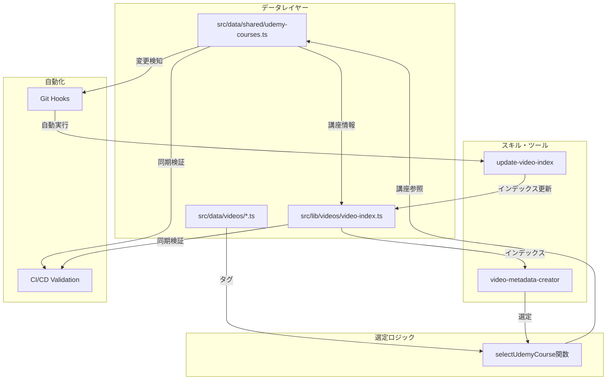
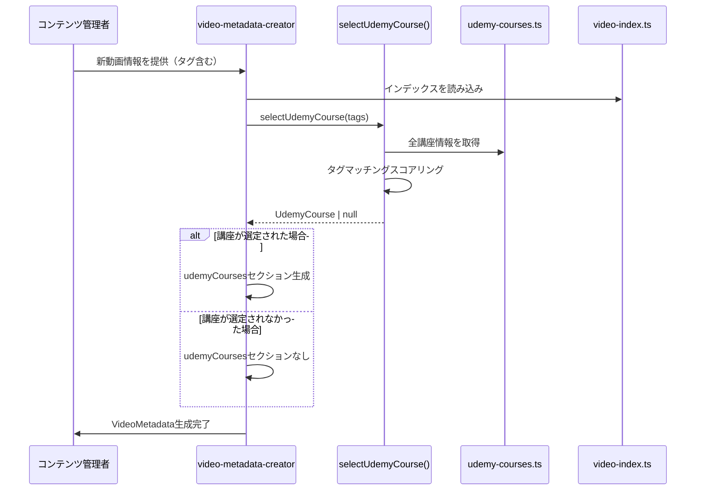
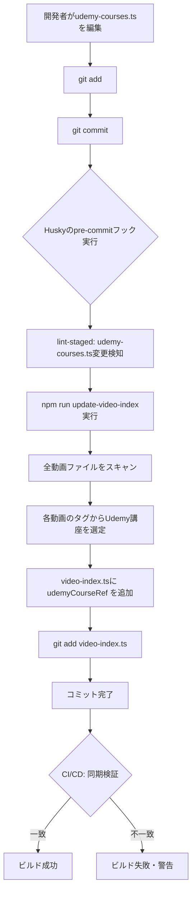
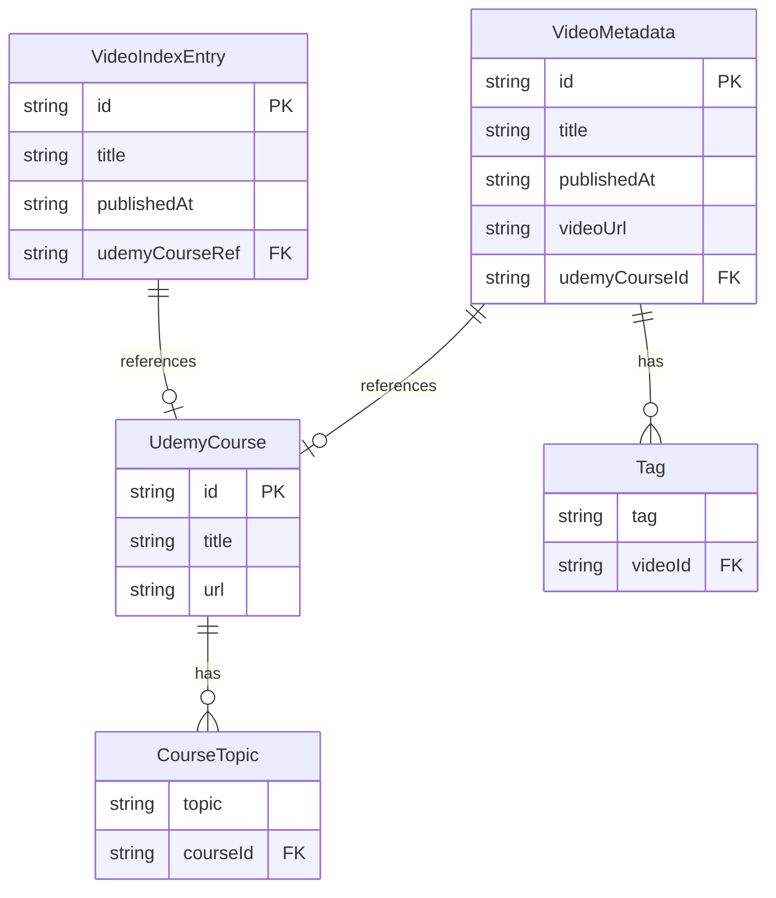
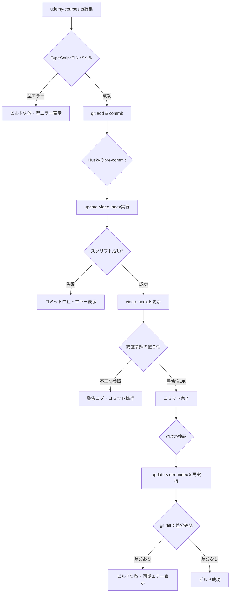

# 技術設計書 - Udemy講座管理システム

## Overview

本機能は、Vibe Coding StudioのUdemy講座情報を一元管理し、YouTube動画のタグに基づいて適切な講座（個別クーポンページまたはフィルタ付きURL）を自動選定するシステムです。

**Purpose**: 現在、各動画ファイルに分散しているUdemy講座情報を単一のデータソースに集約し、`video-metadata-creator` スキルのトークン使用量を削減しながら、講座情報の保守性を向上させます。

**Users**: コンテンツ管理者、開発者、および `video-metadata-creator` スキル利用者が、効率的にUdemy講座情報を管理・参照できるようになります。

**Impact**:
- 講座情報の更新作業を1ファイルに集約（現状：29個の動画ファイルを個別更新 → 変更後：1ファイルのみ更新）
- `video-metadata-creator` スキルのトークン使用量を約10,000トークン削減（全講座情報の読み込みが不要に）
- 動画インデックスシステムと統合し、関連動画検索と同じメカニズムでUdemy講座を参照可能

### Goals

- Udemy講座情報を `src/data/shared/udemy-courses.ts` に一元管理
- 動画タグから適切な講座またはフィルタURLを自動選定する `selectUdemyCourse()` 関数の実装
- 動画インデックスに `udemyCourseRef` フィールドを追加し、インデックスベースでの講座情報アクセスを実現
- `video-metadata-creator` スキルのパフォーマンス最適化（トークン削減、ファイル読み込み削減）
- Git HooksによるUdemy講座情報とインデックスの自動同期

### Non-Goals

- Udemy APIとの統合（外部API連携は対象外）
- リアルタイムのクーポン在庫管理（手動管理を継続）
- 動画メタデータ構造の大幅な変更（既存の `VideoMetadata` 型を維持）
- 複数言語対応のクーポン管理（日本語のみ対応）

## Architecture

### 既存アーキテクチャの分析

現在のシステムは、video-indexing-systemによって以下の構造を持っています：

**既存パターン**:
- `src/data/videos/*.ts` - 個別の動画メタデータファイル（29ファイル）
- `src/data/shared/common-sections.ts` - 共通セクション（SNS、Discord、エンゲージメント）の一元管理
- `src/lib/videos/video-index.ts` - 動画インデックス（自動生成、関連動画検索用）
- `src/types/video.ts` - VideoMetadata型定義

**現在のUdemy講座情報の管理方法**:
各動画ファイルに `udemyCourses` セクションが個別に定義されており、以下の課題があります：
- 講座URLのフィルタ条件（`?topic=claude-code`, `?topic=codex`）がハードコード
- 講座情報の更新時に複数ファイルを修正する必要がある
- `video-metadata-creator` スキルが全動画ファイルを読み込んで講座情報を抽出（高トークン消費）

### High-Level Architecture



**Architecture Integration**:

**既存パターンの保持**:
- `common-sections.ts` と同じパターンで `udemy-courses.ts` を配置（共通データの一元管理）
- video-indexing-systemと統合し、インデックスに `udemyCourseRef` を追加
- `VideoMetadata` 型の `udemyCourses` セクションは既存の構造を維持

**新規コンポーネントの導入理由**:
- **udemy-courses.ts**: 講座情報の単一信頼できる情報源（SSOT: Single Source of Truth）
- **selectUdemyCourse()**: 動画タグから講座を自動判定するロジックの抽出と再利用
- **Git Hooks**: 講座情報変更時のインデックス自動更新による同期状態の保証

**Technology Alignment**:
- TypeScript厳格モード準拠
- Next.js 15 App Routerの静的ファイル管理パターンに準拠
- 既存のテストフレームワーク（Jest）を使用

**Steering Compliance**:
- プロジェクト構造（structure.md）: `src/data/shared/` の共通データ管理パターンに従う
- 技術スタック（tech.md）: TypeScript厳格モード、テストカバレッジ80%以上を維持
- 製品方針（product.md）: 保守性の高いコードベース、拡張性のある設計を実現

### Technology Alignment

本機能は既存のVibe Coding Studioの技術スタックに完全に整合します：

**既存技術スタックの活用**:
- **TypeScript 5**: 厳格モードで型安全性を確保
- **Next.js 15**: App Routerの静的データ管理パターンを踏襲
- **Jest**: 既存のテストフレームワークでユニットテスト実装

**新規導入ライブラリ**:
- **husky** (v9): Git Hooksの管理（pre-commit）
- **lint-staged**: ステージングされたファイルに対するタスク実行

**既存パターンとの整合**:
- `src/data/shared/common-sections.ts` と同様の共通データ管理パターン
- video-indexing-systemのインデックス構造を拡張（後方互換性を維持）

### 主要設計決定

#### 決定1: Udemy講座情報の一元管理場所

**Decision**: `src/data/shared/udemy-courses.ts` に全講座情報を集約

**Context**: 現在、各動画ファイルに講座情報が分散しており、以下の問題が発生しています：
- 講座URLやフィルタ条件の変更時に29ファイルを個別更新
- `video-metadata-creator` スキルが全動画ファイルを読み込み、トークン消費が大きい
- 講座情報の一貫性を保つことが困難

**Alternatives**:
1. **データベース（Supabase等）に保存**: リアルタイムな更新が可能だが、静的サイト生成（SSG）のメリットを失う
2. **環境変数で管理**: 設定が簡単だが、型安全性がなく、複雑な講座選定ロジックに対応できない
3. **共通TypeScriptファイル（選択）**: 型安全性、静的解析、既存パターンとの整合性を確保

**Selected Approach**:
`src/data/shared/udemy-courses.ts` にTypeScriptファイルとして実装し、以下の構造を持たせます：
```typescript
export interface UdemyCourse {
  id: string
  title: string
  url: string
  topics: string[] // 関連トピック/タグ
}

export const udemyCourses: UdemyCourse[] = [...]
export function selectUdemyCourse(tags: string[]): UdemyCourse | null
```

**Rationale**:
- **型安全性**: TypeScriptの厳格モードで型チェックが可能
- **既存パターンとの整合**: `common-sections.ts` と同じディレクトリ構造
- **静的最適化**: Next.jsのビルド時に最適化され、ランタイムコストがゼロ
- **開発体験**: IDEの補完機能、リファクタリング支援

**Trade-offs**:
- **利点**: 型安全性、開発体験、ビルド時最適化、既存パターンとの一貫性
- **制約**: 講座情報の変更にはコードのデプロイが必要（ただし、現状も同様）

#### 決定2: 講座選定アルゴリズム

**Decision**: タグマッチングスコアリング方式による優先度判定

**Context**: 動画のタグから適切なUdemy講座を選定する必要があります。現在の `video-metadata-creator` スキルは、以下のルールベースで判定しています：
- Claude Code系 → `?topic=claude-code`
- Codex系 → `?topic=codex`
- その他 → フィルタなし

**Alternatives**:
1. **完全一致による単純マッピング**: 特定のタグがあればその講座、という単純なルール（柔軟性が低い）
2. **機械学習による推薦**: 過去のデータから学習（オーバーエンジニアリング、データ不足）
3. **タグマッチングスコアリング（選択）**: 各講座の `topics` とのマッチ度でスコアリング

**Selected Approach**:
```typescript
export function selectUdemyCourse(tags: string[]): UdemyCourse | null {
  const scores = udemyCourses.map(course => {
    const matchCount = tags.filter(tag =>
      course.topics.some(topic =>
        tag.toLowerCase().includes(topic.toLowerCase()) ||
        topic.toLowerCase().includes(tag.toLowerCase())
      )
    ).length
    return { course, score: matchCount }
  })

  const bestMatch = scores.reduce((best, current) =>
    current.score > best.score ? current : best
  )

  return bestMatch.score > 0 ? bestMatch.course : null
}
```

**Rationale**:
- **柔軟性**: 新しい講座やタグを追加しても、ロジックの変更が不要
- **透明性**: スコアリングロジックが明確で、デバッグが容易
- **拡張性**: 将来的に重み付けや優先度ルールを追加可能

**Trade-offs**:
- **利点**: 柔軟性、透明性、拡張性、テストが容易
- **制約**: 複雑なビジネスルール（例：特定の組み合わせで優先度変更）には追加ロジックが必要

#### 決定3: Git Hooksによる自動同期戦略

**Decision**: Husky + lint-stagedによるpre-commitフックで `udemy-courses.ts` 変更時にインデックスを自動更新

**Context**:
- Udemy講座情報が変更されたら、動画インデックスも更新する必要がある
- 手動での同期は忘れやすく、不整合が発生するリスクがある

**Alternatives**:
1. **手動更新**: 開発者が `npm run update-video-index` を実行（忘れるリスク大）
2. **CI/CDでのみ検証**: プッシュ後にエラーが発覚（フィードバックが遅い）
3. **Git Hooks（選択）**: コミット時に自動更新・自動ステージング

**Selected Approach**:
```json
// package.json
{
  "scripts": {
    "prepare": "husky",
    "update-video-index": "tsx scripts/update-video-index.ts"
  },
  "lint-staged": {
    "src/data/shared/udemy-courses.ts": [
      "npm run update-video-index",
      "git add src/lib/videos/video-index.ts"
    ]
  }
}
```

**Rationale**:
- **早期フィードバック**: コミット時に即座に同期を実行
- **自動化**: 開発者が同期を忘れることがない
- **一貫性**: 講座情報とインデックスが常に同期された状態

**Trade-offs**:
- **利点**: 自動化、早期フィードバック、人為的ミスの防止
- **制約**: 初回セットアップが必要、コミット時間が若干増加（1-2秒程度）

## System Flows

### 講座選定フロー



### 自動同期フロー



## Requirements Traceability

| Requirement | 要件概要 | コンポーネント | インターフェース | フロー |
|-------------|---------|--------------|----------------|------|
| 1.1 | Udemy講座情報の一元管理 | UdemyCoursesDataSource | `udemyCourses: UdemyCourse[]` | - |
| 1.2 | 2つのリンクパターンのサポート | UdemyCourse型定義 | `url: string` フィールド | - |
| 1.3 | 動画タグからの自動選定 | CourseSelectionService | `selectUdemyCourse(tags: string[]): UdemyCourse \| null` | 講座選定フロー |
| 1.4-1.6 | タグベースの講座選定ロジック | CourseSelectionService | スコアリングアルゴリズム | 講座選定フロー |
| 1.7 | 1ファイル更新で全動画に反映 | UdemyCoursesDataSource + Git Hooks | `udemy-courses.ts` の単一更新 | 自動同期フロー |
| 2.1-2.4 | 動画インデックスへの講座参照追加 | VideoIndexGenerator | `udemyCourseRef?: string` フィールド | 自動同期フロー |
| 3.1-3.5 | スキルのパフォーマンス最適化 | video-metadata-creator | インデックスベースのデータアクセス | 講座選定フロー |
| 4.1-4.4 | データ型とインターフェース | UdemyCourse型、VideoIndex型 | TypeScript型定義 | - |
| 5.1-5.5 | テストとドキュメント | テストスイート、ドキュメント | Jest、Markdown | - |
| 6.1-6.4 | CI/CD検証 | GitHub Actions | ワークフローファイル | 自動同期フロー |
| 7.1-7.4 | Git Hooks設定 | Husky + lint-staged | pre-commitフック | 自動同期フロー |

## Components and Interfaces

### データ管理レイヤー

#### UdemyCoursesDataSource

**責任と境界**

**Primary Responsibility**: Udemy講座情報の単一信頼できる情報源（SSOT）として、全講座データを管理し、他のコンポーネントにアクセスを提供します。

**Domain Boundary**: Udemy講座情報のマスターデータ管理ドメインに属し、講座の定義、メタデータ、トピック分類を所有します。

**Data Ownership**:
- 講座ID、タイトル、URL、関連トピックのマスターデータ
- 講座とトピックのマッピング情報

**Transaction Boundary**: 静的データファイルであるため、トランザクションは発生しません。すべての変更はGitのコミット単位で管理されます。

**依存関係**

**Inbound**:
- `CourseSelectionService` - 講座選定ロジック
- `VideoIndexGenerator` - インデックス生成時の講座参照
- `video-metadata-creator` スキル - 新動画作成時の講座情報取得

**Outbound**: なし（最下層のデータソース）

**External**: なし

**Contract Definition**

**Service Interface**:
```typescript
// src/data/shared/udemy-courses.ts

/**
 * Udemy講座の型定義
 */
export interface UdemyCourse {
  /** 講座の一意識別子（例: "claude-code-master", "codex-cli-advanced"） */
  id: string
  /** 講座タイトル */
  title: string
  /** 講座ページURL（クーポンページまたはフィルタ付きURL） */
  url: string
  /** 関連トピック/タグ（講座選定に使用） */
  topics: string[]
}

/**
 * 全Udemy講座のマスターデータ
 */
export const udemyCourses: UdemyCourse[]

/**
 * 講座IDから講座情報を取得
 * @param courseId - 講座ID
 * @returns 講座情報、見つからない場合はundefined
 */
export function getCourseById(courseId: string): UdemyCourse | undefined

/**
 * トピックから関連講座を取得
 * @param topic - トピック名
 * @returns 該当する講座の配列
 */
export function getCoursesByTopic(topic: string): UdemyCourse[]
```

**Preconditions**:
- 講座データは静的に定義され、ビルド時に利用可能であること
- 各講座は一意の `id` を持つこと

**Postconditions**:
- すべての講座データが型安全にアクセス可能
- 不正な講座IDへのアクセスは `undefined` を返す

**Invariants**:
- 講座IDは重複しない
- すべての講座は少なくとも1つのトピックを持つ

#### VideoIndexExtension

**責任と境界**

**Primary Responsibility**: 既存の動画インデックスシステムに `udemyCourseRef` フィールドを追加し、各動画とUdemy講座の関連付けをインデックスレベルで管理します。

**Domain Boundary**: 動画インデックス管理ドメインに属し、既存のvideo-indexing-systemを拡張します。

**Data Ownership**:
- 動画IDとUdemy講座IDのマッピング情報
- インデックスエントリの `udemyCourseRef` フィールド

**Transaction Boundary**: インデックス更新スクリプト（`update-video-index.ts`）の実行単位

**依存関係**

**Inbound**:
- `update-video-index` スクリプト - インデックス生成時
- `video-metadata-creator` スキル - インデックスからの講座情報取得
- Git Hooks - 自動インデックス更新

**Outbound**:
- `UdemyCoursesDataSource` - 講座情報の解決
- `CourseSelectionService` - 動画タグから講座IDを選定

**External**: なし

**Contract Definition**

**Data Model Extension**:
```typescript
// src/types/video-index.ts（拡張）

export interface VideoIndexEntry {
  id: string
  title: string
  publishedAt: string
  tags: string[]
  relatedVideoIds: string[]

  // 新規追加フィールド
  udemyCourseRef?: string // Udemy講座ID（udemy-courses.ts の id）
}

export interface VideoIndex {
  videos: VideoIndexEntry[]
  generatedAt: string
  totalVideos: number
}
```

**API Contract**（インデックス更新スクリプト）:

| Method | Endpoint | Request | Response | Errors |
|--------|----------|---------|----------|--------|
| N/A | CLI Script | `npm run update-video-index` | `video-index.ts` ファイル更新 | ファイルI/Oエラー、型エラー |

**Event Contract**: なし（スクリプト実行型）

**Batch/Job Contract**:
- **Trigger**: Git pre-commitフック、または手動実行
- **Input**: `src/data/videos/*.ts` の全動画ファイル、`src/data/shared/udemy-courses.ts`
- **Output**: `src/lib/videos/video-index.ts` の更新
- **Idempotency**: 同じ入力に対して常に同じインデックスを生成
- **Recovery**: エラー時はインデックスファイルを更新せず、既存のファイルを維持

**Integration Strategy**:
- **Modification Approach**: 既存の `VideoIndexEntry` 型を拡張（オプションフィールド追加）
- **Backward Compatibility**: `udemyCourseRef` はオプションフィールドであるため、既存のインデックス消費者に影響なし
- **Migration Path**: 既存のインデックスエントリには `udemyCourseRef` が未定義、次回インデックス更新時に自動追加

### ビジネスロジックレイヤー

#### CourseSelectionService

**責任と境界**

**Primary Responsibility**: 動画のタグ配列から最適なUdemy講座を自動選定するビジネスロジックを提供します。

**Domain Boundary**: 講座推薦ドメインに属し、タグマッチングとスコアリングアルゴリズムを所有します。

**Data Ownership**:
- 講座選定アルゴリズムのロジック
- スコアリング計算結果（一時的）

**Transaction Boundary**: 関数呼び出し単位（純粋関数、副作用なし）

**依存関係**

**Inbound**:
- `video-metadata-creator` スキル - 新動画作成時の講座選定
- `update-video-index` スクリプト - インデックス更新時の講座選定

**Outbound**:
- `UdemyCoursesDataSource` - 講座マスターデータへのアクセス

**External**: なし

**Contract Definition**

**Service Interface**:
```typescript
// src/lib/udemy/course-selection.ts

/**
 * 動画タグから最適なUdemy講座を選定
 *
 * @param tags - 動画のタグ配列
 * @returns 最適な講座、または該当なしの場合はnull
 *
 * @example
 * const tags = ["ClaudeCode", "MCP", "カスタムコマンド"]
 * const course = selectUdemyCourse(tags)
 * // => { id: "claude-code-master", title: "Claude Code実践マスター講座", ... }
 */
export function selectUdemyCourse(tags: string[]): UdemyCourse | null

/**
 * デバッグ用：各講座のスコアを計算
 *
 * @param tags - 動画のタグ配列
 * @returns 講座とスコアのペア配列（スコア降順）
 */
export function calculateCourseScores(tags: string[]): Array<{
  course: UdemyCourse
  score: number
  matchedTopics: string[]
}>
```

**Preconditions**:
- `tags` 配列は空でないこと（空の場合は `null` を返す）
- `udemyCourses` が正しくロードされていること

**Postconditions**:
- タグにマッチする講座がある場合、最高スコアの講座を返す
- マッチする講座がない場合は `null` を返す
- 複数の講座が同スコアの場合、配列の先頭の講座を返す（決定的な動作）

**Invariants**:
- 同じタグ配列に対して常に同じ結果を返す（純粋関数）
- スコアは非負整数

**アルゴリズム詳細**:
```typescript
function selectUdemyCourse(tags: string[]): UdemyCourse | null {
  if (tags.length === 0) return null

  // 1. 各講座のスコアを計算
  const scores = udemyCourses.map(course => {
    const matchCount = tags.filter(tag =>
      course.topics.some(topic =>
        tag.toLowerCase().includes(topic.toLowerCase()) ||
        topic.toLowerCase().includes(tag.toLowerCase())
      )
    ).length
    return { course, score: matchCount }
  })

  // 2. 最高スコアの講座を選定
  const bestMatch = scores.reduce((best, current) =>
    current.score > best.score ? current : best,
    { course: null as UdemyCourse | null, score: 0 }
  )

  // 3. スコアが0より大きい場合のみ返す
  return bestMatch.score > 0 ? bestMatch.course : null
}
```

### 自動化レイヤー

#### GitHooksAutomation

**責任と境界**

**Primary Responsibility**: `udemy-courses.ts` の変更を検知し、自動的に動画インデックスを更新してステージングに追加します。

**Domain Boundary**: ビルド・デプロイメント自動化ドメインに属します。

**Data Ownership**:
- Git Hooksの設定（`.husky/pre-commit`）
- lint-stagedの設定（`package.json`）

**Transaction Boundary**: Gitコミット単位

**依存関係**

**Inbound**: Git（開発者のコミット操作）

**Outbound**:
- `update-video-index` スクリプト
- Gitステージング操作

**External**:
- **husky** - Git Hooks管理ライブラリ
- **lint-staged** - ステージングファイルへのタスク実行ライブラリ

**External Dependencies Investigation**:

**husky v9**:
- **公式ドキュメント**: https://typicode.github.io/husky/
- **GitHub**: https://github.com/typicode/husky
- **目的**: Git Hooksを簡単に管理し、チーム全体で共有可能にする
- **使用パターン**:
  ```bash
  npm install --save-dev husky
  npx husky init
  echo "npx lint-staged" > .husky/pre-commit
  ```
- **バージョン互換性**: husky v9はNode.js 18以上をサポート（既存環境と互換）
- **ベストプラクティス**: `package.json` の `prepare` スクリプトで自動初期化

**lint-staged v15**:
- **公式ドキュメント**: https://github.com/lint-staged/lint-staged
- **目的**: ステージングされたファイルに対してのみタスク（lint、format、スクリプト）を実行
- **使用パターン**:
  ```json
  {
    "lint-staged": {
      "src/data/shared/udemy-courses.ts": [
        "npm run update-video-index",
        "git add src/lib/videos/video-index.ts"
      ]
    }
  }
  ```
- **バージョン互換性**: v15はNode.js 18以上をサポート
- **パフォーマンス**: ステージングファイルのみ処理するため、コミット時間への影響は最小限（1-2秒程度）

**Contract Definition**

**Batch/Job Contract**:
- **Trigger**: `git commit` 実行時のpre-commitフック
- **Input**: ステージングされた `src/data/shared/udemy-courses.ts`
- **Output**: 更新された `src/lib/videos/video-index.ts`（自動ステージング）
- **Idempotency**: 同じ変更に対して複数回実行しても、結果は同じ
- **Recovery**: スクリプトエラー時はコミットを中止、エラーメッセージを表示

**設定ファイル**:

`package.json`:
```json
{
  "scripts": {
    "prepare": "husky"
  },
  "lint-staged": {
    "src/data/shared/udemy-courses.ts": [
      "npm run update-video-index",
      "git add src/lib/videos/video-index.ts"
    ]
  },
  "devDependencies": {
    "husky": "^9.0.0",
    "lint-staged": "^15.0.0"
  }
}
```

`.husky/pre-commit`:
```bash
npx lint-staged
```

#### CICDValidation

**責任と境界**

**Primary Responsibility**: GitHub ActionsでUdemy講座情報とインデックスの同期状態を検証し、不整合がある場合はビルドを失敗させます。

**Domain Boundary**: 品質保証・CI/CDドメインに属します。

**Data Ownership**:
- GitHub Actionsワークフロー定義
- 検証スクリプトのロジック

**Transaction Boundary**: プルリクエスト・プッシュ単位

**依存関係**

**Inbound**: GitHub（プッシュ、プルリクエスト）

**Outbound**:
- `update-video-index` スクリプト（検証用に実行）
- Gitファイル比較コマンド

**External**:
- **GitHub Actions** - CI/CDプラットフォーム

**Contract Definition**

**Batch/Job Contract**:
- **Trigger**: プッシュ、プルリクエスト
- **Input**: リポジトリ全体のコード
- **Output**: ビルド成功/失敗ステータス
- **Idempotency**: 同じコミットに対して常に同じ結果
- **Recovery**: 検証失敗時はビルドを停止、エラーメッセージを表示

**ワークフロー定義**:

`.github/workflows/validate-udemy-courses.yml`:
```yaml
name: Validate Udemy Courses Sync

on:
  pull_request:
    paths:
      - 'src/data/shared/udemy-courses.ts'
      - 'src/lib/videos/video-index.ts'
  push:
    branches:
      - main
    paths:
      - 'src/data/shared/udemy-courses.ts'
      - 'src/lib/videos/video-index.ts'

jobs:
  validate:
    runs-on: ubuntu-latest
    steps:
      - uses: actions/checkout@v4

      - name: Setup Node.js
        uses: actions/setup-node@v4
        with:
          node-version: '18'
          cache: 'npm'

      - name: Install dependencies
        run: npm ci

      - name: Generate video index
        run: npm run update-video-index

      - name: Check for differences
        run: |
          git diff --exit-code src/lib/videos/video-index.ts || \
          (echo "Error: video-index.ts is out of sync with udemy-courses.ts" && \
           echo "Please run 'npm run update-video-index' and commit the changes" && \
           exit 1)
```

## Data Models

### Domain Model

本システムは、以下の3つの主要エンティティを持ちます：

**Aggregates**:
1. **UdemyCourse Aggregate**: Udemy講座情報を表現する集約
2. **VideoMetadata Aggregate**: 動画メタデータを表現する集約（既存）
3. **VideoIndex Aggregate**: 動画インデックスを表現する集約（既存を拡張）

**Entities**:
- **UdemyCourse**: 講座の一意識別子、タイトル、URL、関連トピックを持つ

**Value Objects**:
- **CourseId**: 講座の一意識別子（文字列）
- **CourseUrl**: 講座ページのURL（クーポンページまたはフィルタ付きURL）
- **CourseTopic**: 講座に関連するトピック/タグ（文字列）

**Domain Events**: なし（静的データ管理のため）

**Business Rules & Invariants**:
1. 講座IDは一意である必要がある
2. すべての講座は少なくとも1つのトピックを持つ
3. 講座URLは有効なURL形式である
4. 動画インデックスの `udemyCourseRef` は、存在する講座IDを参照する必要がある

### Logical Data Model



**Structure Definition**:

**UdemyCourse**:
- **id** (string): 講座の一意識別子（例: "claude-code-master"）
- **title** (string): 講座タイトル
- **url** (string): 講座ページURL
- **topics** (string[]): 関連トピック配列

**VideoIndexEntry**（拡張）:
- **id** (string): 動画ID
- **title** (string): 動画タイトル
- **publishedAt** (string): 公開日時
- **tags** (string[]): タグ配列
- **relatedVideoIds** (string[]): 関連動画ID配列
- **udemyCourseRef** (string, optional): Udemy講座ID参照

**Consistency & Integrity**:
- `udemyCourseRef` は `udemyCourses` 配列内の有効な `id` を参照
- インデックス更新スクリプトが参照整合性を保証
- CI/CDで同期状態を検証

### Physical Data Model

**For TypeScript Static Data Files**:

**Collection Structures**:
- `src/data/shared/udemy-courses.ts`: Udemy講座マスターデータ（配列）
- `src/lib/videos/video-index.ts`: 動画インデックス（自動生成）

**Data File Format**:

`src/data/shared/udemy-courses.ts`:
```typescript
import type { UdemyCourse } from "@/types/udemy"

export const udemyCourses: UdemyCourse[] = [
  {
    id: "claude-code-master",
    title: "Claude Code実践マスター講座",
    url: "https://www.vibecodingstudio.dev/coupons?topic=claude-code",
    topics: ["ClaudeCode", "MCP", "カスタムコマンド", "Playwright"]
  },
  {
    id: "codex-cli-advanced",
    title: "Codex CLI完全攻略講座",
    url: "https://www.vibecodingstudio.dev/coupons?topic=codex",
    topics: ["Codex", "CodexCLI", "GPT-5", "SpecDrivenCodex"]
  },
  {
    id: "ai-development-general",
    title: "AI駆動開発総合講座",
    url: "https://www.vibecodingstudio.dev/coupons",
    topics: ["AI駆動開発", "バイブコーディング", "Cursor", "Junie"]
  }
]

export function getCourseById(courseId: string): UdemyCourse | undefined {
  return udemyCourses.find(course => course.id === courseId)
}

export function getCoursesByTopic(topic: string): UdemyCourse[] {
  return udemyCourses.filter(course =>
    course.topics.some(t =>
      t.toLowerCase().includes(topic.toLowerCase()) ||
      topic.toLowerCase().includes(t.toLowerCase())
    )
  )
}
```

`src/lib/videos/video-index.ts`（拡張部分）:
```typescript
import type { VideoIndex } from "@/types/video-index"

export const videoIndex: VideoIndex = {
  videos: [
    {
      id: "1-1NAB5jIjo",
      title: "リアルなAI駆動開発の全工程！現役エンジニアの仕様駆動開発を公開",
      publishedAt: "2025-11-02T08:00:00+09:00",
      tags: ["AI駆動開発", "仕様駆動開発", "ccsdd", "ClaudeCode", ...],
      relatedVideoIds: ["HM0SLThgXqE", "1EQllS_3TJo", "Xr_HhLuzOy8", ...],
      udemyCourseRef: "claude-code-master" // 新規追加
    },
    // ...
  ],
  generatedAt: "2025-11-04T12:00:00Z",
  totalVideos: 29
}
```

**Index Definitions**:
- TypeScript配列のため、物理的なインデックスは不要
- ルックアップは `Array.find()` や `Array.filter()` で実行（O(n)）
- 動画数が少ない（29本）ため、パフォーマンスへの影響は無視できる

### Data Contracts & Integration

**API Data Transfer**:

`selectUdemyCourse()` 関数の入出力スキーマ:

**Request Schema**:
```typescript
{
  tags: string[] // 動画のタグ配列
}
```

**Response Schema**:
```typescript
UdemyCourse | null

interface UdemyCourse {
  id: string
  title: string
  url: string
  topics: string[]
}
```

**Validation Rules**:
- `tags` は配列型である必要がある
- 各タグは空でない文字列である必要がある
- 戻り値の `UdemyCourse` は `udemyCourses` 配列内の有効な講座である

**Serialization Format**: TypeScriptオブジェクト（JSONシリアライズ不要）

**Cross-Service Data Management**:

video-metadata-creatorスキルとの統合:
1. スキルが動画インデックスを読み込み
2. インデックスから `udemyCourseRef` を取得
3. `getCourseById(udemyCourseRef)` で講座詳細を取得
4. `UdemyCoursesSection` を生成

データフロー:
```
video-metadata-creator
  ↓
video-index.ts (udemyCourseRef)
  ↓
udemy-courses.ts (getCourseById)
  ↓
UdemyCourse オブジェクト
  ↓
VideoMetadata.udemyCourses セクション
```

## Error Handling

### Error Strategy

本システムは、以下の3つのエラーカテゴリに対応します：

**User Errors (開発者エラー)**:
- **講座ID重複**: `udemy-courses.ts` で同じIDを複数定義
- **不正な講座参照**: インデックスに存在しない講座IDを参照

**System Errors (システムエラー)**:
- **ファイル読み込み失敗**: `udemy-courses.ts` や `video-index.ts` が見つからない
- **TypeScriptコンパイルエラー**: 型定義の不一致

**Business Logic Errors (ビジネスロジックエラー)**:
- **講座が選定されない**: 動画のタグがどの講座にもマッチしない（正常な動作）

### Error Categories and Responses

#### User Errors (開発者エラー)

**講座ID重複**:
- **検知**: TypeScriptコンパイル時、またはテスト実行時
- **対応**:
  - ビルドエラーとして明示
  - エラーメッセージ: "Duplicate course ID detected: {id}. Each course must have a unique ID."
  - 解決策: 重複したIDを削除または変更

**不正な講座参照**:
- **検知**: CI/CD検証時、または `getCourseById()` 呼び出し時
- **対応**:
  - 警告メッセージ: "Invalid course reference: {id}. Course not found in udemy-courses.ts."
  - 解決策: 正しい講座IDに修正、または講座を `udemy-courses.ts` に追加

#### System Errors (システムエラー)

**ファイル読み込み失敗**:
- **検知**: スクリプト実行時、またはビルド時
- **対応**:
  - Graceful Degradation: `video-metadata-creator` スキルは講座情報なしで動作継続
  - エラーログ: "Failed to load udemy-courses.ts. Please check file path and permissions."
  - 解決策: ファイルパスの確認、権限の修正

**TypeScriptコンパイルエラー**:
- **検知**: `npm run type-check` 実行時
- **対応**:
  - ビルド失敗
  - 型エラーの詳細を表示
  - 解決策: 型定義の修正

#### Business Logic Errors (正常動作)

**講座が選定されない（タグマッチなし）**:
- **検知**: `selectUdemyCourse()` が `null` を返す
- **対応**:
  - 正常な動作として処理
  - `VideoMetadata.udemyCourses` セクションを省略
  - ログメッセージ（デバッグレベル）: "No matching course found for tags: {tags}"

### Process Flow Visualization



### Monitoring

**エラー追跡**:
- TypeScriptコンパイラの型エラー出力
- Jestテストの失敗レポート
- GitHub Actionsのビルドログ

**ログ記録**:
- `update-video-index` スクリプトの標準出力（講座選定結果、警告）
- Git Hooksの実行ログ（成功/失敗ステータス）

**ヘルスモニタリング**:
- CI/CDビルドステータス（成功/失敗）
- テストカバレッジレポート（80%以上を維持）

## Testing Strategy

### Unit Tests

**CourseSelectionService**:
1. `selectUdemyCourse()`のタグマッチング精度テスト
   - Claude Code系タグ → `claude-code-master` 講座を返す
   - Codex系タグ → `codex-cli-advanced` 講座を返す
   - 混合タグ → 最高スコアの講座を返す
   - マッチなしタグ → `null` を返す
   - 空配列 → `null` を返す

2. `calculateCourseScores()`のスコアリングロジックテスト
   - スコアが正しく計算される
   - 複数マッチ時の優先度が正しい

3. `getCourseById()`のルックアップテスト
   - 存在する講座ID → 講座オブジェクトを返す
   - 存在しない講座ID → `undefined` を返す

4. `getCoursesByTopic()`のフィルタリングテスト
   - トピック部分一致で正しくフィルタされる
   - 大文字小文字を無視する

**UdemyCoursesDataSource**:
5. 講座データの整合性テスト
   - 講座IDが一意である
   - すべての講座が少なくとも1つのトピックを持つ
   - URLが有効な形式である

### Integration Tests

**VideoIndexGenerator**:
1. `update-video-index`スクリプトの統合テスト
   - 全動画ファイルを読み込み、インデックスを生成
   - 各動画の `udemyCourseRef` が正しく設定される
   - 講座が選定されない動画は `udemyCourseRef` が未定義

2. video-metadata-creatorスキルとの統合テスト
   - インデックスから講座情報を取得し、`UdemyCoursesSection` を生成
   - 講座が選定されない場合、`udemyCourses` セクションが省略される

3. Git Hooksの統合テスト
   - `udemy-courses.ts` 変更時に `video-index.ts` が自動更新される
   - 更新されたインデックスが自動的にステージングに追加される

### E2E/UI Tests

本機能はバックエンドのデータ管理システムであり、UIは存在しないため、E2Eテストは対象外です。

### Performance/Load Tests

1. **講座選定パフォーマンステスト**
   - 10,000タグに対する `selectUdemyCourse()` の実行時間（目標: < 10ms）

2. **インデックス生成パフォーマンステスト**
   - 100動画ファイルに対する `update-video-index` の実行時間（目標: < 5秒）

3. **Git Hookのコミット時間への影響テスト**
   - `udemy-courses.ts` 変更時のコミット時間増加（目標: < 2秒）

## Security Considerations

本機能は静的データ管理システムであり、外部APIとの通信や認証は含まれませんが、以下のセキュリティ対策を実施します：

**入力検証**:
- `selectUdemyCourse()` の `tags` パラメータは配列型であることを検証
- 講座URLは有効なURL形式であることを検証（テストで確認）

**データ保護**:
- 講座情報は公開情報であり、機密データは含まない
- Gitリポジトリにコミットされるため、秘密鍵やAPIキーは含めない

**アクセス制御**:
- ファイルシステムレベルのアクセス権限に依存
- 開発者のみが `udemy-courses.ts` を編集可能（Gitの権限管理）

## Performance & Scalability

### Target Metrics

**講座選定パフォーマンス**:
- `selectUdemyCourse()` の実行時間: < 10ms（10,000タグの場合）
- `getCourseById()` の実行時間: < 1ms

**インデックス生成パフォーマンス**:
- `update-video-index` の実行時間: < 5秒（100動画の場合）
- Git Hookのコミット時間への影響: < 2秒

**Measurement Strategies**:
- Jestのパフォーマンステストで測定
- `console.time()` / `console.timeEnd()` でスクリプト実行時間を計測

### Scaling Approaches

**講座数の増加**:
- 講座数が100を超える場合、`Map` データ構造を使用して `getCourseById()` をO(1)に最適化
- 講座選定アルゴリズムはO(n*m)（n=講座数、m=タグ数）だが、nとmが小さいため問題なし

**動画数の増加**:
- 動画数が1,000を超える場合、`update-video-index` をバッチ処理に変更
- インデックスファイルを分割（年別、カテゴリ別など）

### Caching Strategies

**ビルド時キャッシング**:
- `udemy-courses.ts` は静的ファイルとしてNext.jsのビルド時にバンドルされる
- ランタイムでのキャッシング不要（すべて静的解決）

**開発時キャッシング**:
- `update-video-index` スクリプトは変更があったファイルのみ処理（将来の最適化）

### Optimization Techniques

**データ構造の最適化**:
- 現在の配列ベースのデータ構造は、講座数が少ない（< 10）場合は十分高速
- 将来的に講座数が増加した場合、`Map<string, UdemyCourse>` に変更を検討

**アルゴリズムの最適化**:
- タグマッチングは大文字小文字を無視した部分一致検索
- 現在のO(n*m)は許容範囲内だが、将来的に正規表現やトライ木の使用を検討

---

本設計書は、Udemy講座管理システムの技術的な詳細を定義しています。実装フェーズでは、この設計に基づいてコードを記述し、テストで品質を保証します。
