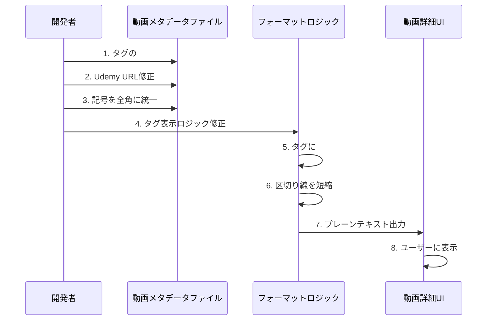
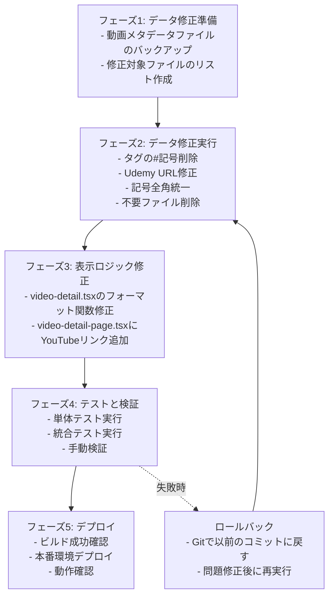

# 技術設計ドキュメント

## 概要

本機能は、`/videos`ページおよび動画詳細ページにおける動画メタデータの表示品質を向上させるための改善プロジェクトです。既存のNext.js 15アプリケーション内で、主にコンポーネントの表示ロジックとデータ構造の修正を行います。

**目的**: YouTube概要欄へのコピーペースト性を向上させ、ユーザーにとって視認性の高い動画情報表示を実現する。

**ユーザー**: YouTube視聴者およびコンテンツ制作者が、動画メタデータをより快適に閲覧・利用できるようにする。

**影響**: 既存の動画データ表示システムにおいて、表示フォーマット、データ構造、およびURLの整合性を改善する。データ削除により、存在しない動画のメタデータファイルも整理される。

### ゴール

- セクション区切り線、タグ表示、記号統一により、視覚的可読性を向上させる
- YouTube概要欄へのコピーペースト時に不要な注釈がなく、フラットな形式で利用可能にする
- Udemy講座URLを正確かつ一貫した形式に修正し、ユーザーが正しくリンクにアクセスできるようにする
- 存在しない動画メタデータファイルを削除し、データの整合性を保つ

### 非ゴール

- 新規動画の追加機能の開発
- 動画データの外部API連携（YouTube Data API等）
- 動画ページのレイアウト全体の再設計
- `/coupons`ページの機能変更（整合性確保のみ）

## アーキテクチャ

### 既存アーキテクチャ分析

本機能は既存システムの拡張であり、以下の構造を維持します：

- **データ層**: `/src/data/videos/*.ts` および `/src/data/shared/common-sections.ts` に動画メタデータをTypeScriptオブジェクトとして静的管理
- **型システム**: `/src/types/video.ts` で `VideoMetadata` 型を厳密に定義
- **表示層**: `/src/components/videos/video-detail.tsx` でプレーンテキスト形式に変換して表示
- **ページ層**: `/src/app/videos/[id]/page.tsx` で動的ルーティングによる詳細ページ表示

既存のドメイン境界：
- 動画データ管理（`src/data/videos/`、`src/lib/videos/video-data.ts`）
- UI表示（`src/components/videos/`）
- ページルーティング（`src/app/videos/`）

これらの境界は維持し、既存パターンに従って修正を行います。

### 高レベルアーキテクチャ

```mermaid
graph TB
    subgraph "データ層"
        VideoData[動画メタデータ<br/>*.ts files]
        CommonSections[共通セクション<br/>common-sections.ts]
        VideoTypes[型定義<br/>video.ts]
    end

    subgraph "ロジック層"
        VideoDataLoader[動画データローダー<br/>video-data.ts]
        FormatLogic[フォーマットロジック<br/>video-detail.tsx]
    end

    subgraph "UI層"
        VideoCard[動画カード<br/>video-card.tsx]
        VideoDetail[動画詳細<br/>video-detail.tsx]
    end

    subgraph "ページ層"
        VideoList[動画一覧<br/>/videos/page.tsx]
        VideoPage[動画詳細<br/>/videos/[id]/page.tsx]
    end

    VideoData --> VideoDataLoader
    CommonSections --> VideoData
    VideoTypes --> VideoData
    VideoDataLoader --> VideoList
    VideoDataLoader --> VideoPage
    VideoPage --> VideoDetail
    VideoList --> VideoCard
    FormatLogic -.修正対象.-> VideoDetail
    VideoData -.修正対象.-> VideoData
```

**アーキテクチャ統合**:
- **既存パターンの維持**: Next.js 15 App Router、TypeScript厳格モード、静的サイト生成（SSG）
- **新規コンポーネントの不要性**: 既存コンポーネント内のロジック修正のみで対応
- **技術スタック整合**: Tailwind CSS、TypeScript、Next.jsの既存技術スタックを使用
- **ステアリング準拠**: `structure.md`（コンポーネント構造）、`tech.md`（技術スタック）、`product.md`（品質基準）に準拠

### 技術整合性

本機能は既存システムの拡張であり、以下の技術スタックと整合します：

**フロントエンド**: Next.js 15 App Router、React 19、TypeScript（厳格モード）、Tailwind CSS v4

**新規依存関係**: なし（既存の依存関係のみ使用）

**既存パターンからの逸脱**: なし

### 主要な設計決定

#### 決定1: タグの`#`記号を表示時に自動付与

**決定**: タグデータには`#`記号を含めず、表示コンポーネント側で自動付与する

**コンテキスト**: 現在、動画メタデータファイル内で一部のタグに`#`記号が含まれており、データの一貫性が損なわれている。また、YouTube概要欄へのコピーペースト時に`#`記号が必要であるが、データ管理上は不要な情報である。

**代替案**:
1. データに`#`記号を含めて管理する → データの冗長性が高く、保守性が低い
2. `#`記号を含めずに表示もしない → YouTube概要欄でのタグ機能が動作しない
3. 表示時に条件付きで付与（既存に`#`があればそのまま、なければ付与） → 複雑な条件分岐が必要

**選択されたアプローチ**: データには`#`記号を含めず、`video-detail.tsx`の`formatVideoAsPlainText`関数内でタグ表示時に自動的に`#`記号を先頭に付与する

**根拠**:
- データの一貫性が向上し、保守性が高まる
- 表示ロジックが単純化される（すべてのタグに一律で`#`を付与）
- データ層と表示層の責務が明確に分離される

**トレードオフ**:
- **獲得**: データの一貫性、保守性の向上、シンプルな実装
- **犠牲**: データファイルを見ただけではYouTube概要欄での表示形式が直感的にわからない（ただしコメントで説明可能）

#### 決定2: Udemy講座URLを`/coupons`ページに統一

**決定**: すべての動画メタデータ内のUdemy講座URLを`https://www.vibecodingstudio.dev/coupons`に統一し、特定トピックの場合はフィルタパラメータを追加する

**コンテキスト**: 現在、動画メタデータ内に存在しないUdemy講座への不正なリンク（`/courses`、`/cta`パス）が含まれており、ユーザーが404エラーに遭遇する可能性がある。また、`/coupons`ページには講座フィルタリング機能があるが、活用されていない。

**代替案**:
1. 各動画に個別の講座URLを設定 → 整合性管理が困難、リンク切れのリスク
2. すべて汎用的な`/coupons`のみに統一 → 動画トピックと関連する講座への誘導が弱い
3. 外部Udemy URLに直接リンク → クーポン適用が困難、トラッキング不可

**選択されたアプローチ**: 基本は`/coupons`ページへのリンクとし、動画トピックに関連する特定の講座がある場合はフィルタパラメータ付きURLを使用

**根拠**:
- `/coupons`ページは単一の信頼できる情報源（Single Source of Truth）として機能
- フィルタ機能により、ユーザーは動画トピックに関連する講座を即座に発見できる
- リンク切れや404エラーのリスクを最小化
- 将来的な講座の追加・削除にも柔軟に対応可能

**トレードオフ**:
- **獲得**: URL整合性、保守性、ユーザビリティの向上
- **犠牲**: 個別講座への直接リンクではなくなるため、ワンクリックでの講座アクセスは不可（ただしフィルタにより2クリックで到達可能）

#### 決定3: 区切り線の長さ調整とタグセクション前の区切り線削除

**決定**: セクション区切り線を短縮し、タグセクションの直前には区切り線を表示しない

**コンテキスト**: 現在の区切り線（`━`が50文字程度）は視覚的に過度に長く、特にモバイル表示時に圧迫感がある。また、タグセクションの前にも区切り線があることで、最終セクションとして目立たなくなっている。

**代替案**:
1. 区切り線を完全に削除 → セクションの区別が困難
2. すべてのセクションで区切り線を統一 → タグセクションの特別性が失われる
3. 視覚的装飾（ボーダー、背景色等）を追加 → プレーンテキストの原則に反する

**選択されたアプローチ**: 区切り線の文字数を短縮（50文字→30文字程度）し、タグセクション直前のみ区切り線を削除

**根拠**:
- 視覚的バランスが改善され、読みやすさが向上
- タグセクションが最終セクションとして自然に配置される
- YouTube概要欄での表示時も適切な長さ

**トレードオフ**:
- **獲得**: 視覚的バランス、モバイル表示での見やすさ
- **犠牲**: 従来の区切り線の長さに慣れたユーザーには違和感がある可能性（ただし短期間で適応可能）

## システムフロー

### データ修正から表示までのフロー



## 要件トレーサビリティ

| 要件 | 要件概要 | コンポーネント | インターフェース | フロー |
|------|---------|--------------|----------------|--------|
| 1.1 | セクション区切り線の長さ短縮 | VideoDetail | formatVideoAsPlainText | データ修正フロー |
| 1.3 | タグセクション前の区切り線削除 | VideoDetail | formatVideoAsPlainText | データ修正フロー |
| 2.1-2.3 | 注釈テキストの削除 | VideoDetail | formatVideoAsPlainText | データ修正フロー |
| 3.1-3.3 | タグの#記号自動付与 | VideoDetail | formatVideoAsPlainText | データ修正フロー |
| 4.1-4.3 | 記号の全角統一 | 動画メタデータファイル | VideoMetadata型 | データ修正フロー |
| 5.1-5.3 | 概要セクションの改行最適化 | VideoDetail | formatVideoAsPlainText | データ修正フロー |
| 6.1-6.3 | 関連動画の表示形式改善 | VideoDetail | formatVideoAsPlainText | データ修正フロー |
| 7.1-7.3 | 箇条書きマーカーの統一 | 動画メタデータファイル | VideoMetadata型 | データ修正フロー |
| 8.1-8.3 | 動画リンクの追加 | VideoDetailPage | VideoMetadata.videoUrl | データ修正フロー |
| 9.1-9.3 | 不要動画ファイルの削除 | video-data.ts | getVideoById | データ修正フロー |
| 10.1-10.5 | Udemy URL修正と統一 | 動画メタデータファイル | UdemyCoursesSection型 | データ修正フロー |
| 11.1-11.3 | `/coupons`ページとの整合性確保 | 動画メタデータファイル | UdemyCoursesSection型 | データ修正フロー |

## コンポーネントとインターフェース

### データ層

#### VideoMetadataファイル群（`src/data/videos/*.ts`）

**責務と境界**
- **主要責務**: 各動画のメタデータ（タイトル、タグ、セクション、URL等）を静的TypeScriptオブジェクトとして定義
- **ドメイン境界**: 動画データ管理ドメイン
- **データ所有権**: 各動画の完全なメタデータ（基本情報、セクション、タグ、カスタムセクション）
- **トランザクション境界**: 静的データのため、トランザクションは該当しない（ビルド時にバンドル）

**依存関係**
- **インバウンド**: `video-data.ts`（動画データローダー）
- **アウトバウンド**: `common-sections.ts`（共通セクション定義）、`@/types/video`（型定義）
- **外部**: なし

**契約定義**

```typescript
// データ構造契約
interface VideoMetadata {
  id: string
  title: string
  publishedAt: string
  videoUrl: string
  opening: OpeningSection
  learningPoints: LearningPointsSection
  timestamps: TimestampSection
  tags: string[]  // #記号を含まない純粋なタグ文字列
  relatedVideos?: RelatedVideosSection
  udemyCourses?: UdemyCoursesSection  // 修正されたURL構造
  customSections?: CustomSection[]
  social: SocialSection
  discordCommunity?: DiscordSection
  engagement: EngagementSection
}
```

**データ整合性ルール**:
- タグは`#`記号を含まない文字列配列
- Udemy講座URLは`https://www.vibecodingstudio.dev/coupons`形式
- 記号はすべて全角（感嘆符`!`→`!`）
- 箇条書きマーカーは中点「・」で統一（セクションタイトルの絵文字を除く）

**統合戦略**（既存システムの修正）:
- **修正アプローチ**: 既存ファイルの内容を直接修正（データ構造変更なし）
- **後方互換性**: `VideoMetadata`型のインターフェースは不変、データ内容のみ修正
- **移行パス**: 段階的にファイルを修正し、テストで検証

### ロジック層

#### VideoDetailコンポーネント（`src/components/videos/video-detail.tsx`）

**責務と境界**
- **主要責務**: `VideoMetadata`オブジェクトをYouTube概要欄用のプレーンテキスト形式に変換して表示
- **ドメイン境界**: UI表示ドメイン
- **データ所有権**: なし（表示のみ、データは不変）
- **トランザクション境界**: 該当しない（静的表示）

**依存関係**
- **インバウンド**: `VideoDetailPage`（動画詳細ページ）
- **アウトバウンド**: `@/types/video`（型定義）
- **外部**: なし

**契約定義**

**サービスインターフェース**（変更部分のみ）:
```typescript
interface VideoDetailProps {
  video: VideoMetadata
}

// フォーマット関数（内部関数）
function formatVideoAsPlainText(video: VideoMetadata): string {
  // 修正内容:
  // 1. SECTION_DIVIDER の長さを短縮（50文字→30文字）
  // 2. タグ表示時に自動的に # を付与
  // 3. タグセクション前の区切り線を削除
  // 4. 関連動画の表示形式を改善（タイトルとURLを改行で区切り、動画間に空白行）
  // 5. 概要セクションの改行を最適化
}
```

**事前条件**: `video`オブジェクトが`VideoMetadata`型に準拠している

**事後条件**: YouTube概要欄にコピーペースト可能なプレーンテキスト文字列を返す

**不変条件**: プレーンテキスト形式（HTML、Markdown等を含まない）

**状態管理**: なし（ステートレスなプレゼンテーションコンポーネント）

#### VideoDetailPage（`src/app/videos/[id]/page.tsx`）

**責務と境界**
- **主要責務**: 動画IDに基づいて動画データを取得し、詳細ページを表示
- **ドメイン境界**: ページルーティングドメイン
- **データ所有権**: なし（データ取得のみ）
- **トランザクション境界**: 該当しない（静的ページ）

**依存関係**
- **インバウンド**: Next.js App Router
- **アウトバウンド**: `video-data.ts`（動画データローダー）、`VideoDetail`コンポーネント
- **外部**: なし

**契約定義**

**APIコンテキスト**（修正内容）:

```typescript
// 動画詳細ページに動画リンクを追加
export default async function VideoDetailPage({
  params,
}: {
  params: Promise<{ id: string }>
}) {
  const { id } = await params
  const video = getVideoById(id)

  if (!video) {
    notFound()
  }

  return (
    <div>
      {/* 既存のナビゲーションとヘッダー */}

      {/* 新規追加: YouTube動画リンク */}
      <a href={video.videoUrl} target="_blank" rel="noopener noreferrer">
        YouTube動画を見る
      </a>

      <VideoDetail video={video} />
    </div>
  )
}
```

**事前条件**: 動画IDが有効であること

**事後条件**: 動画データが存在する場合は詳細ページを表示、存在しない場合は404ページを表示

**エラー処理**: 動画が見つからない場合は`notFound()`を呼び出し

## データモデル

### ドメインモデル

本機能は主にデータの修正であり、新規エンティティや値オブジェクトの追加はありません。既存の`VideoMetadata`型を維持しつつ、データ内容の整合性を改善します。

**コアコンセプト**:
- **VideoMetadataエンティティ**: 各動画の完全な情報を表現する集約ルート
- **タグ値オブジェクト**: `#`記号を含まない純粋な文字列配列（表示時に`#`を自動付与）
- **UdemyCoursesSection値オブジェクト**: `/coupons`ページへのリンク情報

**ビジネスルールと不変条件**:
- タグは必ず`#`記号を含まないこと
- Udemy講座URLは`https://www.vibecodingstudio.dev/coupons`形式であること
- 記号は全角であること（特に感嘆符`!`）
- 関連動画のタイトルには絵文字を使用せず、中点「・」を使用すること

### 物理データモデル

**TypeScriptオブジェクト（静的データ）**:

```typescript
// 修正後のタグデータ例
tags: [
  "Junie",              // #記号なし
  "JetBrains",
  "RubyMine",
  "GPT5",
  "AI駆動開発",
  "バイブコーディング",
  "VibeCoding",
  "RubyonRails",
  "ClaudeCode比較",
  "AIエージェント",
]

// 修正後のUdemy講座セクション例
udemyCourses: {
  title: "🚀 体系的に学びたい方へ",
  description: "Claude CodeとCodexを使った開発手法を体系的に学べるUdemy講座を公開中!",
  courses: [
    "Claude Code完全マスター講座",
    "Codex CLI実践マスター講座",
    // ...
  ],
  cta: {
    text: "🎁 最大90%OFFクーポン配布中!",
    url: "https://www.vibecodingstudio.dev/coupons"  // 統一されたURL
  }
}
```

**データ整合性制約**:
- `tags`配列内の各要素は`#`記号を含まない
- `udemyCourses.cta.url`は常に`https://www.vibecodingstudio.dev/coupons`で始まる
- 関連動画のタイトルには絵文字を含まない

## エラーハンドリング

### エラー戦略

本機能は主に静的データの修正であるため、実行時エラーは限定的です。主なエラーケースは以下の通りです。

### エラーカテゴリと対応

**ユーザーエラー（4xx）**:
- **存在しない動画IDへのアクセス**: `notFound()`を呼び出し、Next.jsの404ページを表示
- **対応**: 動画一覧ページへの誘導リンクを提供

**システムエラー（5xx）**:
- **ビルド時のデータ読み込み失敗**: TypeScriptコンパイルエラーとして検出
- **対応**: ビルド前の型チェックとテストで事前検出

**ビジネスロジックエラー（422）**:
- **不正なデータ形式（タグに`#`記号が含まれる等）**: TypeScript型定義により静的に検出
- **対応**: データ修正スクリプトまたは手動修正により事前に解決

### モニタリング

- **エラートラッキング**: Next.jsの標準エラーハンドリング（開発環境でのコンソールログ、本番環境でのエラーバウンダリ）
- **ロギング**: 動画が見つからない場合のログ記録（開発環境のみ）
- **ヘルスモニタリング**: ビルド時の型チェックおよびテスト成功による健全性確認

## テスト戦略

### 単体テスト

1. **`formatVideoAsPlainText`関数のテスト**
   - タグに`#`記号が自動付与されることを検証
   - セクション区切り線の長さが短縮されていることを検証
   - タグセクション前の区切り線が存在しないことを検証
   - 関連動画の表示形式が改善されていることを検証（タイトルとURLが改行で区切られ、動画間に空白行が存在）

2. **動画メタデータの整合性テスト**
   - すべての動画データファイルでタグに`#`記号が含まれていないことを検証
   - Udemy講座URLが`https://www.vibecodingstudio.dev/coupons`形式であることを検証
   - 記号が全角であることを検証

### 統合テスト

1. **動画詳細ページの表示テスト**
   - 動画データが正しくプレーンテキスト形式で表示されることを検証
   - YouTube動画リンクが正しく表示されることを検証
   - 存在しない動画IDで404ページが表示されることを検証

2. **データローダーのテスト**
   - 削除された動画ファイルがローダーから除外されていることを検証
   - すべての動画IDが正しく取得されることを検証

### E2E/UIテスト（該当する場合）

1. **動画一覧ページから詳細ページへの遷移**
   - 一覧ページから動画カードをクリックし、詳細ページに遷移できることを検証
   - 詳細ページでYouTube動画リンクをクリックし、新しいタブで開くことを検証

2. **コピーペースト機能の検証**
   - プレーンテキスト形式の内容をクリップボードにコピーし、YouTube概要欄に正しく貼り付けられることを手動検証

### パフォーマンス/負荷テスト（該当する場合）

本機能は静的サイト生成（SSG）によるビルド時の処理であるため、実行時のパフォーマンステストは不要です。ビルド時間の増加が許容範囲内であることを確認します。

## セキュリティ考慮事項

### 脅威モデリング

**脅威**: 外部URLへの不正なリンク（フィッシングサイト等）
- **対策**: Udemy講座URLを信頼できる内部`/coupons`ページに統一
- **検証**: テストですべてのURLが`https://www.vibecodingstudio.dev/coupons`形式であることを確認

### セキュリティコントロール

- **XSS対策**: Reactの自動エスケープ機能により、動画メタデータ内の特殊文字は安全に表示
- **外部リンク**: YouTube動画リンクおよび`/coupons`ページへのリンクは`target="_blank"`および`rel="noopener noreferrer"`で安全に開く

### データ保護とプライバシー

本機能は公開動画のメタデータのみを扱い、個人情報や機密情報は含まれません。

## パフォーマンスとスケーラビリティ

### ターゲットメトリクス

- **ビルド時間**: 動画ファイル削除により、ビルド時間が微減する（28ファイル→27ファイル）
- **初期バンドルサイズ**: 変化なし（データ修正のみ）
- **ページ表示速度**: 静的ページのため、変化なし

### スケーリングアプローチ

本機能は静的データの修正であり、スケーリングの考慮は不要です。将来的に動画数が増加した場合も、Next.jsの静的サイト生成（SSG）により、すべてのページが事前にビルドされます。

### キャッシング戦略

既存のNext.jsキャッシュ戦略（ISR: 60秒再検証）を維持します。

## 移行戦略

### 移行フェーズ



### プロセス

**フェーズ1: データ修正準備**
- すべての動画メタデータファイル（`src/data/videos/*.ts`）をリストアップ
- 修正が必要な項目（タグの`#`記号、Udemy URL、半角記号、不要ファイル）を特定

**フェーズ2: データ修正実行**
- 各動画メタデータファイルを順次修正
- 不要な動画ファイル（存在しない動画）を削除
- `video-data.ts`から削除ファイルのインポートを除外

**フェーズ3: 表示ロジック修正**
- `video-detail.tsx`の`formatVideoAsPlainText`関数を修正
  - 区切り線の長さ短縮
  - タグ表示時の`#`記号自動付与
  - タグセクション前の区切り線削除
  - 関連動画の表示形式改善
- `VideoDetailPage`にYouTube動画リンクを追加

**フェーズ4: テストと検証**
- 単体テスト実行（`npm run test`）
- 型チェック（`npm run type-check`）
- ビルド成功確認（`npm run build`）
- 手動でプレビュー環境を確認

**フェーズ5: デプロイ**
- ビルド成功後、本番環境にデプロイ
- 数件の動画詳細ページを手動確認
- Udemy講座リンクが正しく動作することを確認

### ロールバックトリガー

- ビルド失敗（TypeScriptエラー、テスト失敗）
- 手動検証でYouTube概要欄へのコピーペーストが正しく動作しない
- Udemy講座リンクが404エラーを返す

### 検証チェックポイント

**フェーズ2完了時**:
- すべての動画メタデータファイルでタグに`#`記号が含まれていないことを確認
- Udemy URLが`/coupons`形式であることを確認

**フェーズ3完了時**:
- `formatVideoAsPlainText`関数がタグに`#`記号を付与することを確認
- 区切り線の長さが短縮されていることを確認

**フェーズ4完了時**:
- すべてのテストが合格
- TypeScriptエラーなし
- ビルド成功

**フェーズ5完了時**:
- 本番環境で動画詳細ページが正しく表示される
- Udemy講座リンクが正しく動作する
- YouTube概要欄へのコピーペーストが正しく機能する
