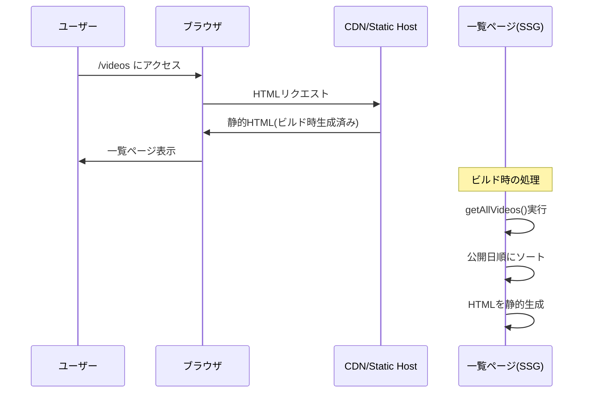
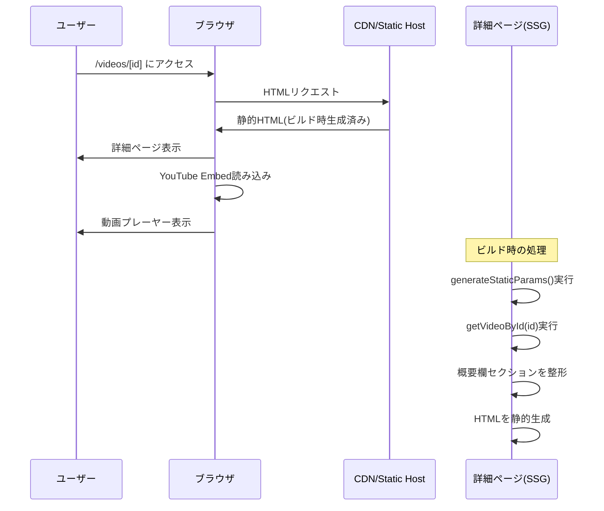
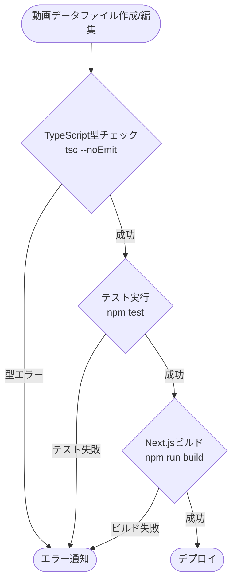

# YouTube動画メタデータ表示システム 技術設計書

## Overview

YouTube動画メタデータ表示システムは、YouTube動画のタイトル、概要欄などのメタデータをTypeScriptファイルとして構造化して管理し、Next.jsの静的サイト生成機能を活用して一覧・詳細ページで閲覧可能にするシステムである。

### 目的

本システムは、YouTubeコンテンツ作成者に対して以下の価値を提供する:

- **データの一元管理**: 動画メタデータをGitで管理し、履歴管理・変更追跡を実現する
- **一貫性の保証**: SNS、Discordなどの共通データを外部化し、全動画で統一された情報を提供する
- **品質保証**: TypeScriptの型システムにより、必須項目の漏れやデータ構造の誤りを事前に防ぐ
- **効率的な運用**: ビルド時の型チェックと自動テストにより、データ品質を継続的に保証する

### ユーザー

- **コンテンツ作成者**: 動画メタデータを作成・編集し、Gitで管理する開発者
- **視聴者**: 動画一覧・詳細ページを閲覧し、動画情報を取得するエンドユーザー

### 影響範囲

本システムは、既存のVibe Coding Studioサイトに新しいルート(`/videos`)を追加する形で統合される。既存のページ実装パターン(クーポンページなど)を踏襲し、一貫したユーザー体験を提供する。

### Goals

- TypeScriptの型システムを活用した、型安全な動画メタデータ管理の実現
- Next.jsの静的サイト生成(SSG)による、高速な一覧・詳細ページの提供
- Gitベースのファイル管理による、変更履歴の追跡と共同編集の実現
- ビルド時の型チェックとテストによる、データ品質の自動検証
- 既存のプロジェクト構造とパターンに準拠した、保守性の高い実装

### Non-Goals

- 管理画面の実装(データの作成・編集はすべてファイルベースで行う)
- 動的なデータ取得やリアルタイム更新(すべて静的サイト生成で対応)
- YouTube APIとの連携(メタデータは手動でファイルに記録)
- 検索・フィルタ機能(Phase 1では対象外、将来的な拡張として検討)

## Architecture

### 既存アーキテクチャの分析

Vibe Coding Studioは、Next.js 15 App Routerを採用したJamstackアーキテクチャで構築されている。既存のクーポン機能(`/coupons`)は、TypeScriptファイルでデータを管理し、ビルド時に静的ページを生成するパターンを採用しており、本機能も同様のアプローチを踏襲する。

**既存パターンの特徴**:
- データ定義: `src/lib/coupons/coupon-data.ts` - RawDataとして定義
- 型定義: `src/types/coupon.ts` - 型安全性を保証
- 共通データ: `src/constants/coupon-courses.ts` - 再利用可能な情報を外部化
- ページコンポーネント: `src/app/coupons/page.tsx` - メタデータ生成とSSG
- 詳細ページ: `src/app/coupons/[slug]/page.tsx` - 動的ルーティング

### 高レベルアーキテクチャ

```mermaid
graph TB
    subgraph "データ層"
        VideoData[動画データファイル<br/>src/data/videos/]
        CommonData[共通データファイル<br/>src/data/shared/]
        TypeDef[型定義<br/>src/types/video.ts]
    end

    subgraph "ビルドプロセス"
        TypeCheck[TypeScript型チェック<br/>tsc --noEmit]
        Test[テスト実行<br/>Jest]
        Build[Next.jsビルド<br/>SSG]
    end

    subgraph "アプリケーション層"
        DataLoader[データローダー<br/>src/lib/videos/video-data.ts]
        ListPage[一覧ページ<br/>/videos]
        DetailPage[詳細ページ<br/>/videos/[id]]
    end

    subgraph "プレゼンテーション層"
        Components[UIコンポーネント<br/>src/components/videos/]
        Layout[共通レイアウト<br/>Navbar, Footer]
    end

    VideoData --> TypeCheck
    CommonData --> TypeCheck
    TypeDef --> TypeCheck
    TypeCheck --> Test
    Test --> Build

    VideoData --> DataLoader
    CommonData --> DataLoader
    DataLoader --> ListPage
    DataLoader --> DetailPage

    ListPage --> Components
    DetailPage --> Components
    Components --> Layout
```

### アーキテクチャ統合方針

**既存パターンの継承**:
- Next.js App Routerの動的ルーティング(`/videos/[id]`)を活用
- メタデータ生成(`generateMetadata`)による SEO 最適化
- Containerコンポーネントを使用した一貫したレイアウト
- ErrorBoundaryによるエラーハンドリング

**新規コンポーネントの追加理由**:
- `VideoCard`: 一覧ページでの動画情報表示に特化したコンポーネント
- `VideoDetail`: 詳細ページでの概要欄セクションの整形表示
- `YouTubeEmbed`: YouTube埋め込みプレーヤーの最適化

**技術スタックの整合性**:
- 既存のTailwind CSS v4を使用したスタイリング
- Headless UIによるアクセシブルなUIコンポーネント
- CSPNonceProviderを含むセキュリティ設定の継承

**Steering Documentへの準拠**:
- `structure.md`: src/data/ディレクトリを追加し、動画データを管理
- `tech.md`: TypeScript厳格モード、Jest、Prettierの既存設定を継承
- `product.md`: 本番環境対応の品質基準(テストカバレッジ80%以上)を遵守

## Technology Stack and Design Decisions

### 技術スタック整合性

本機能は、既存のVibe Coding Studioの技術スタックをそのまま活用する。新しい外部依存関係の追加は行わない。

**フロントエンド**:
- Next.js 15.4.4 (App Router) - 既存のSSG機能を活用
- React 19 - 既存のコンポーネントパターンを踏襲
- TypeScript (strict mode) - 型安全性の継続

**スタイリング**:
- Tailwind CSS v4 - 既存のデザインシステムを継承
- Headless UI - アクセシブルなUIコンポーネント

**テスト・品質保証**:
- Jest - 既存のテスト環境を活用
- TypeScript Compiler (tsc --noEmit) - 型チェック

**新規追加ライブラリ**: なし

### 主要な技術設計決定

#### 決定1: TypeScriptファイルによるデータ管理

**決定**: 動画メタデータをTypeScriptファイル(`.ts`)として管理し、JSONではなくTypeScriptの型システムを最大限活用する。

**コンテキスト**:
- データの一貫性と品質保証が最重要課題
- Gitによる履歴管理と共同編集が必要
- 管理画面は不要で、ファイルベースの編集で十分

**代替案**:
1. **JSONファイル + スキーマバリデーション**: Zodなどのスキーマバリデーションライブラリを使用
2. **マークダウン + Front Matter**: MDXやGray-matterでメタデータを管理
3. **データベース + 管理画面**: Supabaseなどのデータベースを使用

**選択したアプローチ**: TypeScriptファイルによるデータ管理

TypeScriptファイルとして動画データを定義し、型定義を通じてデータ構造を保証する。共通データは別ファイルとして外部化し、importで参照する。

```typescript
// src/data/videos/video-001.ts
import { commonSections } from '@/data/shared/common-sections'
import type { VideoMetadata } from '@/types/video'

export const video001: VideoMetadata = {
  title: "Next.jsで学ぶApp Router入門",
  publishedAt: "2025-10-01T12:00:00+09:00",
  videoUrl: "https://www.youtube.com/watch?v=example",
  opening: {
    lines: [
      "この動画では、Next.js 15のApp Routerについて学びます。",
      "Server ComponentsやServer Actionsなど、最新機能を網羅します。"
    ]
  },
  learningPoints: {
    title: "💡 この動画で学べること",
    items: [
      "✅ App Routerの基本概念",
      "✅ Server Componentsの使い方",
      "✅ Server Actionsによるフォーム処理"
    ]
  },
  timestamps: {
    title: "⏰ タイムスタンプ",
    items: [
      { time: "00:00", label: "イントロダクション" },
      { time: "02:30", label: "App Routerの概要" }
    ]
  },
  tags: ["#NextJS", "#React", "#AppRouter"],
  social: commonSections.social,
  engagement: commonSections.engagement
}
```

**理論的根拠**:
- **型安全性**: TypeScriptコンパイラがビルド時に型エラーを検出し、必須項目の漏れを防ぐ
- **IDEサポート**: 自動補完、型チェック、リファクタリングサポートが利用可能
- **コードとしての管理**: import/exportによる共通データの再利用が容易
- **既存パターンとの整合性**: クーポン機能と同じアプローチで一貫性を保つ
- **ゼロランタイムオーバーヘッド**: 型情報はビルド時に削除され、実行時コストなし

**トレードオフ**:
- **利点**: 強力な型安全性、IDEサポート、共通データの再利用が容易
- **欠点**: JSONと比較してファイルサイズが若干大きい(ただしビルド時に最適化される)

#### 決定2: 共通データの外部化戦略

**決定**: SNS、Discord、エンゲージメント文言などの全動画共通データを別ファイルとして外部化し、各動画データからimportして参照する。

**コンテキスト**:
- SNSアカウント情報、Discordコミュニティ情報、エンゲージメント文言は全動画で固定
- 共通データの更新時に全動画ファイルを編集する必要を回避したい
- DRY原則に従い、単一の情報源(Single Source of Truth)を維持したい

**代替案**:
1. **各動画ファイルに直接記述**: 共通データを各ファイルにコピー&ペースト
2. **ビルド時のマージ処理**: 動画データと共通データをビルド時に結合
3. **グローバルコンテキスト**: React Contextで共通データを提供

**選択したアプローチ**: 外部ファイル化 + import参照

共通データを`src/data/shared/common-sections.ts`に定義し、各動画データからimportで参照する。

```typescript
// src/data/shared/common-sections.ts
export const commonSections = {
  social: {
    title: "🔗 SNS・コミュニティ",
    accounts: [
      { platform: "X", emoji: "🐦", label: "X(Twitter)", url: "https://x.com/muscle_coding" },
      { platform: "note", emoji: "📝", url: "https://note.com/tomada" }
    ]
  },
  discordCommunity: {
    title: "💬 Discordコミュニティ(無料)",
    description: "AI駆動開発を学ぶ仲間と繋がれるDiscordコミュニティ!",
    url: "https://discord.gg/qZDRagzbVD"
  },
  engagement: {
    title: "💬 コメント・質問お待ちしています!",
    message: "実際に試してみた感想や、つまずいた点があればコメント欄で教えてください。",
    callToAction: "チャンネル登録・高評価いただけると励みになります🙏"
  }
}
```

**理論的根拠**:
- **DRY原則**: 共通データを1箇所で管理し、重複を排除
- **一貫性保証**: 共通データの更新が全動画に自動的に反映される
- **保守性向上**: SNSアカウント変更時に1ファイルの編集で完了
- **型安全性**: TypeScriptの型システムにより、共通データの構造も保証される

**トレードオフ**:
- **利点**: DRY原則の徹底、保守性の向上、一貫性の保証
- **欠点**: なし(既存のクーポン機能でも同じパターンを採用)

#### 決定3: ビルド時静的データ取り込み戦略

**決定**: Next.jsのビルド時にすべての動画データをimportし、`generateStaticParams`で静的ページを生成する。

**コンテキスト**:
- 動画データは頻繁に変更されない(新規追加は週1回程度)
- リアルタイム更新は不要で、ビルド時にデータを確定できる
- ISR(Incremental Static Regeneration)も不要

**代替案**:
1. **クライアントサイドデータフェッチ**: useEffectでデータを取得
2. **Server Components + 動的レンダリング**: リクエスト時にデータを取得
3. **ISR**: 一定時間ごとにページを再生成

**選択したアプローチ**: ビルド時の完全な静的サイト生成(SSG)

すべての動画データをビルド時にimportし、`generateStaticParams`ですべての動画IDを列挙して静的HTMLを生成する。

```typescript
// src/app/videos/[id]/page.tsx
export async function generateStaticParams() {
  const videos = getAllVideos() // すべての動画データを取得
  return videos.map((video) => ({ id: video.id }))
}

export default function VideoDetailPage({ params }: { params: { id: string } }) {
  const video = getVideoById(params.id)
  if (!video) notFound()

  return <VideoDetail video={video} />
}
```

**理論的根拠**:
- **最高のパフォーマンス**: すべてのページがビルド時に生成され、CDNから配信される
- **コスト効率**: サーバーサイド処理が不要で、静的ホスティングで十分
- **シンプルさ**: データフェッチのロジックが不要で、実装が簡潔
- **既存パターンとの一貫性**: クーポン機能と同じアプローチ

**トレードオフ**:
- **利点**: 最高のパフォーマンス、シンプルな実装、低コスト
- **欠点**: データ更新時に再ビルドが必要(ただし、GitHub Actionsなどで自動化可能)

## System Flows

### 動画一覧ページの表示フロー



### 動画詳細ページの表示フロー



### データ品質検証フロー



## Requirements Traceability

| 要件ID | 要件概要 | 実現コンポーネント | インターフェース | フロー |
|--------|----------|-------------------|-----------------|--------|
| 1.1-1.7 | 動画メタデータの型定義と構造化 | `src/types/video.ts` | `VideoMetadata`, `OpeningSection`, `LearningPointsSection`, `TimestampSection` | データ品質検証フロー |
| 2.1-2.5 | 共通データの外部化と再利用 | `src/data/shared/common-sections.ts` | `CommonSections`, `SocialSection`, `DiscordSection`, `EngagementSection` | - |
| 3.1-3.5 | 動画データのファイル管理 | `src/data/videos/` | 各動画データファイル(`video-001.ts`等) | - |
| 4.1-4.8 | データ品質の自動検証 | `src/lib/videos/__tests__/video-data.test.ts` | テストスイート | データ品質検証フロー |
| 5.1-5.5 | 動画一覧ページの表示 | `src/app/videos/page.tsx`, `src/components/videos/VideoCard.tsx` | `VideoListPage`, `VideoCard` | 動画一覧ページ表示フロー |
| 6.1-6.13 | 動画詳細ページの表示 | `src/app/videos/[id]/page.tsx`, `src/components/videos/VideoDetail.tsx` | `VideoDetailPage`, `VideoDetail`, `YouTubeEmbed` | 動画詳細ページ表示フロー |
| 7.1-7.6 | カスタムセクションの柔軟性 | `src/types/video.ts` (CustomSection型) | `CustomSection`, `TextSection`, `ListSection`, `LinkSection` | - |
| 8.1-8.5 | 概要欄の構造パターンの遵守 | `src/components/videos/VideoDetail.tsx` | セクション表示順序制御 | 動画詳細ページ表示フロー |
| 9.1-9.5 | TypeScriptファイルのインポートとビルド時の静的データ取り込み | `src/lib/videos/video-data.ts` | `getAllVideos()`, `getVideoById()` | 動画一覧/詳細ページ表示フロー |
| 10.1-10.6 | 拡張性と保守性の確保 | 全コンポーネント | 型定義による拡張性、テストによる品質保証 | データ品質検証フロー |

## Components and Interfaces

### データ層

#### VideoMetadata型定義

**責任と境界**
- **主要責任**: 動画メタデータの型構造を定義し、TypeScriptの型システムを通じてデータ整合性を保証する
- **ドメイン境界**: 動画メタデータドメイン(タイトル、概要欄、タイムスタンプなど)
- **データ所有権**: 動画メタデータの構造定義を所有

**依存関係**
- **Inbound**: 動画データファイル(`src/data/videos/*.ts`)、データローダー(`src/lib/videos/video-data.ts`)
- **Outbound**: なし
- **External**: なし

**契約定義**

```typescript
// src/types/video.ts

/**
 * タイムスタンプアイテム
 * YouTube概要欄のタイムスタンプ("00:00 イントロダクション"形式)
 */
export interface TimestampItem {
  /** 時間("00:00"形式) */
  time: string
  /** ラベル */
  label: string
}

/**
 * 冒頭セクション
 * 動画の最初に表示される説明文
 */
export interface OpeningSection {
  /** 冒頭の各行 */
  lines: string[]
}

/**
 * 学べる内容セクション
 * "💡 この動画で学べること"セクション
 */
export interface LearningPointsSection {
  /** セクションタイトル(例: "💡 この動画で学べること") */
  title: string
  /** 箇条書き項目(✅で始まる) */
  items: string[]
}

/**
 * タイムスタンプセクション
 * "⏰ タイムスタンプ"セクション
 */
export interface TimestampSection {
  /** セクションタイトル(例: "⏰ タイムスタンプ") */
  title: string
  /** タイムスタンプリスト */
  items: TimestampItem[]
}

/**
 * 関連動画情報
 */
export interface RelatedVideo {
  /** 動画タイトル */
  title: string
  /** 動画URL */
  url: string
  /** 絵文字(オプション) */
  emoji?: string
}

/**
 * 関連動画セクション
 */
export interface RelatedVideosSection {
  /** セクションタイトル(例: "📌 関連動画") */
  title: string
  /** 関連動画リスト */
  videos: RelatedVideo[]
}

/**
 * Udemy講座誘導セクション
 */
export interface UdemyCoursesSection {
  /** セクションタイトル(例: "🚀 体系的に学びたい方へ") */
  title: string
  /** 説明文(オプション) */
  description?: string
  /** 講座リスト(オプション) */
  courses?: string[]
  /** CTA(Call To Action) */
  cta: {
    /** CTAテキスト */
    text: string
    /** CTAURL */
    url: string
  }
}

/**
 * SNSアカウント情報
 */
export interface SocialAccount {
  /** プラットフォーム名 */
  platform: string
  /** 絵文字 */
  emoji: string
  /** 表示ラベル(オプション) */
  label?: string
  /** URL */
  url: string
}

/**
 * SNS・コミュニティセクション
 */
export interface SocialSection {
  /** セクションタイトル(例: "🔗 SNS・コミュニティ") */
  title: string
  /** SNSアカウントリスト */
  accounts: SocialAccount[]
}

/**
 * Discordコミュニティセクション
 */
export interface DiscordSection {
  /** セクションタイトル(例: "💬 Discordコミュニティ(無料)") */
  title: string
  /** 説明文 */
  description: string
  /** Discord招待URL */
  url: string
  /** 無料かどうか */
  isFree?: boolean
}

/**
 * エンゲージメント促進セクション
 */
export interface EngagementSection {
  /** セクションタイトル(オプション) */
  title?: string
  /** メッセージ */
  message: string
  /** CTA文言 */
  callToAction: string
}

/**
 * カスタムセクション(基底型)
 */
export interface CustomSectionBase {
  /** セクションタイトル */
  title: string
  /** セクションタイプ */
  type: 'text' | 'list' | 'links' | 'mixed'
}

/**
 * テキストセクション
 */
export interface TextSection extends CustomSectionBase {
  type: 'text'
  /** テキストコンテンツ */
  content: string
}

/**
 * リストセクション
 */
export interface ListSection extends CustomSectionBase {
  type: 'list'
  /** リスト項目 */
  items: string[]
}

/**
 * リンクセクション
 */
export interface LinkSection extends CustomSectionBase {
  type: 'links'
  /** リンクリスト */
  links: Array<{
    label: string
    url: string
  }>
}

/**
 * 混合セクション(テキスト + リスト + リンク)
 */
export interface MixedSection extends CustomSectionBase {
  type: 'mixed'
  /** テキストコンテンツ(オプション) */
  content?: string
  /** リスト項目(オプション) */
  items?: string[]
  /** リンクリスト(オプション) */
  links?: Array<{
    label: string
    url: string
  }>
}

/**
 * カスタムセクション(Union型)
 */
export type CustomSection = TextSection | ListSection | LinkSection | MixedSection

/**
 * 動画メタデータ
 * 1つの動画に対応するすべてのメタデータを含む
 */
export interface VideoMetadata {
  /** 動画ID(ファイル名から生成、例: "video-001") */
  id: string
  /** 動画タイトル */
  title: string
  /** 公開日時(ISO 8601形式) */
  publishedAt: string
  /** YouTube動画URL */
  videoUrl: string

  // 必須セクション
  /** 冒頭セクション */
  opening: OpeningSection
  /** 学べる内容セクション */
  learningPoints: LearningPointsSection
  /** タイムスタンプセクション */
  timestamps: TimestampSection
  /** タグ */
  tags: string[]

  // オプションセクション
  /** 関連動画セクション(オプション) */
  relatedVideos?: RelatedVideosSection
  /** Udemy講座誘導セクション(オプション) */
  udemyCourses?: UdemyCoursesSection
  /** カスタムセクション(オプション) */
  customSections?: CustomSection[]

  // 共通データ参照
  /** SNS・コミュニティセクション */
  social: SocialSection
  /** Discordコミュニティセクション(オプション) */
  discordCommunity?: DiscordSection
  /** エンゲージメント促進セクション */
  engagement: EngagementSection
}

/**
 * 共通セクション定義
 */
export interface CommonSections {
  social: SocialSection
  discordCommunity: DiscordSection
  engagement: EngagementSection
}
```

**事前条件**:
- すべての動画データファイルは、`VideoMetadata`型に準拠する
- 必須項目(title, publishedAt, videoUrl, opening, learningPoints, timestamps, tags, social, engagement)は省略不可
- publishedAtはISO 8601形式の文字列である
- videoUrlは`https://www.youtube.com/`または`https://youtu.be/`で始まる

**事後条件**:
- TypeScriptコンパイラは、型に準拠しないデータファイルをエラーとして検出する
- テストスイートは、すべての動画データが型定義に準拠していることを検証する

**不変条件**:
- 型定義の変更は、すべての既存動画データに影響を与える(後方互換性を保つ必要がある)

#### 共通データファイル

**責任と境界**
- **主要責任**: 全動画で共通のSNS、Discord、エンゲージメント情報を一元管理する
- **ドメイン境界**: 共通コンテンツドメイン
- **データ所有権**: SNSアカウント情報、Discordコミュニティ情報、エンゲージメント文言を所有

**依存関係**
- **Inbound**: 動画データファイル(`src/data/videos/*.ts`)
- **Outbound**: なし
- **External**: なし

**契約定義**

```typescript
// src/data/shared/common-sections.ts
import type { CommonSections } from '@/types/video'

/**
 * 全動画共通のセクション定義
 * SNS、Discord、エンゲージメントなどの共通情報を管理
 */
export const commonSections: CommonSections = {
  social: {
    title: "🔗 SNS・コミュニティ",
    accounts: [
      {
        platform: "X",
        emoji: "🐦",
        label: "X(Twitter)",
        url: "https://x.com/muscle_coding"
      },
      {
        platform: "note",
        emoji: "📝",
        url: "https://note.com/tomada"
      },
      {
        platform: "Qiita",
        emoji: "💻",
        url: "https://qiita.com/tomada"
      },
      {
        platform: "Zenn",
        emoji: "📘",
        url: "https://zenn.dev/tmasuyama1114"
      }
    ]
  },
  discordCommunity: {
    title: "💬 Discordコミュニティ(無料)",
    description: "最新情報をキャッチアップしつつ、AI駆動開発を学ぶ仲間と繋がれるDiscordコミュニティも運営してます!気軽に参加してみてください。",
    url: "https://discord.gg/qZDRagzbVD",
    isFree: true
  },
  engagement: {
    title: "💬 コメント・質問お待ちしています!",
    message: "実際に試してみた感想や、つまずいた点があればコメント欄で教えてください。\n可能な限りお答えします!",
    callToAction: "チャンネル登録・高評価いただけると今後の動画作成の励みになります🙏"
  }
}
```

**事前条件**:
- 共通データは、プロジェクトのセットアップ時に1度定義される
- SNSアカウント情報、Discordコミュニティ情報は正確で最新である

**事後条件**:
- 共通データの更新は、すべての動画データに自動的に反映される
- 共通データの構造変更は、型定義の変更を伴う

### アプリケーション層

#### VideoDataLoader(データローダー)

**責任と境界**
- **主要責任**: 動画データファイルを読み込み、一覧取得・個別取得のAPIを提供する
- **ドメイン境界**: データアクセス層
- **データ所有権**: 動画データの読み込みロジックを所有

**依存関係**
- **Inbound**: 一覧ページ(`src/app/videos/page.tsx`)、詳細ページ(`src/app/videos/[id]/page.tsx`)
- **Outbound**: 動画データファイル(`src/data/videos/*.ts`)
- **External**: なし

**契約定義(Service Interface)**

```typescript
// src/lib/videos/video-data.ts

/**
 * すべての動画データを取得する
 *
 * @returns すべての動画データの配列
 */
export function getAllVideos(): VideoMetadata[]

/**
 * 公開日順(新しい順)でソートされた動画データを取得する
 *
 * @returns 公開日順でソートされた動画データの配列
 */
export function getLatestVideos(): VideoMetadata[]

/**
 * 動画IDから動画データを取得する
 *
 * @param id - 動画ID
 * @returns 動画データ、存在しない場合はundefined
 */
export function getVideoById(id: string): VideoMetadata | undefined

/**
 * すべての動画IDを取得する(generateStaticParams用)
 *
 * @returns すべての動画IDの配列
 */
export function getAllVideoIds(): string[]
```

**事前条件**:
- 動画データファイルが`src/data/videos/`ディレクトリに存在する
- 各動画データファイルは、`VideoMetadata`型に準拠している

**事後条件**:
- `getAllVideos()`は、すべての動画データを配列で返す
- `getLatestVideos()`は、公開日の降順でソートされた動画データを返す
- `getVideoById(id)`は、指定されたIDの動画データを返す(存在しない場合は`undefined`)
- `getAllVideoIds()`は、すべての動画IDを配列で返す

**不変条件**:
- 動画データは読み取り専用である(ランタイムでの変更は行わない)

#### 一覧ページコンポーネント

**責任と境界**
- **主要責任**: すべての動画を一覧表示し、詳細ページへのナビゲーションを提供する
- **ドメイン境界**: プレゼンテーション層(一覧表示)
- **データ所有権**: なし(データローダーから取得)

**依存関係**
- **Inbound**: ユーザーのブラウザ
- **Outbound**: データローダー(`src/lib/videos/video-data.ts`)、VideoCardコンポーネント
- **External**: なし

**契約定義(Server Component)**

```typescript
// src/app/videos/page.tsx
import type { Metadata } from 'next'

/**
 * メタデータ生成
 */
export async function generateMetadata(): Promise<Metadata>

/**
 * 動画一覧ページ
 */
export default function VideosPage(): JSX.Element
```

**事前条件**:
- ビルド時にすべての動画データが利用可能である

**事後条件**:
- 公開日順(新しい順)でソートされた動画一覧が表示される
- 各動画にタイトル、公開日、詳細ページへのリンクが含まれる
- メタデータ(title, description, OGP)が適切に生成される

#### 詳細ページコンポーネント

**責任と境界**
- **主要責任**: 動画の詳細情報を整形して表示し、YouTube埋め込みプレーヤーを提供する
- **ドメイン境界**: プレゼンテーション層(詳細表示)
- **データ所有権**: なし(データローダーから取得)

**依存関係**
- **Inbound**: ユーザーのブラウザ
- **Outbound**: データローダー(`src/lib/videos/video-data.ts`)、VideoDetailコンポーネント、YouTubeEmbedコンポーネント
- **External**: YouTube Embed API

**契約定義(Server Component)**

```typescript
// src/app/videos/[id]/page.tsx
import type { Metadata } from 'next'

/**
 * 静的パラメータ生成(すべての動画IDを列挙)
 */
export async function generateStaticParams(): Promise<Array<{ id: string }>>

/**
 * メタデータ生成
 */
export async function generateMetadata({ params }: { params: { id: string } }): Promise<Metadata>

/**
 * 動画詳細ページ
 */
export default function VideoDetailPage({ params }: { params: { id: string } }): JSX.Element
```

**事前条件**:
- 指定された動画IDが存在する
- ビルド時に動画データが利用可能である

**事後条件**:
- 動画タイトル、公開日、YouTube埋め込みプレーヤーが表示される
- 概要欄の各セクションが適切に整形されて表示される
- 存在しない動画IDの場合、404ページが表示される

**YouTube Embed APIの調査**:
- **公式ドキュメント**: https://developers.google.com/youtube/iframe_api_reference
- **埋め込み方法**: iframeを使用した標準的な埋め込み(APIキー不要)
- **URLフォーマット**: `https://www.youtube.com/embed/{VIDEO_ID}`
- **パラメータ**: `autoplay`, `controls`, `modestbranding`などが利用可能
- **レスポンシブ対応**: aspect-ratioを使用してアスペクト比を保持(16:9)
- **セキュリティ**: CSPで`frame-src`に`https://www.youtube.com`を追加する必要がある

### プレゼンテーション層

#### VideoCardコンポーネント

**責任と境界**
- **主要責任**: 一覧ページで1つの動画情報を表示するカードコンポーネント
- **ドメイン境界**: UIコンポーネント層
- **データ所有権**: なし(propsで受け取る)

**依存関係**
- **Inbound**: 一覧ページ(`src/app/videos/page.tsx`)
- **Outbound**: Next.js Link、Tailwind CSSクラス
- **External**: なし

**契約定義(React Component)**

```typescript
// src/components/videos/VideoCard.tsx

interface VideoCardProps {
  /** 動画データ */
  video: VideoMetadata
}

/**
 * 動画カードコンポーネント
 * 一覧ページで1つの動画情報を表示する
 */
export function VideoCard({ video }: VideoCardProps): JSX.Element
```

**事前条件**:
- `video`プロパティが`VideoMetadata`型に準拠している

**事後条件**:
- 動画タイトル、公開日、詳細ページへのリンクが表示される
- ホバー時にカードがハイライトされる
- アクセシブルなリンクとセマンティックHTMLが使用される

#### VideoDetailコンポーネント

**責任と境界**
- **主要責任**: 動画詳細ページで概要欄の各セクションを整形して表示する
- **ドメイン境界**: UIコンポーネント層
- **データ所有権**: なし(propsで受け取る)

**依存関係**
- **Inbound**: 詳細ページ(`src/app/videos/[id]/page.tsx`)
- **Outbound**: YouTubeEmbedコンポーネント、Tailwind CSSクラス
- **External**: なし

**契約定義(React Component)**

```typescript
// src/components/videos/VideoDetail.tsx

interface VideoDetailProps {
  /** 動画データ */
  video: VideoMetadata
}

/**
 * 動画詳細コンポーネント
 * 概要欄の各セクションを整形して表示する
 */
export function VideoDetail({ video }: VideoDetailProps): JSX.Element
```

**事前条件**:
- `video`プロパティが`VideoMetadata`型に準拠している

**事後条件**:
- 概要欄のセクションが以下の順序で表示される: 冒頭、学べる内容、カスタムセクション、関連動画、Udemy講座、SNS・コミュニティ、Discord、タイムスタンプ、エンゲージメント促進
- セクション間に視覚的な区切り線が表示される
- すべてのURLがクリック可能なリンクとして表示される
- 学べる内容セクションの箇条書きが適切にフォーマットされる

#### YouTubeEmbedコンポーネント

**責任と境界**
- **主要責任**: YouTube動画の埋め込みプレーヤーを提供する
- **ドメイン境界**: UIコンポーネント層
- **データ所有権**: なし(propsで受け取る)

**依存関係**
- **Inbound**: VideoDetailコンポーネント
- **Outbound**: YouTube Embed API
- **External**: YouTube Embed API

**契約定義(React Component)**

```typescript
// src/components/videos/YouTubeEmbed.tsx

interface YouTubeEmbedProps {
  /** YouTube動画URL */
  videoUrl: string
  /** 動画タイトル(アクセシビリティ用) */
  title: string
}

/**
 * YouTube埋め込みプレーヤーコンポーネント
 * レスポンシブ対応、16:9のアスペクト比を保持
 */
export function YouTubeEmbed({ videoUrl, title }: YouTubeEmbedProps): JSX.Element
```

**事前条件**:
- `videoUrl`が有効なYouTube URLである(`https://www.youtube.com/watch?v=`または`https://youtu.be/`)
- `title`が動画のタイトルである

**事後条件**:
- YouTube埋め込みプレーヤーが表示される
- レスポンシブ対応で、16:9のアスペクト比が保持される
- iframeにtitle属性が設定され、アクセシビリティが確保される

**統合戦略**:
- **CSP設定の更新**: `src/lib/csp.ts`で`frame-src 'self' https://www.youtube.com`を追加
- **URLパース処理**: `videoUrl`からビデオIDを抽出し、Embed URLを生成する

## Data Models

### ドメインモデル

本システムのコアドメインは「動画メタデータ管理」であり、以下のエンティティと値オブジェクトで構成される。

**主要エンティティ**:
- **VideoMetadata**: 1つのYouTube動画に対応するメタデータの集約ルート

**値オブジェクト**:
- **OpeningSection**: 冒頭セクション
- **LearningPointsSection**: 学べる内容セクション
- **TimestampSection**: タイムスタンプセクション
- **RelatedVideosSection**: 関連動画セクション
- **UdemyCoursesSection**: Udemy講座誘導セクション
- **SocialSection**: SNS・コミュニティセクション
- **DiscordSection**: Discordコミュニティセクション
- **EngagementSection**: エンゲージメント促進セクション
- **CustomSection**: カスタムセクション(Union型)

**ビジネスルールと不変条件**:
1. すべての動画は、一意のID(ファイル名から生成)を持つ
2. 必須項目(title, publishedAt, videoUrl, opening, learningPoints, timestamps, tags, social, engagement)は省略不可
3. publishedAtはISO 8601形式の文字列である
4. videoUrlは`https://www.youtube.com/`または`https://youtu.be/`で始まる
5. タイムスタンプのtime項目は`"00:00"`形式である
6. 共通データ(social, discordCommunity, engagement)は、commonSectionsから参照される

**集約境界**:
- VideoMetadataは集約ルートであり、すべてのセクションを含む
- 共通データ(CommonSections)は別の集約として管理される

### データ契約とスキーマ

本システムでは、TypeScriptの型定義がデータ契約として機能する。すべての動画データファイルは、`VideoMetadata`型に準拠する必要がある。

**型チェックによる検証**:
```bash
# すべての動画データファイルの型チェック
tsc --noEmit
```

**テストによる検証**:
```typescript
// src/lib/videos/__tests__/video-data.test.ts
describe('動画データの検証', () => {
  const allVideos = getAllVideos()

  allVideos.forEach((video) => {
    test(`${video.title} のデータ検証`, () => {
      // 必須項目の存在確認
      expect(video.title).toBeTruthy()
      expect(video.publishedAt).toMatch(/^\d{4}-\d{2}-\d{2}T/)
      expect(video.videoUrl).toMatch(/^https:\/\/(youtu\.be|youtube\.com)/)

      // 配列の検証
      expect(Array.isArray(video.opening.lines)).toBe(true)
      expect(video.opening.lines.length).toBeGreaterThan(0)
      expect(Array.isArray(video.learningPoints.items)).toBe(true)
      expect(video.learningPoints.items.length).toBeGreaterThan(0)
      expect(Array.isArray(video.timestamps.items)).toBe(true)
      expect(video.tags.length).toBeGreaterThan(0)

      // タイムスタンプの形式検証
      video.timestamps.items.forEach((ts) => {
        expect(ts.time).toMatch(/^\d{2}:\d{2}$/)
        expect(ts.label).toBeTruthy()
      })

      // オプション項目の検証
      if (video.relatedVideos) {
        expect(Array.isArray(video.relatedVideos.videos)).toBe(true)
      }
      if (video.udemyCourses) {
        expect(video.udemyCourses.cta.url).toBeTruthy()
      }
    })
  })
})
```

**スキーマバージョニング戦略**:
- 型定義の変更は、semverのmajor/minor/patchバージョンで管理する
- 後方互換性のない変更(必須項目の追加など)は、majorバージョンアップとする
- 後方互換性のある変更(オプション項目の追加など)は、minorバージョンアップとする

## Error Handling

### エラー戦略

本システムでは、以下の3つのエラーカテゴリに対して、それぞれ異なるハンドリング戦略を適用する。

### エラーカテゴリと対応

#### ビルド時エラー(開発者向け)

**型エラー**:
- **発生条件**: 動画データファイルが`VideoMetadata`型に準拠していない
- **検出方法**: TypeScriptコンパイラ(`tsc --noEmit`)
- **対応**: エラーメッセージを表示し、ビルドを中止する
- **例**: 必須項目の欠落、型の不一致、未定義のプロパティ

**テストエラー**:
- **発生条件**: 動画データが検証ルールに違反している
- **検出方法**: Jestテストスイート(`npm test`)
- **対応**: エラーメッセージを表示し、ビルドを中止する
- **例**: タイムスタンプ形式の誤り、URL形式の誤り、配列が空

**ビルドエラー**:
- **発生条件**: Next.jsビルドプロセスが失敗する
- **検出方法**: Next.jsビルド(`npm run build`)
- **対応**: エラーメッセージを表示し、デプロイを中止する
- **例**: 動画データファイルが見つからない、importエラー

#### ランタイムエラー(ユーザー向け)

**404エラー(動画が見つからない)**:
- **発生条件**: 存在しない動画IDでアクセスされた
- **対応**: Next.jsの`notFound()`関数を呼び出し、404ページを表示する
- **メッセージ**: "お探しの動画は見つかりませんでした"

```typescript
// src/app/videos/[id]/page.tsx
export default function VideoDetailPage({ params }: { params: { id: string } }) {
  const video = getVideoById(params.id)

  if (!video) {
    notFound() // 404ページを表示
  }

  return <VideoDetail video={video} />
}
```

**YouTube埋め込みエラー**:
- **発生条件**: YouTube Embed APIの読み込みに失敗、または動画が削除された
- **対応**: エラーバウンダリでキャッチし、フォールバックUIを表示する
- **メッセージ**: "動画の読み込みに失敗しました。後ほど再度お試しください。"

```typescript
// src/components/videos/YouTubeEmbed.tsx
export function YouTubeEmbed({ videoUrl, title }: YouTubeEmbedProps) {
  return (
    <ErrorBoundary fallback={<VideoLoadError />}>
      <div className="aspect-video">
        <iframe
          src={getEmbedUrl(videoUrl)}
          title={title}
          allow="accelerometer; autoplay; clipboard-write; encrypted-media; gyroscope; picture-in-picture"
          allowFullScreen
          className="h-full w-full rounded-lg"
        />
      </div>
    </ErrorBoundary>
  )
}
```

### モニタリング

**ビルド時モニタリング**:
- CI/CDパイプライン(GitHub Actions)でのビルド成功/失敗の監視
- 型チェック、テスト、ビルドのログを記録

**ランタイムモニタリング**:
- 既存のErrorBoundaryコンポーネントを活用(開発環境では詳細なエラー表示)
- 本番環境では、エラー発生時にログを記録(将来的にSentryなどの導入を検討)

## Testing Strategy

### 単体テスト

**型定義の検証**:
- テスト対象: `src/types/video.ts`
- テスト内容: 型定義が正しく構造化されているかを確認
- テスト方法: TypeScriptコンパイラの型チェック(`tsc --noEmit`)

**データローダーの検証**:
- テスト対象: `src/lib/videos/video-data.ts`
- テスト内容:
  - `getAllVideos()`がすべての動画データを返すか
  - `getLatestVideos()`が公開日順でソートされているか
  - `getVideoById(id)`が正しい動画データを返すか
  - 存在しない動画IDで`undefined`を返すか
  - `getAllVideoIds()`がすべての動画IDを返すか

**共通データの検証**:
- テスト対象: `src/data/shared/common-sections.ts`
- テスト内容:
  - SNSアカウント情報が正しく定義されているか
  - Discordコミュニティ情報が正しく定義されているか
  - エンゲージメント文言が正しく定義されているか

### 統合テスト

**動画データの全件検証**:
- テスト対象: `src/data/videos/*.ts`(すべての動画データファイル)
- テスト内容:
  - 必須項目の存在確認
  - 配列が空でないこと
  - URL形式の妥当性(`videoUrl`, `relatedVideos.videos[].url`, `udemyCourses.cta.url`)
  - 日付形式の妥当性(`publishedAt`がISO 8601形式)
  - タイムスタンプ形式の妥当性(`timestamps.items[].time`が`"00:00"`形式)
  - 文字列が空でないこと
  - オプション項目が存在する場合の追加検証

```typescript
// src/lib/videos/__tests__/video-data.test.ts
describe('全動画データの検証', () => {
  const allVideos = getAllVideos()

  test('動画データが存在する', () => {
    expect(allVideos.length).toBeGreaterThan(0)
  })

  allVideos.forEach((video) => {
    describe(`${video.title}`, () => {
      test('必須項目が存在する', () => {
        expect(video.id).toBeTruthy()
        expect(video.title).toBeTruthy()
        expect(video.publishedAt).toBeTruthy()
        expect(video.videoUrl).toBeTruthy()
      })

      test('日付形式が正しい(ISO 8601)', () => {
        expect(video.publishedAt).toMatch(/^\d{4}-\d{2}-\d{2}T/)
      })

      test('YouTube URLが正しい', () => {
        expect(video.videoUrl).toMatch(/^https:\/\/(youtu\.be|youtube\.com)/)
      })

      test('必須セクションが存在する', () => {
        expect(Array.isArray(video.opening.lines)).toBe(true)
        expect(video.opening.lines.length).toBeGreaterThan(0)
        expect(Array.isArray(video.learningPoints.items)).toBe(true)
        expect(video.learningPoints.items.length).toBeGreaterThan(0)
        expect(Array.isArray(video.timestamps.items)).toBe(true)
        expect(video.tags.length).toBeGreaterThan(0)
      })

      test('タイムスタンプ形式が正しい("00:00")', () => {
        video.timestamps.items.forEach((ts) => {
          expect(ts.time).toMatch(/^\d{2}:\d{2}$/)
          expect(ts.label).toBeTruthy()
        })
      })

      test('共通データが正しく参照されている', () => {
        expect(video.social).toBeDefined()
        expect(Array.isArray(video.social.accounts)).toBe(true)
        expect(video.engagement).toBeDefined()
      })

      if (video.relatedVideos) {
        test('関連動画のURLが正しい', () => {
          video.relatedVideos.videos.forEach((relatedVideo) => {
            expect(relatedVideo.url).toMatch(/^https:\/\//)
          })
        })
      }

      if (video.udemyCourses) {
        test('Udemy講座のCTA URLが正しい', () => {
          expect(video.udemyCourses.cta.url).toMatch(/^https:\/\//)
        })
      }
    })
  })
})
```

**データローダーの統合テスト**:
- テスト対象: `src/lib/videos/video-data.ts`
- テスト内容:
  - 動画データファイルのimportが成功するか
  - ソート処理が正しく動作するか
  - IDによる検索が正しく動作するか

### UIコンポーネントテスト

**VideoCardコンポーネント**:
- テスト対象: `src/components/videos/VideoCard.tsx`
- テスト内容:
  - 動画タイトルが表示されるか
  - 公開日が正しくフォーマットされて表示されるか
  - 詳細ページへのリンクが正しいか
  - アクセシビリティ属性が正しく設定されているか

**VideoDetailコンポーネント**:
- テスト対象: `src/components/videos/VideoDetail.tsx`
- テスト内容:
  - すべてのセクションが正しい順序で表示されるか
  - セクション間に区切り線が表示されるか
  - URLがクリック可能なリンクとして表示されるか
  - 学べる内容セクションの箇条書きが正しくフォーマットされるか

**YouTubeEmbedコンポーネント**:
- テスト対象: `src/components/videos/YouTubeEmbed.tsx`
- テスト内容:
  - iframeが正しく生成されるか
  - Embed URLが正しく生成されるか
  - title属性が設定されているか

### E2Eテスト(将来的な拡張)

本Phase 1では対象外だが、将来的には以下のE2Eテストを検討する:

**一覧ページの表示**:
- 動画一覧ページが正しく表示されるか
- 動画カードのクリックで詳細ページに遷移するか

**詳細ページの表示**:
- 詳細ページが正しく表示されるか
- YouTube埋め込みプレーヤーが読み込まれるか
- リンクが正しく機能するか

## Security Considerations

### セキュリティ制御

**コンテンツセキュリティポリシー(CSP)の更新**:
- YouTube埋め込みプレーヤーのために、`frame-src`ディレクティブに`https://www.youtube.com`を追加する必要がある
- 既存のCSP設定(`src/lib/csp.ts`)を更新する

```typescript
// src/lib/csp.ts
const cspDirectives = [
  "default-src 'self'",
  `script-src 'self' 'nonce-${nonce}'`,
  "style-src 'self' 'unsafe-inline'",
  "img-src 'self' data: https:",
  "font-src 'self'",
  "connect-src 'self'",
  "frame-src 'self' https://www.youtube.com", // YouTube埋め込み用
  "frame-ancestors 'self'",
  "base-uri 'self'",
  "form-action 'self'"
]
```

**XSS対策**:
- Reactの自動エスケープ機能を活用する
- `dangerouslySetInnerHTML`は使用しない
- ユーザー入力は存在しないため、追加のサニタイズ処理は不要

**データ保護**:
- 動画データファイルには、個人情報やAPIキーなどの機密情報を含めない
- 共通データファイルも同様に、公開可能な情報のみを含める

### 脅威モデリング

**脅威1: XSS攻撃**:
- **攻撃ベクター**: 動画データファイルに悪意のあるスクリプトを挿入
- **対策**: Reactの自動エスケープ、CSPによるインラインスクリプトの禁止
- **残存リスク**: 低(動画データファイルはGitで管理され、レビュー済み)

**脅威2: CSRFトークン偽造**:
- **攻撃ベクター**: 存在しない(本システムはリードオンリーで、フォームや状態変更APIが存在しない)
- **対策**: 不要
- **残存リスク**: なし

**脅威3: YouTube埋め込みプレーヤーのセキュリティリスク**:
- **攻撃ベクター**: YouTube埋め込みプレーヤーを通じた攻撃
- **対策**: CSPの`frame-src`で`https://www.youtube.com`のみを許可、`sandbox`属性の使用は検討(UX低下のため慎重に判断)
- **残存リスク**: 低(YouTubeのセキュリティ対策に依存)

## Performance & Scalability

### 目標メトリクス

本システムは、既存のVibe Coding Studioサイトと同等のパフォーマンスを目標とする。

- **LCP(Largest Contentful Paint)**: < 2.5秒
- **CLS(Cumulative Layout Shift)**: < 0.1
- **FID(First Input Delay)**: < 100ミリ秒
- **初期バンドルサイズ**: < 500KB(gzip圧縮後)

### スケーリングアプローチ

**水平スケーリング**:
- 静的サイト生成(SSG)により、CDNから配信されるため、トラフィック増加に対しても自動的にスケールする
- 動画データが増加しても、ビルド時間の増加のみで、ランタイムパフォーマンスには影響しない

**垂直スケーリング**:
- 不要(静的サイト生成のため、サーバーリソースは使用しない)

### キャッシュ戦略

**ブラウザキャッシュ**:
- 静的HTMLファイル: `Cache-Control: public, s-maxage=60, stale-while-revalidate=3600`
- 静的アセット(画像、CSS、JS): `Cache-Control: public, max-age=31536000, immutable`

**CDNキャッシュ**:
- Vercel EdgeやNetlifyなどのCDNで自動的にキャッシュされる
- 再デプロイ時にキャッシュが自動的にクリアされる

### 最適化技術

**コード分割**:
- Next.jsの動的インポートを活用し、詳細ページのコンポーネントを遅延読み込みする
- YouTube埋め込みプレーヤーは、詳細ページでのみ読み込まれる

**画像最適化**:
- 本Phase 1では、動画のサムネイル画像は対象外(YouTube埋め込みプレーヤーで自動的に表示される)
- 将来的にサムネイル画像を追加する場合は、Next.jsの`Image`コンポーネントを使用する

**フォント最適化**:
- 既存のフォント設定を継承(Next.jsのフォント最適化機能)

---

## 設計レビューとフィードバック

本技術設計書は、以下の観点で包括的にレビューしてください:

1. **要件との整合性**: すべての要件が設計に反映されているか
2. **既存システムとの統合**: 既存のパターンとの一貫性が保たれているか
3. **型安全性**: TypeScriptの型システムが適切に活用されているか
4. **テスト戦略**: 品質保証のための十分なテストカバレッジがあるか
5. **セキュリティ**: セキュリティリスクが適切に評価され、対策が講じられているか
6. **パフォーマンス**: パフォーマンス目標が達成可能か

設計に問題がない場合は、次のコマンドでタスク生成フェーズに進んでください:

```bash
/kiro:spec-tasks youtube-video-metadata -y
```

設計に修正が必要な場合は、具体的なフィードバックをお知らせください。
