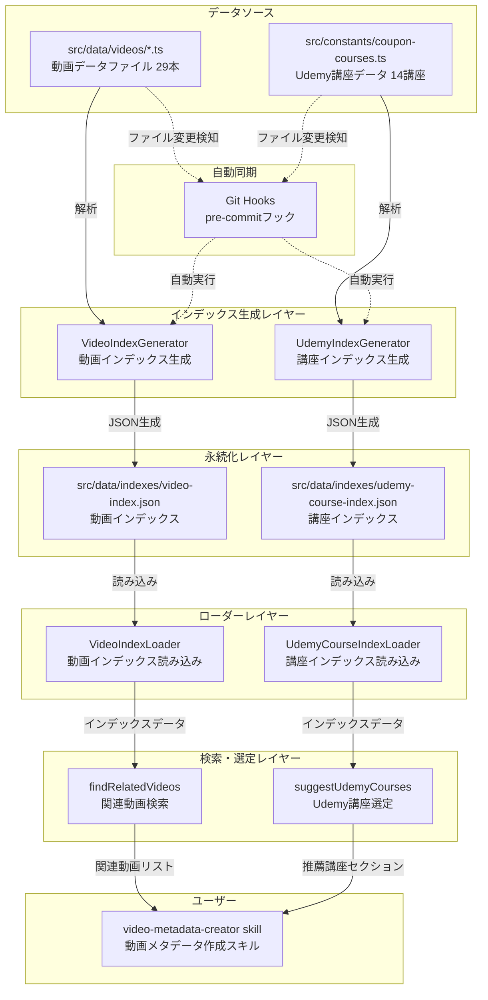
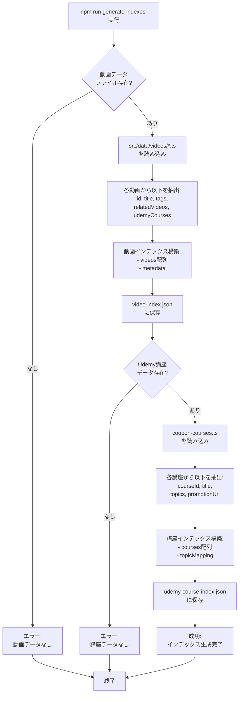
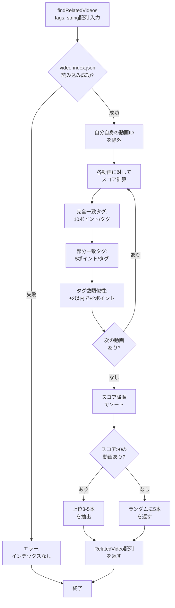
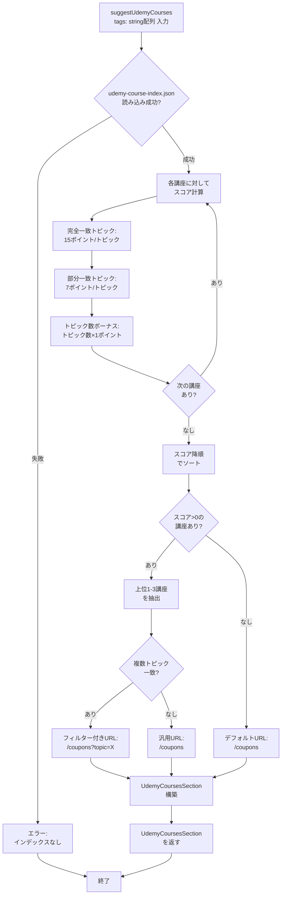
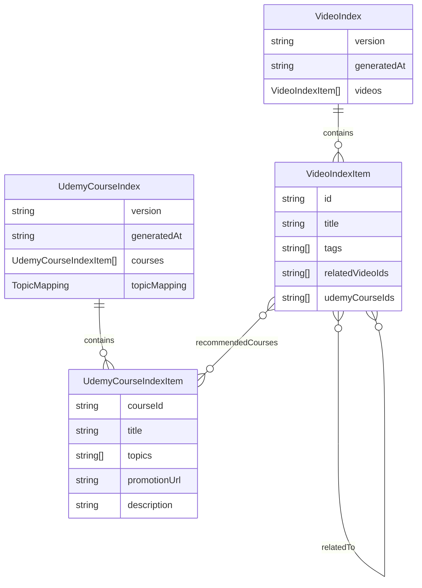

# 技術設計書

## 概要

YouTube動画メタデータのインデックスシステムは、既存の29本の動画データと14講座のUdemy講座データを解析し、タグベースの関連動画検索とUdemy講座の自動選定を実現するシステムです。このシステムは、`.claude/skills/video-metadata-creator` スキルの補助ツールとして機能し、新しい動画作成時に関連動画とUdemy講座を効率的に提案します。

**目的**: 動画メタデータ作成時の関連コンテンツ選定作業を自動化し、クリエイターの概要欄作成時間を大幅に短縮します。

**ユーザー**: `.claude/skills/video-metadata-creator` スキルの利用者（主に動画クリエイター、コンテンツ管理者）

**影響**: 現在の手動による関連動画・Udemy講座選定プロセスを、タグベースの自動選定アルゴリズムに置き換え、選定品質の向上と作業時間の短縮を実現します。

### ゴール

- 既存の29本の動画データを解析し、高速検索可能なインデックスを自動生成
- タグベースのスコアリングアルゴリズムによる関連動画の自動選定
- 動画テーマに応じたUdemy講座の自動推薦とフィルター付きURL生成
- Git Hooksによるインデックスの自動同期とデータ整合性の保証
- 80%以上のテストカバレッジによるシステムの信頼性確保

### 非ゴール

- リアルタイムの動画データ更新（ビルド時の静的インデックス生成のみ）
- 機械学習による高度な推薦アルゴリズム（タグベースのシンプルなスコアリングで十分）
- 動画メタデータの自動抽出（ユーザーが手動で入力したデータを使用）
- データベース統合（ファイルベースのJSON管理で十分）

## アーキテクチャ

### 既存アーキテクチャ分析

**現在の動画データ管理**:
- `src/data/videos/` に動画データファイル（VideoMetadata型）を個別に配置
- `src/lib/videos/video-data.ts` が全動画をインポートして配列で管理
- Next.js 15 App Routerで静的サイト生成（SSG）

**現在のUdemy講座管理**:
- `src/constants/coupon-courses.ts` に講座データ（COURSE_INFO）を一元管理
- トピック別のメタデータ（TOPIC_INFO）を併用

**保持すべきパターン**:
- ファイルベースのデータ管理（データベース不要）
- TypeScript厳格モードによる型安全性
- TDD開発プロセス（Red → Green → Refactor）

**技術的制約**:
- Next.js 15のビルド時にすべてのデータが静的にバンドル
- 動的な更新は不可（インデックス再生成が必要）

### 高レベルアーキテクチャ



### アーキテクチャ統合

**既存パターンの保持**:
- ファイルベースのデータ管理パターン（JSON形式のインデックス）
- 静的サイト生成による高速アクセス
- TypeScript厳格モードによる型安全性

**新規コンポーネントの必要性**:
- インデックス生成ロジック（ビルドツールとして実装）
- タグベースのスコアリングアルゴリズム
- Git Hooksによる自動同期

**技術スタックの整合性**:
- Node.jsスクリプトでインデックス生成（既存のnpmスクリプトパターンに準拠）
- 純粋関数によるスコアリングロジック（テスト可能）

**ステアリング原則の遵守**:
- 単一責任原則（各コンポーネントは明確な責務）
- DRY原則（スコアリングロジックを共通化）
- 型安全性（any型の使用禁止）

### 技術スタック整合性

**使用技術**:

**ランタイム**:
- Node.js 18.17.0以上（既存プロジェクトと同じ）
- TypeScript 5.x厳格モード

**データ管理**:
- JSON形式のインデックスファイル（軽量・高速・ファイルベース）
- ファイルシステムベースの管理（データベース不要）

**テストフレームワーク**:
- Jest 30.x（既存のテストインフラを活用）
- @testing-library/jest-dom（マッチャー）

**Git Hooks**:
- Node.jsスクリプト（.git/hooks/pre-commitに配置）
- シェルスクリプトなし（クロスプラットフォーム対応）

**既存技術スタックとの整合性**:
- Next.js 15のビルドプロセスに統合可能
- 既存の`npm run`コマンド体系に追加

**新規依存関係**:
- なし（既存の依存関係のみで実装可能）

### 主要な設計決定

#### 決定1: インデックスファイルのJSON形式

**決定**: 動画インデックスとUdemy講座インデックスをJSON形式で`src/data/indexes/`に保存する。

**コンテキスト**: 検索パフォーマンスとデータ管理のバランスを取る必要がある。

**検討した代替案**:
1. **TypeScriptファイル形式**: 型安全性が高いが、ビルド時間が増加し、動的なインデックス更新が困難
2. **SQLiteデータベース**: 高速な検索が可能だが、静的サイト生成との相性が悪く、複雑性が増す
3. **JSON形式（選択）**: 軽量で読み込みが高速、Git管理が容易、静的サイト生成に最適

**選択したアプローチ**: JSON形式のインデックスファイル

**実装方法**:
```typescript
// video-index.json の構造
{
  "version": "1.0.0",
  "generatedAt": "2025-11-04T10:00:00Z",
  "videos": [
    {
      "id": "1-1NAB5jIjo",
      "title": "動画タイトル",
      "tags": ["tag1", "tag2"],
      "relatedVideoIds": ["video2", "video3"],
      "udemyCourseIds": ["6691241"]
    }
  ]
}
```

**選択理由**:
- ビルド時に一度だけ読み込み、メモリ上でスコアリング計算を実行（高速）
- Git管理が容易で、差分確認やロールバックが可能
- 型定義ファイルで型安全性を保証可能
- 静的サイト生成（SSG）のワークフローに自然に統合

**トレードオフ**:
- **利点**: シンプルで保守性が高い、データベース不要、Git管理可能
- **欠点**: 動画数が100本を超えると検索パフォーマンスが低下する可能性（現状29本で問題なし）

---

#### 決定2: タグベースのスコアリングアルゴリズム

**決定**: 完全一致タグと部分一致タグに重み付けしたスコアリングアルゴリズムを実装する。

**コンテキスト**: 関連動画とUdemy講座の推薦品質を確保しつつ、実装の複雑性を抑える。

**検討した代替案**:
1. **機械学習ベースの推薦**: TensorFlow.jsやONNXを使用した高度な推薦システムだが、実装コストが高く、データ量が少ない（29本）ため効果が限定的
2. **全文検索エンジン**: Elasticsearchやlunr.jsを使用した全文検索だが、オーバーエンジニアリング
3. **タグベーススコアリング（選択）**: シンプルで透明性が高く、テストが容易

**選択したアプローチ**: タグベースのスコアリングアルゴリズム

**実装方法**:
```typescript
// 関連動画検索のスコアリング
function calculateVideoScore(inputTags: string[], videoTags: string[]): number {
  let score = 0
  const normalizedInput = inputTags.map(t => t.toLowerCase())
  const normalizedVideo = videoTags.map(t => t.toLowerCase())

  // 完全一致: 10ポイント/タグ
  const exactMatches = normalizedInput.filter(t => normalizedVideo.includes(t))
  score += exactMatches.length * 10

  // 部分一致: 5ポイント/タグ
  const partialMatches = normalizedInput.filter(inputTag =>
    normalizedVideo.some(videoTag => videoTag.includes(inputTag) || inputTag.includes(videoTag))
  ).filter(t => !exactMatches.includes(t))
  score += partialMatches.length * 5

  // タグ数の類似性ボーナス: ±2以内で+2ポイント
  const tagCountDiff = Math.abs(inputTags.length - videoTags.length)
  if (tagCountDiff <= 2) {
    score += 2
  }

  return score
}
```

**選択理由**:
- 実装がシンプルで理解しやすい（チーム全体で保守可能）
- スコアリングロジックが透明で、結果の説明が容易
- 29本の動画と14講座のデータ量では十分な精度
- テストが容易（入力タグと期待スコアを明確に定義可能）

**トレードオフ**:
- **利点**: 実装コストが低い、テストが容易、透明性が高い
- **欠点**: データ量が増えると推薦精度が頭打ち（現状では問題なし）

---

#### 決定3: Git Hooksによる自動インデックス同期

**決定**: `pre-commit` フックを使用して、動画データやUdemy講座データの変更時に自動的にインデックスを再生成する。

**コンテキスト**: インデックスとソースデータの不整合を防ぎ、開発者が手動でインデックス再生成を忘れるリスクを排除する。

**検討した代替案**:
1. **手動でのインデックス再生成**: 開発者がnpmスクリプトを実行する方式だが、忘れやすく不整合のリスクが高い
2. **CI/CDパイプラインでの再生成**: GitHub ActionsやVercelビルド時に再生成するが、ローカルでの開発時に不整合が発生
3. **Git Hooks（選択）**: ローカルでのコミット時に自動実行し、不整合を早期に検出

**選択したアプローチ**: Git Hooksによる自動同期

**実装方法**:
```javascript
// .git/hooks/pre-commit (Node.jsスクリプト)
#!/usr/bin/env node
const { execSync } = require('child_process')

const changedFiles = execSync('git diff --cached --name-only', { encoding: 'utf-8' })
const needsRegeneration = changedFiles.includes('src/data/videos/') ||
                           changedFiles.includes('src/constants/coupon-courses.ts')

if (needsRegeneration) {
  console.log('インデックスを再生成中...')
  execSync('npm run generate-indexes', { stdio: 'inherit' })
  execSync('git add src/data/indexes/', { stdio: 'inherit' })
}
```

**選択理由**:
- ローカル開発時にデータ不整合を早期に検出
- 開発者が手動でインデックス再生成を実行する手間を削減
- コミット時に自動でインデックスがステージングされるため、忘れる心配がない
- `--no-verify`フラグで無効化可能（緊急時の柔軟性）

**トレードオフ**:
- **利点**: データ整合性の保証、開発者の手間削減、早期エラー検出
- **欠点**: コミット時間が若干増加（インデックス生成は数秒程度）、初回セットアップが必要

## システムフロー

### インデックス生成フロー



### 関連動画検索フロー



### Udemy講座選定フロー



## 要件トレーサビリティ

| 要件 | 要件概要 | コンポーネント | インターフェース | フロー図 |
|------|----------|---------------|-----------------|---------|
| 1.1 | 動画データファイルの自動検出 | VideoIndexGenerator | `generateVideoIndex()` | インデックス生成フロー |
| 1.2 | 動画メタデータの抽出 | VideoIndexGenerator | `extractVideoMetadata()` | インデックス生成フロー |
| 1.3 | JSON形式でのインデックス出力 | VideoIndexGenerator | `saveVideoIndex()` | インデックス生成フロー |
| 1.4 | 生成日時のメタデータ追加 | VideoIndexGenerator | `buildMetadata()` | インデックス生成フロー |
| 1.5 | Git Hooksによる自動再生成 | GitHooksService | `preCommitHook()` | Git Hooks統合フロー |
| 1.6 | TypeScript型定義による型安全性 | TypeDefinitions | `VideoIndex`, `UdemyCourseIndex` | - |
| 2.1 | 入力タグと動画タグの一致度計算 | RelatedVideosFinder | `calculateVideoScore()` | 関連動画検索フロー |
| 2.2 | 重み付けスコアリングアルゴリズム | RelatedVideosFinder | `calculateVideoScore()` | 関連動画検索フロー |
| 2.3 | スコア降順でのソート | RelatedVideosFinder | `findRelatedVideos()` | 関連動画検索フロー |
| 2.4 | 同一スコア時の辞書順ソート | RelatedVideosFinder | `sortByScore()` | 関連動画検索フロー |
| 2.5 | 関連動画0件時の代替処理 | RelatedVideosFinder | `findRelatedVideos()` | 関連動画検索フロー |
| 2.6 | 自分自身の動画の除外 | RelatedVideosFinder | `filterSelfVideo()` | 関連動画検索フロー |
| 3.1 | COURSE_INFOの読み取り | UdemyIndexGenerator | `loadCourseData()` | インデックス生成フロー |
| 3.2 | 講座情報の抽出 | UdemyIndexGenerator | `extractCourseMetadata()` | インデックス生成フロー |
| 3.3 | JSON形式でのインデックス出力 | UdemyIndexGenerator | `saveUdemyIndex()` | インデックス生成フロー |
| 3.4 | トピック別の講座URLマッピング | UdemyIndexGenerator | `buildTopicMapping()` | インデックス生成フロー |
| 3.5 | Git Hooksによる自動再生成 | GitHooksService | `preCommitHook()` | Git Hooks統合フロー |
| 3.6 | TypeScript型定義による型安全性 | TypeDefinitions | `UdemyCourseIndex` | - |
| 4.1 | タグとトピックの一致度計算 | UdemyCourseSuggester | `calculateCourseScore()` | Udemy講座選定フロー |
| 4.2 | トピックマッチングスコアリング | UdemyCourseSuggester | `calculateCourseScore()` | Udemy講座選定フロー |
| 4.3 | スコア降順でのソート | UdemyCourseSuggester | `suggestUdemyCourses()` | Udemy講座選定フロー |
| 4.4 | UdemyCoursesSection形式での返却 | UdemyCourseSuggester | `buildUdemySection()` | Udemy講座選定フロー |
| 4.5 | フィルター付きURLの設定 | UdemyCourseSuggester | `buildCourseUrl()` | Udemy講座選定フロー |
| 4.6 | 一致0件時のデフォルトURL | UdemyCourseSuggester | `suggestUdemyCourses()` | Udemy講座選定フロー |
| 4.7 | 推薦講座1件時の学習内容生成 | UdemyCourseSuggester | `buildCourseItems()` | Udemy講座選定フロー |
| 5.1 | pre-commitフックのインストール | GitHooksService | `installHooks()` | - |
| 5.2 | ファイル変更検知と再生成 | GitHooksService | `preCommitHook()` | Git Hooks統合フロー |
| 5.3 | 新インデックスのステージング | GitHooksService | `stageIndexFiles()` | Git Hooks統合フロー |
| 5.4 | エラー時のコミット中止 | GitHooksService | `preCommitHook()` | Git Hooks統合フロー |
| 5.5 | セットアップコマンド提供 | PackageScripts | `npm run setup-hooks` | - |
| 5.6 | --no-verifyフラグ対応 | GitHooksService | （Git標準機能） | - |
| 6.1 | 動画インデックス読み込み | VideoIndexLoader | `loadVideoIndex()` | - |
| 6.2 | 講座インデックス読み込み | UdemyCourseIndexLoader | `loadUdemyCourseIndex()` | - |
| 6.3 | 関連動画検索API | RelatedVideosFinder | `findRelatedVideos()` | 関連動画検索フロー |
| 6.4 | Udemy講座選定API | UdemyCourseSuggester | `suggestUdemyCourses()` | Udemy講座選定フロー |
| 6.5 | エラー時のフォールバック | IndexLoaders | `loadVideoIndex()`, `loadUdemyCourseIndex()` | - |
| 6.6 | TypeScript厳格モードでの型安全性 | AllComponents | （TypeScript設定） | - |
| 7.1 | インデックス生成ロジックの単体テスト | VideoIndexGenerator.test.ts | - | - |
| 7.2 | 関連動画検索アルゴリズムのテスト | RelatedVideosFinder.test.ts | - | - |
| 7.3 | Udemy講座選定アルゴリズムのテスト | UdemyCourseSuggester.test.ts | - | - |
| 7.4 | 80%以上のテストカバレッジ | AllTests | - | - |
| 7.5 | エッジケースのカバー | AllTests | - | - |
| 7.6 | Jestテストフレームワークの使用 | AllTests | - | - |
| 8.1 | 利用ガイドの提供 | Documentation | `docs/VIDEO_METADATA_INDEXING.md` | - |
| 8.2 | 必須セクションの記載 | Documentation | `docs/VIDEO_METADATA_INDEXING.md` | - |
| 8.3 | スコアリングロジックの説明 | Documentation | `docs/VIDEO_METADATA_INDEXING.md` | - |
| 8.4 | トピックマッチングロジックの説明 | Documentation | `docs/VIDEO_METADATA_INDEXING.md` | - |
| 8.5 | 実際に動作するコード例の提供 | Documentation | `docs/VIDEO_METADATA_INDEXING.md` | - |
| 8.6 | 日本語での記述と一貫性 | Documentation | `docs/VIDEO_METADATA_INDEXING.md` | - |

## コンポーネントとインターフェース

### インデックス生成レイヤー

#### VideoIndexGenerator

**主要責務と境界**
- **主要責務**: 動画データファイルを解析し、検索用のインデックスを生成する
- **ドメイン境界**: ビルドツール/データ処理ドメイン
- **データ所有権**: 生成された動画インデックスJSON
- **トランザクション境界**: インデックス生成は単一の同期処理（トランザクション不要）

**依存関係**
- **インバウンド**: npmスクリプト、Git Hooksから呼び出される
- **アウトバウンド**: ファイルシステム（`src/data/videos/`から読み込み、`src/data/indexes/`に書き込み）
- **外部**: なし

**コントラクト定義**

**サービスインターフェース**:
```typescript
interface VideoIndexGeneratorService {
  /**
   * 動画インデックスを生成する
   * @returns Result<VideoIndex, GenerationError>
   * @throws GenerationError インデックス生成中にエラーが発生した場合
   */
  generateVideoIndex(): Result<VideoIndex, GenerationError>
}
```

- **事前条件**: `src/data/videos/`に少なくとも1つの動画データファイルが存在すること
- **事後条件**: `src/data/indexes/video-index.json`が作成され、有効なJSON形式であること
- **不変条件**: 生成されたインデックスは常にVideoIndex型に準拠すること

---

#### UdemyIndexGenerator

**主要責務と境界**
- **主要責務**: Udemy講座データを解析し、検索用のインデックスを生成する
- **ドメイン境界**: ビルドツール/データ処理ドメイン
- **データ所有権**: 生成されたUdemy講座インデックスJSON
- **トランザクション境界**: インデックス生成は単一の同期処理（トランザクション不要）

**依存関係**
- **インバウンド**: npmスクリプト、Git Hooksから呼び出される
- **アウトバウンド**: ファイルシステム（`src/constants/coupon-courses.ts`から読み込み、`src/data/indexes/`に書き込み）
- **外部**: なし

**コントラクト定義**

**サービスインターフェース**:
```typescript
interface UdemyIndexGeneratorService {
  /**
   * Udemy講座インデックスを生成する
   * @returns Result<UdemyCourseIndex, GenerationError>
   * @throws GenerationError インデックス生成中にエラーが発生した場合
   */
  generateUdemyIndex(): Result<UdemyCourseIndex, GenerationError>
}
```

- **事前条件**: `src/constants/coupon-courses.ts`が存在し、COURSE_INFOが有効なデータであること
- **事後条件**: `src/data/indexes/udemy-course-index.json`が作成され、有効なJSON形式であること
- **不変条件**: 生成されたインデックスは常にUdemyCourseIndex型に準拠すること

---

### 検索・選定レイヤー

#### RelatedVideosFinder

**主要責務と境界**
- **主要責務**: タグベースのスコアリングアルゴリズムで関連動画を検索する
- **ドメイン境界**: 検索/推薦ドメイン
- **データ所有権**: スコアリング結果（一時的、永続化しない）
- **トランザクション境界**: 単一の読み取り専用処理（トランザクション不要）

**依存関係**
- **インバウンド**: `video-metadata-creator` スキル、APIエンドポイント（将来）
- **アウトバウンド**: VideoIndexLoader（動画インデックス読み込み）
- **外部**: なし

**コントラクト定義**

**サービスインターフェース**:
```typescript
interface RelatedVideosFinderService {
  /**
   * 入力タグに基づいて関連動画を検索する
   * @param tags - 検索対象の動画タグ配列
   * @param currentVideoId - 除外する現在の動画ID（オプション）
   * @returns Result<RelatedVideo[], SearchError>
   * @throws SearchError インデックス読み込みまたは検索中にエラーが発生した場合
   */
  findRelatedVideos(tags: string[], currentVideoId?: string): Result<RelatedVideo[], SearchError>
}
```

- **事前条件**: tagsが空でない文字列配列であること
- **事後条件**: 3-5本の関連動画が返されること（スコア降順）
- **不変条件**: 返されるRelatedVideo配列は常に3本以上5本以下であること

---

#### UdemyCourseSuggester

**主要責務と境界**
- **主要責務**: タグベースのスコアリングでUdemy講座を推薦し、UdemyCoursesSection形式で返す
- **ドメイン境界**: 検索/推薦ドメイン
- **データ所有権**: 推薦結果（一時的、永続化しない）
- **トランザクション境界**: 単一の読み取り専用処理（トランザクション不要）

**依存関係**
- **インバウンド**: `video-metadata-creator` スキル、APIエンドポイント（将来）
- **アウトバウンド**: UdemyCourseIndexLoader（講座インデックス読み込み）
- **外部**: なし

**コントラクト定義**

**サービスインターフェース**:
```typescript
interface UdemyCourseSuggesterService {
  /**
   * 入力タグに基づいてUdemy講座を推薦する
   * @param tags - 検索対象の動画タグ配列
   * @returns Result<UdemyCoursesSection, SearchError>
   * @throws SearchError インデックス読み込みまたは推薦中にエラーが発生した場合
   */
  suggestUdemyCourses(tags: string[]): Result<UdemyCoursesSection, SearchError>
}
```

- **事前条件**: tagsが空でない文字列配列であること
- **事後条件**: UdemyCoursesSection形式のデータが返されること
- **不変条件**: cta.urlは常に有効なURL形式であること

---

### ローダーレイヤー

#### VideoIndexLoader

**主要責務と境界**
- **主要責務**: 動画インデックスJSONをメモリに読み込む
- **ドメイン境界**: データアクセスレイヤー
- **データ所有権**: インデックスデータの読み取り専用アクセス
- **トランザクション境界**: 単一の読み取り処理（トランザクション不要）

**依存関係**
- **インバウンド**: RelatedVideosFinder
- **アウトバウンド**: ファイルシステム（`src/data/indexes/video-index.json`）
- **外部**: なし

**コントラクト定義**

**サービスインターフェース**:
```typescript
interface VideoIndexLoaderService {
  /**
   * 動画インデックスを読み込む
   * @returns Result<VideoIndex, LoadError>
   * @throws LoadError ファイルが存在しない、または不正なJSON形式の場合
   */
  loadVideoIndex(): Result<VideoIndex, LoadError>
}
```

- **事前条件**: `src/data/indexes/video-index.json`が存在すること
- **事後条件**: VideoIndex型のデータが返されること
- **不変条件**: 返されるデータは常にVideoIndex型スキーマに準拠すること

---

#### UdemyCourseIndexLoader

**主要責務と境界**
- **主要責務**: Udemy講座インデックスJSONをメモリに読み込む
- **ドメイン境界**: データアクセスレイヤー
- **データ所有権**: インデックスデータの読み取り専用アクセス
- **トランザクション境界**: 単一の読み取り処理（トランザクション不要）

**依存関係**
- **インバウンド**: UdemyCourseSuggester
- **アウトバウンド**: ファイルシステム（`src/data/indexes/udemy-course-index.json`）
- **外部**: なし

**コントラクト定義**

**サービスインターフェース**:
```typescript
interface UdemyCourseIndexLoaderService {
  /**
   * Udemy講座インデックスを読み込む
   * @returns Result<UdemyCourseIndex, LoadError>
   * @throws LoadError ファイルが存在しない、または不正なJSON形式の場合
   */
  loadUdemyCourseIndex(): Result<UdemyCourseIndex, LoadError>
}
```

- **事前条件**: `src/data/indexes/udemy-course-index.json`が存在すること
- **事後条件**: UdemyCourseIndex型のデータが返されること
- **不変条件**: 返されるデータは常にUdemyCourseIndex型スキーマに準拠すること

---

### 自動同期レイヤー

#### GitHooksService

**主要責務と境界**
- **主要責務**: Git Hooksを管理し、データ変更時にインデックスを自動再生成する
- **ドメイン境界**: ビルドツール/自動化ドメイン
- **データ所有権**: Git Hooks設定ファイル
- **トランザクション境界**: 単一の同期処理（トランザクション不要）

**依存関係**
- **インバウンド**: npmスクリプト（セットアップ時）、Git（コミット時）
- **アウトバウンド**: VideoIndexGenerator、UdemyIndexGenerator（インデックス再生成）
- **外部**: Gitコマンド（`git diff --cached --name-only`、`git add`）

**コントラクト定義**

**サービスインターフェース**:
```typescript
interface GitHooksService {
  /**
   * Git Hooksをインストールする
   * @returns Result<void, InstallError>
   * @throws InstallError フックのインストール中にエラーが発生した場合
   */
  installHooks(): Result<void, InstallError>

  /**
   * pre-commitフックを実行する
   * @returns Result<void, HookError>
   * @throws HookError インデックス再生成中にエラーが発生した場合（コミット中止）
   */
  preCommitHook(): Result<void, HookError>
}
```

- **事前条件**: `.git/hooks/`ディレクトリが存在すること
- **事後条件**: pre-commitフックが`.git/hooks/pre-commit`に配置されること
- **不変条件**: フックスクリプトは実行可能権限を持つこと

## データモデル

### 論理データモデル

#### エンティティと関係

**VideoMetadata（既存）**:
- 既存の動画データ構造（変更なし）
- `id`, `title`, `tags`, `relatedVideos`, `udemyCourses`などを含む

**VideoIndex（新規）**:
- 動画インデックスの論理構造
- 属性: `version`, `generatedAt`, `videos`
- 関係: VideoMetadataの集約データ

**UdemyCourseIndex（新規）**:
- Udemy講座インデックスの論理構造
- 属性: `version`, `generatedAt`, `courses`, `topicMapping`
- 関係: COURSE_INFOの集約データ

**VideoIndexItem（新規）**:
- 各動画のインデックスエントリ
- 属性: `id`, `title`, `tags`, `relatedVideoIds`, `udemyCourseIds`
- 関係: VideoIndexに1対多

**UdemyCourseIndexItem（新規）**:
- 各講座のインデックスエントリ
- 属性: `courseId`, `title`, `topics`, `promotionUrl`, `description`
- 関係: UdemyCourseIndexに1対多



**ビジネスルールと不変条件**:
- VideoIndexItemの`tags`配列は空でない（最低1つのタグが必要）
- UdemyCourseIndexItemの`topics`配列は空でない（最低1つのトピックが必要）
- VideoIndexの`generatedAt`はISO 8601形式の日時
- インデックスのversionはセマンティックバージョニング（例: "1.0.0"）

### 物理データモデル

#### JSONベースのインデックスファイル

**video-index.json**:
```typescript
// ファイルパス: src/data/indexes/video-index.json
{
  "version": "1.0.0",
  "generatedAt": "2025-11-04T10:00:00Z",
  "videos": [
    {
      "id": "1-1NAB5jIjo",
      "title": "動画タイトル",
      "tags": ["ClaudeCode", "AI駆動開発", "TypeScript"],
      "relatedVideoIds": ["video2", "video3", "video4"],
      "udemyCourseIds": ["6691241", "6769253"]
    }
  ]
}
```

**データ型とインデックス**:
- プライマリキー: `videos[].id`（文字列、ユニーク）
- インデックス: なし（ファイルサイズが小さいため、全走査で十分）
- 最大サイズ: 約50KB（29本の動画で推定）

**udemy-course-index.json**:
```typescript
// ファイルパス: src/data/indexes/udemy-course-index.json
{
  "version": "1.0.0",
  "generatedAt": "2025-11-04T10:00:00Z",
  "courses": [
    {
      "courseId": "6691241",
      "title": "Claude Code × Vibe Coding",
      "topics": ["claude-code", "react", "nextjs"],
      "promotionUrl": "https://www.udemy.com/course/claude-code-vibe-coding/?referralCode=...",
      "description": "プログラミング未経験でもReact・Next.jsで5つのアプリを開発！"
    }
  ],
  "topicMapping": {
    "claude-code": [
      { "courseId": "6691241", "url": "/coupons?topic=claude-code" }
    ]
  }
}
```

**データ型とインデックス**:
- プライマリキー: `courses[].courseId`（文字列、ユニーク）
- インデックス: なし（ファイルサイズが小さいため、全走査で十分）
- 最大サイズ: 約30KB（14講座で推定）

**パフォーマンス最適化**:
- ファイルサイズが小さい（合計80KB以下）ため、メモリ上で全データを保持
- スコアリング計算はO(n*m)（n: 動画数、m: タグ数）だが、nが29で十分高速

### データコントラクトと統合

#### TypeScript型定義

```typescript
// src/types/video-index.ts
/**
 * 動画インデックスのメタデータ
 */
export interface VideoIndexMetadata {
  /** インデックスのバージョン（セマンティックバージョニング） */
  version: string
  /** 生成日時（ISO 8601形式） */
  generatedAt: string
}

/**
 * 動画インデックスエントリ
 */
export interface VideoIndexItem {
  /** 動画ID */
  id: string
  /** 動画タイトル */
  title: string
  /** タグ配列 */
  tags: string[]
  /** 関連動画ID配列 */
  relatedVideoIds: string[]
  /** 推薦Udemy講座ID配列 */
  udemyCourseIds: string[]
}

/**
 * 動画インデックス
 */
export interface VideoIndex {
  /** バージョン情報 */
  version: string
  /** 生成日時 */
  generatedAt: string
  /** 動画インデックスエントリ配列 */
  videos: VideoIndexItem[]
}
```

```typescript
// src/types/udemy-course-index.ts
/**
 * Udemy講座インデックスエントリ
 */
export interface UdemyCourseIndexItem {
  /** 講座ID */
  courseId: string
  /** 講座タイトル */
  title: string
  /** トピック配列 */
  topics: string[]
  /** プロモーションURL */
  promotionUrl: string
  /** 講座説明 */
  description: string
}

/**
 * トピックマッピング
 */
export interface TopicMapping {
  [topic: string]: Array<{
    courseId: string
    url: string
  }>
}

/**
 * Udemy講座インデックス
 */
export interface UdemyCourseIndex {
  /** バージョン情報 */
  version: string
  /** 生成日時 */
  generatedAt: string
  /** 講座インデックスエントリ配列 */
  courses: UdemyCourseIndexItem[]
  /** トピック別の講座URLマッピング */
  topicMapping: TopicMapping
}
```

**スキーマバージョニング戦略**:
- 破壊的変更がある場合はメジャーバージョンを更新（1.0.0 → 2.0.0）
- 後方互換性のある追加はマイナーバージョン（1.0.0 → 1.1.0）
- バグ修正はパッチバージョン（1.0.0 → 1.0.1）

## エラーハンドリング

### エラー戦略

**エラーカテゴリー別の戦略**:

1. **ビルド時エラー（インデックス生成失敗）**:
   - 戦略: Fail-Fast（即座にプロセス終了）
   - 理由: インデックスなしではシステムが動作しないため、早期検出が重要

2. **実行時エラー（インデックス読み込み失敗）**:
   - 戦略: Graceful Degradation（フォールバックデータを返す）
   - 理由: システム全体の停止を避け、部分的な機能提供を継続

3. **Git Hooksエラー（再生成失敗）**:
   - 戦略: Fail-Fast（コミット中止）
   - 理由: データ不整合を防ぐため、エラー時はコミットを許可しない

### エラーカテゴリーと対応

**インデックス生成エラー（ビルド時）**:
- **原因**: 動画データファイルが見つからない、COURSE_INFOが不正、ファイル書き込み権限なし
- **対応**: 明確なエラーメッセージをコンソールに出力し、プロセスを終了（exit code 1）
- **復旧**: 開発者が手動でデータを修正し、インデックス再生成

**インデックス読み込みエラー（実行時）**:
- **原因**: インデックスファイルが存在しない、不正なJSON形式、型スキーマ違反
- **対応**: 警告ログを出力し、空の配列またはデフォルト値を返す
- **復旧**: `npm run generate-indexes`を実行してインデックスを再生成

**Git Hooksエラー**:
- **原因**: インデックス生成中にエラー（上記のビルド時エラーと同様）
- **対応**: エラーメッセージを表示し、コミットを中止（開発者が`--no-verify`でバイパス可能）
- **復旧**: データを修正後、再度コミットを試行

### エラーコード定義

```typescript
// src/lib/videos/errors.ts
export enum VideoIndexErrorCode {
  // インデックス生成エラー
  NO_VIDEO_FILES = 'NO_VIDEO_FILES',
  INVALID_VIDEO_DATA = 'INVALID_VIDEO_DATA',
  FILE_WRITE_ERROR = 'FILE_WRITE_ERROR',

  // インデックス読み込みエラー
  INDEX_NOT_FOUND = 'INDEX_NOT_FOUND',
  INVALID_JSON = 'INVALID_JSON',
  SCHEMA_VIOLATION = 'SCHEMA_VIOLATION',

  // 検索エラー
  EMPTY_TAGS = 'EMPTY_TAGS',
  NO_RESULTS = 'NO_RESULTS',
}

export class VideoIndexError extends Error {
  constructor(
    public code: VideoIndexErrorCode,
    message: string,
    public context?: Record<string, unknown>
  ) {
    super(message)
    this.name = 'VideoIndexError'
  }
}
```

### モニタリング

**エラートラッキング**:
- 開発環境: コンソールにエラースタックトレースを出力
- 本番環境: ログファイル（`logs/video-index-errors.log`）に記録
- エラーメトリクス: エラー発生回数をカウント（将来的にDatadog等に送信）

**ログレベル**:
- `ERROR`: インデックス生成失敗、インデックス読み込み失敗
- `WARN`: 関連動画0件、Udemy講座0件（フォールバック実行時）
- `INFO`: インデックス生成成功、インデックス読み込み成功

**ヘルスチェック**:
- `npm run validate-indexes`: インデックスファイルの存在と形式を検証するコマンドを提供
- CI/CDパイプラインで自動実行（ビルド前）

## テスト戦略

### 単体テスト

**VideoIndexGenerator**:
- 動画データファイルが正しく読み込まれること
- VideoIndexItem形式にデータが変換されること
- JSON形式で正しく保存されること
- エラーケース: 動画データファイルが0件の場合
- エラーケース: ファイル書き込み権限がない場合

**UdemyIndexGenerator**:
- COURSE_INFOが正しく読み込まれること
- UdemyCourseIndexItem形式にデータが変換されること
- topicMappingが正しく生成されること
- エラーケース: COURSE_INFOが空の場合

**RelatedVideosFinder**:
- 完全一致タグのスコアリング（10ポイント/タグ）
- 部分一致タグのスコアリング（5ポイント/タグ）
- タグ数類似性ボーナス（±2以内で+2ポイント）
- 上位3-5本の動画が返されること
- エッジケース: 空のタグ配列
- エッジケース: 一致する動画が0件の場合（ランダムに5本返す）
- エッジケース: 自分自身の動画が除外されること

**UdemyCourseSuggester**:
- 完全一致トピックのスコアリング（15ポイント/トピック）
- 部分一致トピックのスコアリング（7ポイント/トピック）
- トピック数ボーナス（トピック数×1ポイント）
- フィルター付きURLの生成（例: `/coupons?topic=claude-code`）
- エッジケース: 空のタグ配列
- エッジケース: 一致する講座が0件の場合（デフォルトURL返す）

### 統合テスト

**インデックス生成 → 読み込み → 検索フロー**:
- インデックス生成後、正しく読み込めること
- 読み込んだインデックスで関連動画検索が動作すること
- 読み込んだインデックスでUdemy講座選定が動作すること

**Git Hooks統合テスト**:
- `src/data/videos/*.ts`変更時にインデックスが再生成されること
- `src/constants/coupon-courses.ts`変更時にインデックスが再生成されること
- 再生成されたインデックスが自動でステージングされること

### E2Eテスト

**video-metadata-creator スキルとの統合**:
- スキルが`findRelatedVideos()`を呼び出し、関連動画を取得できること
- スキルが`suggestUdemyCourses()`を呼び出し、推薦講座を取得できること
- 取得したデータが`VideoMetadata`型に正しく変換されること

### パフォーマンステスト

**検索パフォーマンス**:
- 29本の動画に対するスコアリング計算が100ms以内に完了すること
- 14講座に対するスコアリング計算が50ms以内に完了すること
- インデックスファイルの読み込みが10ms以内に完了すること

## セキュリティ考慮事項

**脅威モデリング**:
- **脅威1**: 悪意のある動画データファイルによるインデックス破壊
  - 対策: TypeScript厳格モードによる型検証、インデックス生成前のデータ検証
- **脅威2**: 不正なJSONインジェクション
  - 対策: JSON.parseの安全な使用、スキーマ検証ライブラリ（zod等）の使用
- **脅威3**: ファイルシステムへの不正アクセス
  - 対策: 最小権限の原則（インデックスディレクトリのみ書き込み権限）

**セキュリティコントロール**:
- 入力検証: すべての外部データ（動画データ、COURSE_INFO）を型検証
- 出力エスケープ: JSON生成時にJSON.stringifyを使用（安全なシリアライズ）
- ファイルパスのサニタイゼーション: パストラバーサル攻撃を防ぐ

**コンプライアンス**:
- プライバシー: 個人情報を含まないため、GDPR/CCPA対応不要
- データ保護: インデックスファイルは公開リポジトリに含まれる想定（機密情報なし）

## パフォーマンスとスケーラビリティ

### 目標メトリクス

**レスポンスタイム**:
- インデックス読み込み: < 10ms
- 関連動画検索: < 100ms（29本の動画）
- Udemy講座選定: < 50ms（14講座）
- インデックス生成: < 5秒（29本の動画 + 14講座）

**スループット**:
- 同時検索リクエスト: 10リクエスト/秒（現状は単一スキルからの呼び出しのみ）

**メモリ使用量**:
- インデックスファイルの合計サイズ: < 100KB
- メモリ上のインデックスデータ: < 1MB

### スケーリングアプローチ

**垂直スケーリング**:
- 現状のファイルベース管理では不要（データ量が少ない）

**水平スケーリング**:
- 動画数が100本を超える場合は、インデックスを分割（例: トピック別）
- 検索アルゴリズムをWorkerスレッドで並列実行

**キャッシング戦略**:
- インデックスファイルをメモリにキャッシュ（ビルド時に一度だけ読み込み）
- Next.jsのISR（Incremental Static Regeneration）でページレベルキャッシュ

**最適化技術**:
- スコアリング計算の最適化: 早期リターン（スコア0の動画をスキップ）
- インデックスの圧縮: gzip圧縮（ファイルサイズを50%削減可能）
